# [괴이바]

> SK Networks Family AI Camp 27기 4차 프로젝트  
> 개발 기간: [2026-06-09 ~ 2026-06-10]

## Contents

1. [프로젝트 소개](#1-프로젝트-소개)
2. [팀 소개](#2-팀-소개)
3. [기술 스택](#3-기술-스택)
4. [요구사항 정의서](#4-요구사항-정의서)
5. [화면설계서](#5-화면설계서)
6. [ERD](#6-erd)
7. [RAG 시퀀스 다이어그램](#7-rag-시퀀스-다이어그램)
8. [시스템 아키텍처](#8-시스템-아키텍처)
9. [웹페이지 구현](#9-웹페이지-구현)
10. [데이터베이스 설계 (PostgreSQL 및 pgvector)](#10-데이터베이스-설계-postgresql-및-pgvector)
11. [GraphDB 설계](#11-graphdb-설계)
12. [지역 정보실 (Map UI & GraphDB 연동)](#12-지역-정보실-map-ui--graphdb-연동)
13. [AI 괴담 생성 시나리오](#13-ai-괴담-생성-시나리오)
14. [기록 열람실 (챗봇) 구현 구조](#14-기록-열람실-챗봇-구현-구조)
15. [로그인 / 회원가입 및 보안](#15-로그인--회원가입-및-보안)
16. [테스트 및 평가](#16-테스트-및-평가)
17. [기대 효과 및 결론](#17-기대-효과-및-결론)
18. [팀원 회고](#18-팀원-회고)

---

## 1. 프로젝트 소개

### 프로젝트명

**괴이 기록 보관소**

### 프로젝트 개요

Django 기반의 괴담 및 금기 아카이브 플랫폼으로, 다중 데이터베이스와 AI 기술을 결합하여 몰입감 있는 사용자 경험을 제공합니다. 사용자 정보 및 게시글 등 서비스 핵심 데이터는 PostgreSQL로 안정적으로 관리하며, 지역별 장소와 괴담 사이의 관계 정보는 Neo4j를 활용해 구조적으로 탐색할 수 있도록 구현했습니다. 또한 LLM을 연동하여 사용자가 직접 키워드를 입력해 새로운 괴담을 창작하고 공유할 수 있는 기능도 지원합니다.

### 개발 배경

본 프로젝트는 다음 문제를 해결하기 위해 설계했습니다.

| 문제                                       | 해결 방향                                                              |
| ------------------------------------------ | ---------------------------------------------------------------------- |
| 파편화된 지역 괴담/금기 정보 탐색의 어려움 | PostgreSQL 기반 데이터베이스 구축 및 통합 아카이브 제공                |
| 괴담, 장소, 괴이의 복잡한 관계성 파악 한계 | Neo4j GraphDB 기반 지역-장소-괴담 관계 시각화 및 탐색                  |
| 괴담 창작의 어려움                         | LLM 기반 AI 괴담 생성기 및 RAGAS 평가 연동                             |
| 몰입감 있는 콘텐츠 소비를 위한 분위기 부족 | 터미널형 인터페이스 및 글리치 효과, 음향 효과를 통한 독창적 UI/UX 적용 |

### 프로젝트 목표

- Django를 이용한 사용자 인증, 마이페이지, 오픈 게시판 등 웹 코어 기능 구현
- View와 Service 계층 분리를 통한 유지보수성 및 확장성 높은 시스템 구조 설계
- PostgreSQL을 활용한 금기 및 괴담 데이터 저장 및 비동기(fetch) 기반 검색 기능 제공
- Neo4j GraphDB를 활용한 지역 지도 기반 정보실 구축
- LLM 모듈 연동으로 신규 기록(AI 괴담) 자동 생성 파이프라인 구성

---

## 2. 팀 소개

### 팀명

**[괴이바]**

<table align="center" width="100%">
  <tr>
    <td align="center"></td>
    <td align="center">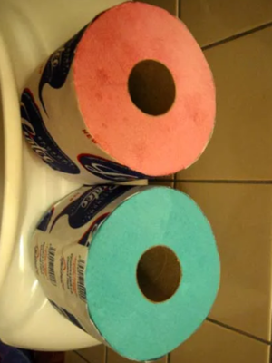</td>
    <td align="center"></td>
    <td align="center"></td>
    <td align="center"></td>
  </tr>
  <tr>
    <td align="center"><b>김민경</b></td>
    <td align="center"><b>권환성</b></td>
    <td align="center"><b>김한솔</b></td>
    <td align="center"><b>박송원</b></td>
    <td align="center"><b>이재강</b></td>
  </tr>
  <tr>
    <td align="center">팀장</td>
    <td align="center">팀원</td>
    <td align="center">팀원</td>
    <td align="center">팀원</td>
    <td align="center">팀원</td>
  </tr>
  <tr>
    <td align="center"><a href="https://github.com/m2k-dcyh13">m2k-dcyh13</a></td>
    <td align="center"><a href="https://github.com/nanseong">nanseong</a></td>
    <td align="center"><a href="https://github.com/kimhansol777">kimhansol777</a></td>
    <td align="center"><a href="https://github.com/enooola0204-spec">Songwonapark87</a></td>
    <td align="center"><a href="https://github.com/leejaegang27">leejaegang27</a></td>
  </tr>
</table>

| 팀원       | 담당 업무                                                                                                                        |
| ---------- | -------------------------------------------------------------------------------------------------------------------------------- |
| **김민경** | 기획서/요구사항 정의서 작성, 폴더/프로젝트 구조 설계, `archive` 앱 구현(`TTS`, 괴담 챗봇, 자료실), 최종 코드 통합                |
| **권환성** | 프로젝트 화면 UI 설계, `accounts` 앱 구현(로그인, 회원가입, 로그아웃 Session, 마이페이지, 회원탈퇴), `archive`앱 금기자료실 구현 |
| **김한솔** | 데이터셋 수집 및 전처리, GraphDB 설계, Neo4j 적재, 벡터 임베딩, `regions` 앱 구현                                                |
| **박송원** | 괴담 데이터셋 확보, LLM Prompt 작성 및 연동, `generator` 앱 구현(AI 신규 기록 창작)                                              |
| **이재강** | 데이터 전처리, PostgreSQL 기반 ERD 설계 및 pgvector 임베딩, `post` 앱 구현(열린 게시판 작성/수정/삭제)                           |

---

## 3. 기술 스택

### 💻 Language

<p>
  
  
  
  
</p>

### ⚙️ Framework & Database

<p>
  
  
  
</p>

### 🚀 AI & Infra

<p>
  
  
  
</p>

### 🎨 UI/UX

- **Django Templates**: 서버 사이드 렌더링을 통한 뷰 구성
- **JavaScript (Flicker 효과)**: 무작위 화면 글리치 및 오디오 효과 연출로 오컬트 몰입감 극대화

---

## 4. 요구사항 정의서

본 프로젝트의 주요 요구사항은 다음과 같습니다.

| 요구사항 ID | 구분 | 기능 요구사항 | 상세 설명 |
|:---:|:---|:---|:---|
| REQ-01 | 회원 | 회원 가입 및 로그인 | 세션 기반 로그인, 아이디 중복 확인, 비밀번호 검증 |
| REQ-02 | 회원 | 마이페이지 | 사용자 정보 확인, 본인이 작성한 게시글 및 보관한 기록(금기/괴담) 관리 |
| REQ-03 | 기록 | 챗봇(기록 열람실) | 사용자의 키워드와 의도를 파악하여 관련 괴담이나 기록을 대화형으로 검색 |
| REQ-04 | 기록 | 금기 자료실 | 매일 갱신되는 '오늘의 금기' 제공 및 전체 미신/금기 리스트 조회 |
| REQ-05 | 창작 | AI 괴담 생성(신규 기록실) | 사용자가 제공한 키워드를 기반으로 LLM이 새로운 괴담을 창작 (RAG 기반) |
| REQ-06 | 커뮤니티 | 열린 게시판 | 사용자가 직접 경험담을 작성하거나 AI가 생성한 괴담을 공유 (CRUD) |
| REQ-07 | 탐색 | 지역 정보실 | 한국 지도 기반으로 지역을 선택하여 해당 지역의 괴담, 장소, 신화 존재 탐색 |
| REQ-08 | 공통 | UI/UX | 글리치 효과, 오컬트 무드의 배경, 터미널형 인터페이스 및 사운드 효과 적용 |

---

## 5. 화면설계서

화면 설계는 기획 의도인 '오컬트, 터미널형 아카이브' 컨셉에 맞춰 구성되었습니다.

- **메인 화면**: 진입 시 글리치 효과와 함께 서비스 메뉴(열람실, 자료실, 기록실, 정보실, 게시판)가 터미널 명령어 형식으로 노출됩니다.
- **챗봇 (기록 열람실)**: 검은 배경에 녹색/흰색 픽셀 폰트를 사용하여 구형 컴퓨터 콘솔에서 기록을 열람하는 듯한 UI를 제공합니다.
- **지역 정보실**: 한반도 지도 이미지를 중앙에 배치하고, 특정 지역 클릭 시 우측 패널에서 트리 구조로 장소와 괴담 목록이 전개됩니다.
- **신규 기록실 / 커뮤니티**: 입력 폼과 목록 조회 테이블 또한 모노톤의 테두리와 픽셀 폰트를 사용하여 사이트 전체의 통일성을 유지합니다.

*(※ 상세 화면 캡처는 하단의 [9. 웹페이지 구현] 섹션을 참고해 주세요.)*

---

## 6. ERD

PostgreSQL 기반의 관계형 데이터베이스와 Neo4j 기반의 그래프 데이터베이스 구조입니다.

### PostgreSQL ERD

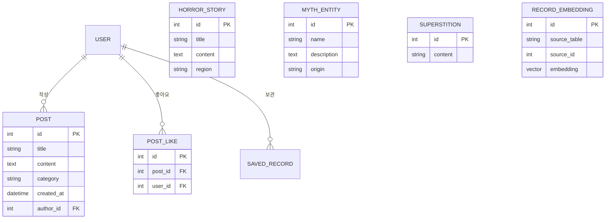

### Neo4j GraphDB 관계도

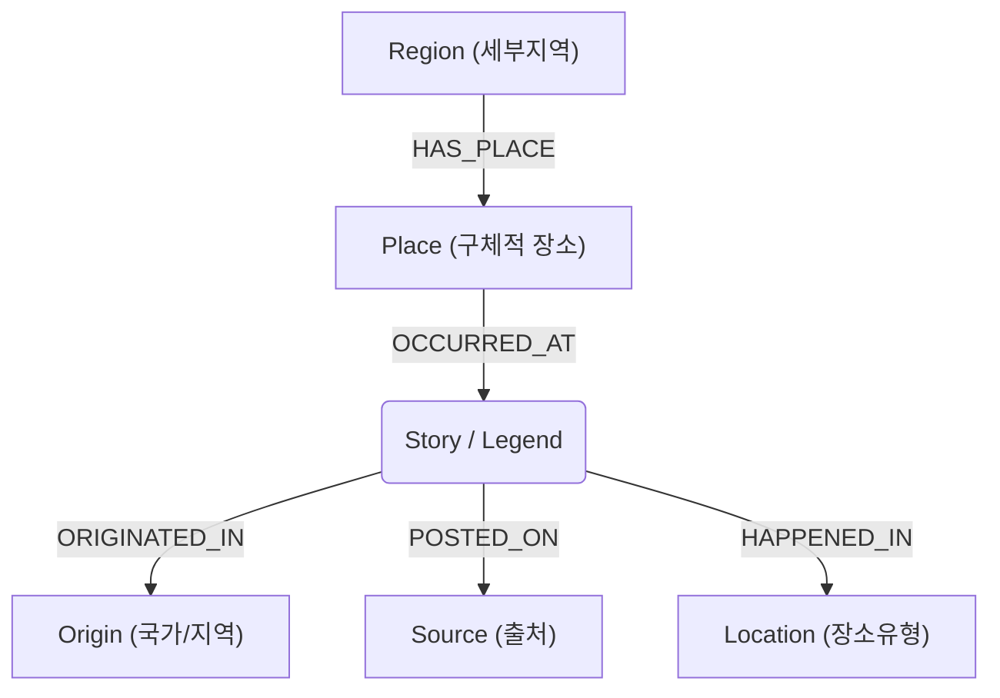

---

## 7. RAG 시퀀스 다이어그램

기록 열람실에서 사용자 키워드를 바탕으로 DB 유사도 검색(pgvector)을 수행하고, LLM을 통해 괴담을 재구성 및 응답하는 RAG(Retrieval-Augmented Generation) 파이프라인입니다.

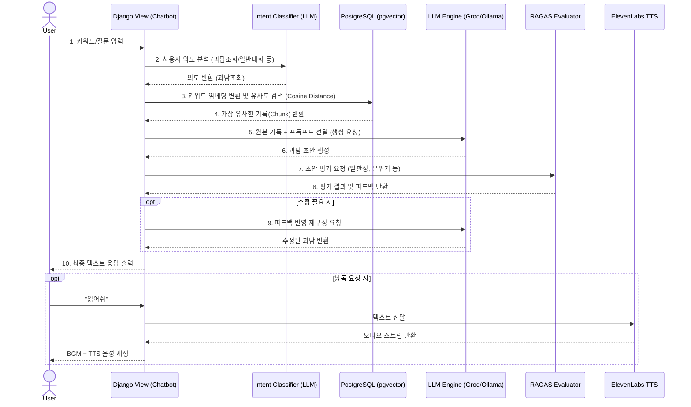

---

## 8. 시스템 아키텍처

### 프로젝트 구조

```text
SKN27-4th-1team/
├─ config/              # Django 프로젝트 핵심 설정 및 URLConf
├─ common/              # 여러 app에서 공유하는 LLM 및 Logging 모듈
├─ accounts/            # 회원가입, 로그인, 로그아웃, 마이페이지 처리 앱
├─ archive/             # 메인페이지, 괴담 검색, 금기 조회 처리 앱
├─ generator/           # AI 괴담 생성 폼 및 RAG/LLM 연동 앱
├─ post/                # 열린 게시판 (목록, 상세, 등록, 수정, 삭제) 앱
├─ regions/             # 지역 정보실 (Neo4j 연동 지역 괴담 조회) 앱
├─ static/              # 전체 공통 정적 파일 (css, js, images, audio, fonts)
├─ templates/           # 앱별 화면 템플릿 (index, chatbot, archive, community 등)
├─ database/            # 초기 데이터 스크립트 등
└─ docker-compose.yaml  # 로컬 DB(PostgreSQL, Neo4j) 컨테이너 설정
```

### 아키텍처 특징 (View-Service 분리)

- **View (`views.py`)**: 사용자 요청 수신, 폼 검증, 권한 확인, 렌더링/리다이렉트 등 HTTP 흐름만 제어합니다.
- **Service (`services.py`)**: 실제 비즈니스 로직(DB 쿼리, 모델 저장/수정/삭제, LLM API 호출, Neo4j 연동 등)은 각 앱의 `services.py`로 분리하여 앱 간 결합도를 낮추고 재사용성을 높였습니다.

---

## 9. 웹페이지 구현

Django Template 기반으로 화면을 구성했습니다.  
각 페이지는 `templates/` 폴더에 배치하고, 공통 스타일과 인터랙션은 `static/css/styles.css`, `static/js/flicker.js`에서 관리합니다.  
HTML 파일을 직접 여는 방식이 아니라 Django URLConf와 View를 통해 페이지를 렌더링합니다.

### 화면 연결 구조

```text
Browser 요청
        ↓
config/urls.py
        ↓
각 app/urls.py
        ↓
각 app/views.py
        ↓
templates/*.html 렌더링
        ↓
static/css, static/js, images 적용
        ↓
사용자 화면 출력

```

### 주요 페이지 및 UI 구현 특징

#### 메인 페이지

<div align="center">
  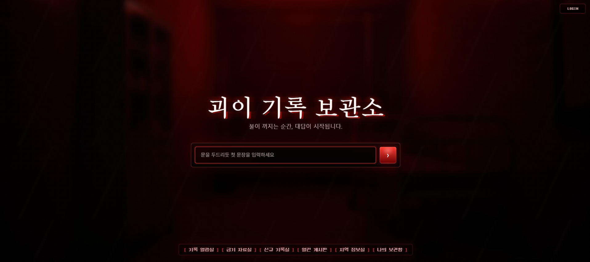
</div>

- URL: /
- Template: templates/archive/index.html
- 서비스 진입 화면
- 로그인 상태에 따라 LOGIN / LOGOUT 표시 변경

#### 기록 열람실

<div align="center">
  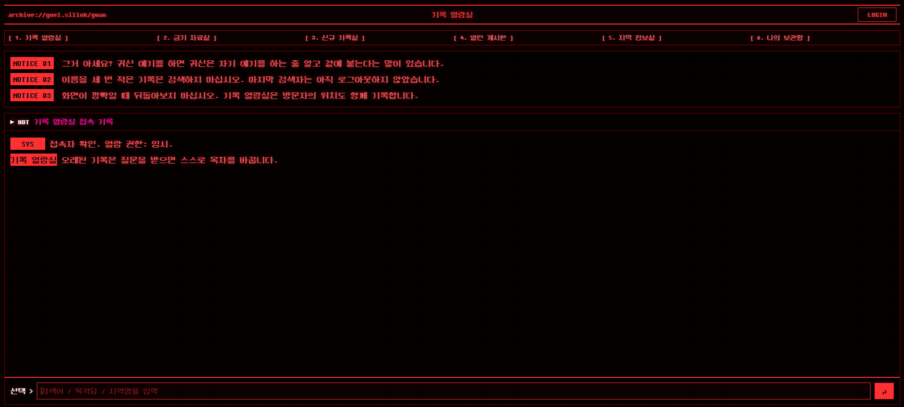
</div>

- URL: /archive/chatbot/
- Template: templates/archive/chatbot.html
- 괴담/기록 검색 화면
- 터미널 로그 형태의 대화형 UI 적용
- 사용자가 입력한 키워드를 기반으로 기록 검색 흐름 구성

#### 금기 자료실

<div align="center">
  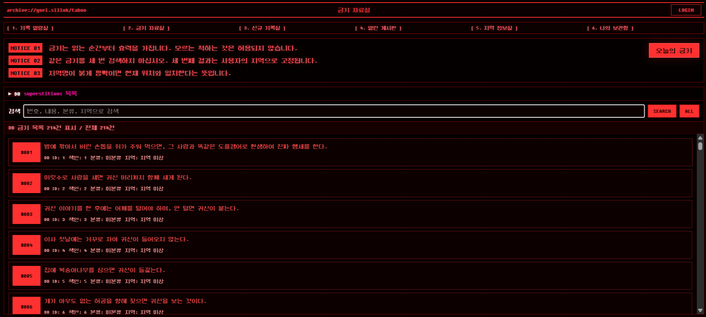
</div>

- URL: /archive/archive/
- Template: templates/archive/archive.html
- superstitions DB 목록 조회
- 오늘의 금기 조회 기능

#### 신규 기록실

<div align="center">
  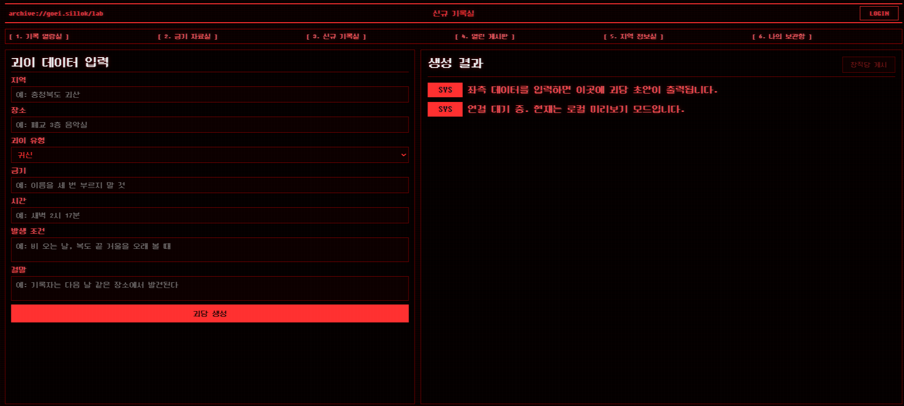
</div>

- URL: /generator/storymaker/
- Template: templates/generator/storymaker.html
- 괴담 생성을 위한 입력 폼 제공
- 게시 성공 시 열린 게시판 창작담 탭으로 이동

#### 열린 게시판

<div align="center">
  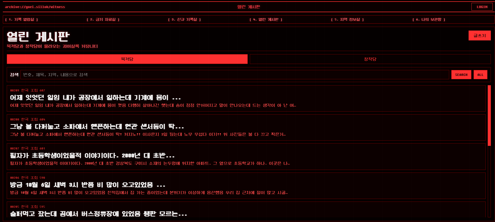
</div>

- URL: /post/community/
- Template: templates/post/community.html
- 게시글 목록, 작성, 상세 조회 기능 제공
- 본인 글일 경우 수정/삭제 버튼 표시

#### 지역 정보실

<div align="center">
  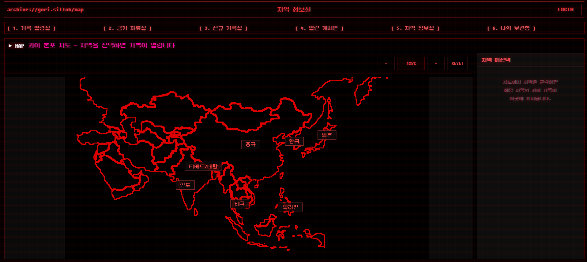
</div>

- URL: /regions/regioninfo/
- Template: templates/regions/regioninfo.html
- 지역 지도 기반 정보 화면
- 지도 이미지와 확대/축소/초기화 UI 구성
- 지역 기반 괴담/장소/관계 탐색 화면으로 사용

#### 로그인

<div align="center">
  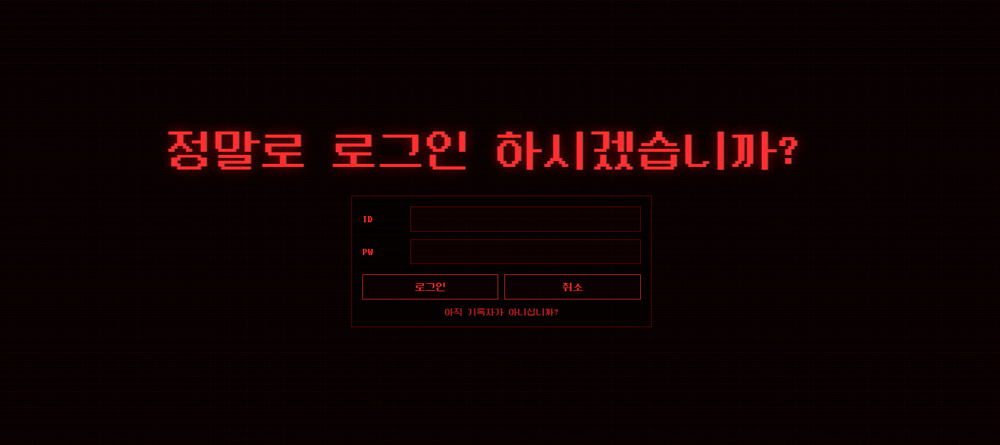
</div>

- URL: /accounts/login/
- Template: templates/accounts/login.html
- 로그인 Form 제공
- 인증 실패 메시지 표시
- 로그인 처리 중 문구 출력

#### 나의 보관함

<div align="center">
  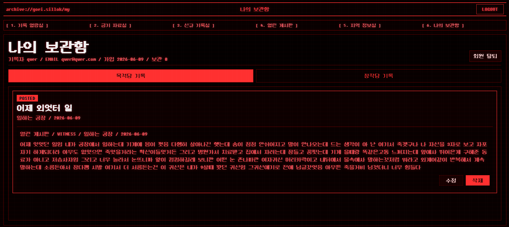
</div>

- URL: /accounts/mypage/
- Template: templates/accounts/mypage.html
- 사용자 기본 정보 표시
- 내가 쓴 글과 보관 기록 표시
- 본인이 작성한 글 수정/삭제 가능
- 회원 탈퇴 버튼과 확인창 구현

### Static 파일 구성

static/css/styles.css

- 전체 페이지 공통 스타일
- BBS/터미널형 UI
- 로그인/회원가입 화면 스타일
- 게시판, 마이페이지, 금기 자료실, 신규 기록실 레이아웃
- 내부 스크롤 영역 제어

static/js/flicker.js

- 화면 글리치 효과
- 랜덤 간격으로 page-flicker 클래스 적용
- 괴이 이미지 랜덤 위치 노출

static/images/

- 메인 배경 이미지
- 지도 이미지
- 글리치 효과 이미지

static/audio/

- 문 열림/닫힘 효과음
- 공포 루프 사운드
- 글리치 효과음

static/fonts/

- DungGeunMo.ttf 픽셀 폰트

---

## 10. 데이터베이스 설계 (PostgreSQL 및 pgvector)

서비스 데이터의 안정적인 저장과 조회를 위해 PostgreSQL을 주 데이터베이스로 사용하며, 원본 괴담 및 외부 수집 데이터를 체계적으로 적재하고 pgvector 확장 기능으로 의미 기반 검색(Semantic Search)을 지원합니다.

### 주요 데이터 구조

| 테이블                    | 데이터 종류             | 역할                                            |
| ------------------------- | ----------------------- | ----------------------------------------------- |
| `horror_stories`          | 검증 한국 괴담/도시전설 | 괴담 아카이브 원본 데이터                       |
| `myth_entities`           | 세계 괴이/신화 존재     | 신화 및 요괴 원본 데이터                        |
| `superstitions`           | 미신 및 금기 문장       | 금기 자료실 정보 제공                           |
| `dcinside_posts`          | 외부 수집 공포 썰       | 유저 작성글과 분리된 외부 검색용 데이터         |
| `post_post` / `post_like` | 열린 게시판 데이터      | 실제 사용자가 작성한 목격담/창작담 및 추천 관리 |
| `record_embeddings`       | pgvector 임베딩 청크    | 의미 기반 검색용 768차원 임베딩 데이터          |

### 외부 수집 데이터 전처리 및 적재

- DCInside 수집글(`dcinside_posts`)은 원본의 제목(태그)에 따라 `CREATION`(창작), `WITNESS`(경험/사건) 등으로 카테고리를 분류하여 적재합니다.
- 외부 수집 데이터와 실제 사용자가 작성한 커뮤니티 게시글(`post_post`)의 DB 테이블을 엄격하게 분리하여 무결성과 유지보수성을 높였습니다.

### pgvector 기반 의미 검색 파이프라인

- `intfloat/multilingual-e5-base` 모델을 사용하여 각 테이블 본문을 문장/문단 단위로 청킹(Chunking)한 뒤 768차원의 벡터로 임베딩합니다.
- 생성된 임베딩 데이터는 `record_embeddings`라는 독립된 테이블에 저장되며, 검색 시 코사인 거리(Cosine Distance)를 계산하여 가장 유사한 `horror_stories`, `myth_entities`, `dcinside_posts` 기록을 반환합니다.
- 데이터 갱신이 잦은 사용자 게시글(`post_post`)이나 문장이 짧은 미신(`superstitions`)은 임베딩 대상에서 의도적으로 제외하여 시스템 리소스 효율을 최적화했습니다.

---

## 11. GraphDB 설계 (Neo4j)

관계형 조회가 유리한 지역, 괴담, 신화 존재 간의 상호 관계를 구조적으로 탐색하기 위해 Neo4j를 분리 구성했습니다.

### 활용 목적

단순 텍스트 검색을 넘어 특정 국가/지역에 얽힌 괴담과 신화 존재를 의미 기반으로 연결하고, 이를 지도 UI와 연동하여 시각적으로 탐색할 수 있는 "지역 정보실" 기능에 활용됩니다.

### 주요 노드

| 노드       | 설명                              |
| ---------- | --------------------------------- |
| `Story`    | DC인사이드 공포 목격담, 한국 괴담 |
| `Legend`   | 세계 신화/요괴 설명               |
| `Origin`   | 국가/지역 (한국, 일본, 인도 등)   |
| `Region`   | 한국 세부 지역 (서울, 부산 등)    |
| `Place`    | 구체적 장소                       |
| `Location` | 장소 유형 (학교, 병원 등)         |

### 주요 관계 구조

- `(Story / Legend)-[:ORIGINATED_IN]->(Origin)`
- `(Region)-[:HAS_PLACE]->(Place)`
- `(Place)-[:OCCURRED_AT]->(Story)`
- `(Story)-[:HAPPENED_IN]->(Location)`
- `(Story)-[:POSTED_ON]->(Source)`
- `(Legend)-[:WARDED_OFF_BY]->(Countermeasure)`

### 지역 정보실 조회 흐름

지도에서 국가 핀 클릭 → `Origin` 노드 기준으로 `ORIGINATED_IN` 관계를 역방향 탐색 → 해당 국가에 연결된 `Story` / `Legend` 목록 반환

---

## 12. 지역 정보실 (Map UI & GraphDB 연동)

**지역 정보실**은 Neo4j GraphDB와 연동하여 국가 및 지역별 하위 장소(City) 노드와 관련 괴이 기록(Story/Legend/SCP)의 유기적인 관계를 시각적으로 탐색하는 서비스입니다.  
Django View를 거쳐 드래그 및 줌(Zoom) 기능이 지원되는 반응형 지도 화면을 렌더링하고, JavaScript `fetch()`와 Cypher Query 기반 API 비동기 조회를 통해 그래프 데이터를 실시간 가공하여 동적 폴더 트리 구조로 제공합니다.

### 1) 데이터 흐름

`/regions/api/list/` API 호출(초기 핀 배치 및 건수 집계) → 지도 핀 클릭 또는 맵 조작 → `/regions/api/cities/?region={지역명}` API 비동기(`fetch`) 요청 → `regions.services`에서 Neo4j 조회 → 조건부 하위 장소 폴더 트리 렌더링

### 2) 주요 기능 및 UI 인터랙션

- **초기 핀 자동 배치**: 페이지 진입 시 Neo4j에서 총 괴담 수(`place_count`)를 집계하여, 지리적 좌표 기반 맵 위에 액티브 핀 버튼을 매핑합니다.
- **드래그 & 줌(Pan & Zoom)**: 바닐라 자바스크립트를 활용한 포인터 이벤트 제어로 스케일(`scale`)과 좌표값(`translate`)을 변환하여 자유로운 탐색이 가능합니다.
- **조건부 폴더 트리**:
  - 하위 도시 노드 존재 시: 📁(City) - 📄(Story) 간의 슬라이드 토글 기반 폴더 트리 구조 렌더링
  - 하위 도시 노드 부재 시: `ORIGINATED_IN` 릴레이션을 추적하여 플랫(Flat)한 스토리 카드 목록 노출
- **괴담 본문 상세 모달**: 리스트 클릭 시 원본 본문을 호출하며, 데이터 내 불필요한 스크립트 노이즈(CSS keyframes 등)를 필터링하는 전처리가 적용되어 있습니다.

### 3) 구현 표준 및 아키텍처 원칙

- **GraphDB 결합 구조**: 지리적 상하 관계(`HAS_CITY`)와 출처 기원 관계(`ORIGINATED_IN`)를 동시에 활용하는 조건부 라우팅 Cypher 쿼리 설계
- **서버-클라이언트 분산 설계**: View는 단순 파싱을 수행하고 실제 Neo4j 트랜잭션 처리는 `regions.services` 계층으로 완전 분리하여 캡슐화 준수
- **다이나믹 UX 구성**: HTML 리프레시 없는 부드러운 전환을 위해 클라이언트 중심의 동적 DOM 제어 적용

---

## 13. AI 괴담 생성 시나리오

1. **사용자 요청**: `generator/storymaker/` 페이지에서 새로운 괴담 생성을 위한 키워드 입력 후 요청
2. **View-Service 라우팅**: `generator.views`가 요청을 받아 `generator.services.generate_story` 호출
3. **LLM 호출**: Service 내부에서 `common.llm_factory`를 이용해 모델 연결 후 프롬프트 기반 괴담 생성
4. **결과 평가 (선택적)**: RAGAS를 활용하여 생성된 이야기의 일관성/연관성 등을 평가
5. **저장 및 응답**: 생성 결과(`save_generated_story`)를 DB에 저장한 뒤, 화면에 결과를 반환하거나 열린 게시판으로 사용자를 유도

---

## 14. 기록 열람실 (챗봇) 구현 구조

기록 열람실 챗봇은 단순한 키워드 검색을 넘어, 사용자의 의도를 분석하고 생성형 AI를 활용하여 몰입감 있는 대화형 검색을 제공합니다.

### 전체 대화 흐름

1. **의도 분류**: 사용자의 입력을 받아 `괴담 조회`, `일반 대화`, `낭독(TTS) 요청` 세 가지 의도 중 하나로 분류합니다.
2. **DB 검색 및 선택**: `괴담 조회` 의도로 판별 시, PostgreSQL DB(`HorrorStory`, `MythEntity`, `Superstition`)에서 관련 기록을 검색하고 LLM을 통해 스산한 선택 유도문을 생성하여 반환합니다.
3. **괴담 재구성 및 평가**: 사용자가 목록에서 기록을 선택하면, 원본 기록을 바탕으로 LLM 파이프라인(생성 → 평가 → 1회 수정)을 거쳐 괴담을 재구성합니다. 평가는 키워드, 일관성, 문체, 분위기를 기준으로 진행됩니다.
4. **TTS (음성 낭독) 연동**: 재구성 완료된 괴담 텍스트는 세션에 저장되며, 사용자가 `읽어줘` 등의 명령을 내리면 ElevenLabs 스트리밍 API를 통해 낭독 오디오를 출력합니다. 동시에 YouTube IFrame API를 활용해 공포스러운 루프 사운드(BGM)를 재생하여 몰입감을 극대화합니다.
5. **세션 기반 상태 관리**: `session_state.py`를 통해 로그인 사용자와 익명 사용자의 대화 기록(History)과 마지막 생성 텍스트 상태를 분리하여 세션에 안전하게 관리합니다.

---

## 15. 로그인 / 회원가입 및 보안

Django 기본 Session 인증 방식을 사용합니다.  
HTML 템플릿 기반 구조에 맞춰 DRF Token 방식 대신 Django Session으로 로그인 상태를 관리합니다.  
`request.user`, `@login_required`, CSRF Token을 사용해 인증이 필요한 페이지와 요청을 보호합니다.

### 인증 흐름

```text
> 회원가입 인증흐름

회원가입 Form POST
        ↓
SignupForm 검증
        ↓
User 생성
        ↓
authenticate / login
        ↓
Django Session 저장
        ↓
로그인 상태 유지
```

```text
> 로그인 인증흐름

로그인 Form POST
        ↓
LoginForm 검증
        ↓
authenticate
        ↓
login(request, user)
        ↓
Django Session 저장
        ↓
로그인 상태 유지
```

### 구현 기능

회원가입

- 아이디 중복 검사
- 비밀번호 8자 이상 검사
- 비밀번호 확인 일치 검사
- 회원가입 성공 시 자동 로그인
- next 파라미터가 있으면 안전한 URL 검증 후 이동

로그인

- 아이디 / 비밀번호 기반 인증
- 로그인 성공 시 Session 생성
- 로그인 실패 시 에러 메시지 출력
- next 파라미터 지원
- 비로그인 사용자가 보호 페이지 접근 시 로그인 페이지로 이동

로그아웃

- 현재 Session 삭제
- 메인 페이지로 리다이렉트

마이페이지 보호

- @login_required 사용
- 비로그인 접근 시 /accounts/login/?next=/accounts/mypage/ 이동
- 로그인 후 원래 목적지로 복귀

---

## 16. 테스트 및 평가

평가는 단일 기능의 동작 여부만 보지 않고 인증/세션, 정적 레이아웃 유지, 외부 API 및 AI 연동, 최종 게시판 매핑 등의 흐름을 분리해 확인했습니다.

### 주요 평가 기준

| 구분 | 평가 항목 | 통과 기준 |
|:---|:---|:---|
| **회원 관리/보안** | 로그인, 회원가입, 로그아웃, 탈퇴 | 정상적인 세션의 생성 및 파기, 폼 에러 노출, CSRF 보안 토큰 작동 확인 |
| **마이페이지 연동** | 보관함(금기/괴담), 작성 글 연동 | DB 연동을 통한 사용자별 정확한 데이터 바인딩 확인 |
| **Web UI / Effects** | 글리치 효과, 동적 스크롤, 랜덤 이미지 | 브라우저 에러 없는 정적 파일 연동 및 CSS 레이아웃 유지 연출 |
| **통합 연동 (E2E)** | 비로그인 제어, Next 파라미터, 게시판 연동 | 페이지 간 유기적인 데이터 매핑 흐름 및 보호된 라우팅 리다이렉트 확인 |

### 대표 테스트 시나리오

| ID | 시나리오명 | 검증 포인트 및 세부 내용 |
|:---:|:---|:---|
| **SIGN-01** | 정상 회원가입 및 로그인 | 규칙에 맞는 폼 입력 시 `auth_user` 생성 및 즉시 자동 로그인되어 메인 리다이렉트 |
| **AUTH-02** | 로그인 실패 처리 | 틀린 계정 정보 입력 시 폼 에러 메시지 노출 및 세션 생성 차단 |
| **AUTH-03** | CSRF 보안 검증 | 변조되거나 누락된 CSRF 토큰 전송 시 `403 Forbidden` 발생 및 접근 차단 |
| **MY-02** | 보관함 데이터 매핑 | 마이페이지 접속 시 본인 저장 데이터(`horror_stories`, `superstitions` 연동) 바인딩 |
| **UI-01** | 글리치 효과 구동 | 랜덤 간격 대기(`flicker.js`) 시 콘솔 에러 없이 무작위 화면 글리치 및 랜덤 괴이 이미지 팝업 연출 |
| **UI-04** | 컴포넌트 내부 스크롤 | 신규 기록실/금기 자료실에서 리스트 출력 영역만 브라우저 스크롤과 독립적으로 구동 |

### E2E 테스트 (통합 흐름)

| ID | 목적 | 흐름 |
|:---:|:---|:---|
| **INT-01** | 비로그인 유저 접근 제한 | 비로그인 상태로 접근 -> `로그인 페이지(?next=)`로 리다이렉트 |
| **INT-02** | 로그인 후 파라미터 복귀 | 차단 후 로그인 성공 -> 메인 페이지가 아닌 원래 목적지로 자동 이동 |
| **INT-03** | AI 괴담 창작담 게시판 연동 | 신규 기록실 결과물 -> `게시판 게시` 클릭 -> 커뮤니티 작성 폼으로 유실 없이 매핑 |

### 개발 로드맵 (우선순위)

| ID | 진행 항목 | 상세 내용 |
|:---:|:---|:---|
| **P-01** | 인증 및 보안 기반 마련 | `accounts` 회원가입/로그인/세션, CSRF 처리 |
| **P-02** | 오컬트 UI 연출 적용 | 정적 자산(CSS/JS) 연동 및 `flicker.js` 화면 레이아웃 안정성 점검 |
| **P-03** | 마이페이지 DB 매핑 | 사용자 정보, 보관함 데이터(`PostgreSQL`) 바인딩 점검 |
| **P-04** | 컴포넌트 내부 스크롤 | 금기 자료실/신규 기록실 내 대량 텍스트 출력부 독자 스크롤 최적화 |
| **P-05** | 통합 권한/매핑 점검 | 비로그인 권한 제어 및 `AI 생성기` -> `커뮤니티` 연동 데이터 매핑 흐름 검증 |

---

## 17. 기대 효과 및 결론

### 기대 효과

- **데이터 기반 아카이빙**: 파편화된 지역 괴담과 금기 지식을 효율적으로 탐색할 수 있습니다.
- **창작 활성화**: 단순 게시판을 넘어 LLM 기반 스토리 생성 기능을 제공하여 유저의 참여도와 콘텐츠 생산력을 극대화합니다.
- **몰입감 강화**: 웹 기술(JS 글리치, 픽셀 폰트, 오디오 루프 등)을 적절히 혼합하여 기존 서비스들과 차별화된 오싹한 분위기와 재미를 선사합니다.

### 결론

본 프로젝트는 Django의 풀스택 웹 개발 프레임워크 구조 위에 RDB(PostgreSQL)와 GraphDB(Neo4j)를 하이브리드 형식으로 적용했습니다. 각 데이터 특성에 맞는 DB 구성과 AI 기술의 연계로, 사용자 친화적이고 독창적인 웹서비스 아키텍처를 성공적으로 구현했습니다.

---

## 18. 팀원 회고

### [김민경]

- [회고 내용 작성]

### [권환성]

- [회고 내용 작성]

### [김한솔]

- [회고 내용 작성]

### [박송원]

- [회고 내용 작성]

### [이재강]

- [회고 내용 작성]
