> SK Networks Family AI Camp 27기 4차 프로젝트  
> 개발 기간: [2026-06-09 ~ 2026-06-10]

## Contents

1. [프로젝트 소개](#1-프로젝트-소개)
2. [팀 소개](#2-팀-소개)
3. [기술 스택](#3-기술-스택)
4. [요구사항 정의서](#4-요구사항-정의서)
5. [화면설계서](#5-화면설계서)
6. [ERD](#6-erd)
7. [주요 기능 시퀀스 다이어그램](#7-주요-기능-시퀀스-다이어그램)
8. [시스템 아키텍처](#8-시스템-아키텍처)
9. [웹페이지 구현](#9-웹페이지-구현)
10. [데이터베이스 설계 (PostgreSQL 및 pgvector)](#10-데이터베이스-설계-postgresql-및-pgvector)
11. [GraphDB 설계](#11-graphdb-설계)
12. [주요 애플리케이션 및 기능 구현](#12-주요-애플리케이션-및-기능-구현)
    - [12.1. 지역 정보실](#121-지역-정보실-map-ui--graphdb-연동)
    - [12.2. AI 괴담 생성](#122-ai-괴담-생성-시나리오)
    - [12.3. 기록 열람실](#123-기록-열람실-챗봇-구현-구조)
    - [12.4. 로그인 / 회원가입 및 보안](#124-로그인--회원가입-및-보안)
13. [테스트 및 평가](#13-테스트-및-평가)
14. [기대 효과 및 결론](#14-기대-효과-및-결론)
15. [팀원 회고](#15-팀원-회고)

---

## 1. 프로젝트 소개

### 프로젝트명

**괴이 기록 보관소**

### 프로젝트 개요

Django 기반의 괴담 및 금기 아카이브 플랫폼으로, 다중 데이터베이스와 AI 기술을 결합하여 몰입감 있는 사용자 경험을 제공합니다. 사용자 정보 및 게시글 등 서비스 핵심 데이터는 PostgreSQL로 안정적으로 관리하며, 지역별 장소와 괴담 사이의 관계 정보는 Neo4j를 활용해 구조적으로 탐색할 수 있도록 구현했습니다. 또한 LLM을 연동하여 사용자가 직접 키워드를 입력해 새로운 괴담을 창작하고 공유할 수 있는 기능도 지원합니다.

### 개발 배경

본 프로젝트는 다음 문제를 해결하기 위해 설계했습니다.

| 문제                                       | 해결 방향                                                              |
| ------------------------------------------ | ---------------------------------------------------------------------- |
| 파편화된 지역 괴담/금기 정보 탐색의 어려움 | PostgreSQL 기반 데이터베이스 구축 및 통합 아카이브 제공                |
| 괴담, 장소, 괴이의 복잡한 관계성 파악 한계 | Neo4j GraphDB 기반 지역-장소-괴담 관계 시각화 및 탐색                  |
| 괴담 창작의 어려움                         | LLM 기반 AI 괴담 생성기 및 RAGAS 평가 연동                             |
| 몰입감 있는 콘텐츠 소비를 위한 분위기 부족 | 터미널형 인터페이스 및 글리치 효과, 음향 효과를 통한 독창적 UI/UX 적용 |

### 프로젝트 목표

- Django를 이용한 사용자 인증, 마이페이지, 오픈 게시판 등 웹 코어 기능 구현
- View와 Service 계층 분리를 통한 유지보수성 및 확장성 높은 시스템 구조 설계
- PostgreSQL을 활용한 금기 및 괴담 데이터 저장 및 비동기(fetch) 기반 검색 기능 제공
- Neo4j GraphDB를 활용한 지역 지도 기반 정보실 구축
- LLM 모듈 연동으로 신규 기록(AI 괴담) 자동 생성 파이프라인 구성

---

## 2. 팀 소개

### 팀명

**[괴이바]**

<table align="center" width="100%">
  <tr>
    <td align="center"></td>
    <td align="center"></td>
    <td align="center"></td>
    <td align="center"></td>
    <td align="center"></td>
  </tr>
  <tr>
    <td align="center"><b>김민경</b></td>
    <td align="center"><b>권환성</b></td>
    <td align="center"><b>김한솔</b></td>
    <td align="center"><b>박송원</b></td>
    <td align="center"><b>이재강</b></td>
  </tr>
  <tr>
    <td align="center">팀장</td>
    <td align="center">팀원</td>
    <td align="center">팀원</td>
    <td align="center">팀원</td>
    <td align="center">팀원</td>
  </tr>
  <tr>
    <td align="center"><a href="https://github.com/m2k-dcyh13">m2k-dcyh13</a></td>
    <td align="center"><a href="https://github.com/nanseong">nanseong</a></td>
    <td align="center"><a href="https://github.com/kimhansol777">kimhansol777</a></td>
    <td align="center"><a href="https://github.com/enooola0204-spec">Songwonapark87</a></td>
    <td align="center"><a href="https://github.com/leejaegang27">leejaegang27</a></td>
  </tr>
</table>

| 팀원       | 담당 업무                                                                                                                        |
| ---------- | -------------------------------------------------------------------------------------------------------------------------------- |
| **김민경** | 기획서/요구사항 정의서 작성, 폴더/프로젝트 구조 설계, `archive` 앱 구현(`TTS`, 괴담 챗봇, 자료실), 최종 코드 통합                |
| **권환성** | 프로젝트 화면 UI 설계, `accounts` 앱 구현(로그인, 회원가입, 로그아웃 Session, 마이페이지, 회원탈퇴), `archive`앱 금기자료실 구현 |
| **김한솔** | 데이터셋 수집 및 전처리, GraphDB 설계, Neo4j 적재, 벡터 임베딩, `regions` 앱 구현                                                |
| **박송원** | 괴담 데이터셋 확보, LLM Prompt 작성 및 연동, `generator` 앱 구현(AI 신규 기록 창작)                                              |
| **이재강** | 데이터 전처리, PostgreSQL 기반 ERD 설계 및 pgvector 임베딩, `post` 앱 구현(열린 게시판 작성/수정/삭제)                           |

---

## 3. 기술 스택

### 💻 Language

<p>
  
  
  
  
</p>

### ⚙️ Framework & Database

<p>
  
  
  
</p>

### 🚀 AI & Infra

<p>
  
  
  
</p>

### 🎨 UI/UX

- **Django Templates**: 서버 사이드 렌더링을 통한 뷰 구성
- **JavaScript (Flicker 효과)**: 무작위 화면 글리치 및 오디오 효과 연출로 오컬트 몰입감 극대화

---

## 4. 요구사항 정의서

본 프로젝트의 요구사항 정의서입니다. `docs/requirements-definition.csv` 문서를 기준으로 작성되었습니다.

| NO | 요구사항명 | 상세 요구사항 정의 | 유형 | 구분 | 제약사항 | 수용여부 |
|:---|:---|:---|:---|:---|:---|:---|
| 1-1 | 회원 인증 | 사용자는 회원가입, 로그인, 로그아웃, 회원 탈퇴를 할 수 있어야 한다. | 기능 | accounts | Django auth 기반으로 처리한다. | 수용 |
| 1-2 | 인증 권한 제어 | 로그인이 필요한 기능은 비로그인 사용자의 접근을 제한해야 한다. | 기능 | accounts | 마이페이지, 게시글 작성/수정/삭제, 좋아요, 북마크에 적용한다. | 수용 |
| 1-3 | 마이페이지 | 사용자는 프로필, 작성 글, 보관한 기록을 한 화면에서 확인할 수 있어야 한다. | 기능 | accounts | 사용자별 데이터만 조회한다. | 수용 |
| 1-4 | 기록 보관 | 사용자는 기록 열람실에서 선택한 기록을 나의 보관함에 저장할 수 있어야 한다. | 기능 | accounts | 사용자별 중복 저장을 방지한다. | 수용 |
| 2-1 | 기록 열람실 진입 | 사용자는 첫 화면에서 입력한 문장으로 기록 열람실 챗봇을 시작할 수 있어야 한다. | 기능 | archive-chatbot | /archive/chatbot/?q=... 흐름을 사용한다. | 수용 |
| 2-2 | 입력 의도 분류 | 챗봇은 사용자 입력을 검색, 추천, 일반 대화, 낭독 요청, 낭독 중지로 분류해야 한다. | 기능 | archive-chatbot | LLM 실패 시 규칙 기반으로 보완한다. | 수용 |
| 2-3 | 기록 검색 | 챗봇은 사용자 키워드와 맥락을 바탕으로 관련 기록 후보를 검색해야 한다. | 기능 | archive-chatbot | pgvector 의미 검색과 키워드 검색을 병합한다. | 수용 |
| 2-4 | 추천 및 제외 조건 | 사용자는 최근 기록 기준 추천이나 특정 소재를 제외한 추천을 요청할 수 있어야 한다. | 기능 | archive-chatbot | archive_context와 query_analysis를 활용한다. | 수용 |
| 2-5 | 검색 결과 선택 | 사용자는 검색 결과 번호나 제목으로 특정 기록을 선택할 수 있어야 한다. | 기능 | archive-chatbot | 프론트에 저장된 마지막 검색 결과를 기준으로 선택한다. | 수용 |
| 2-6 | 선택 기록 기반 괴담 재구성 | 선택한 기록은 새로운 익명 커뮤니티 후기글형 괴담으로 재구성되어야 한다. | 기능 | archive-chatbot | 자동 RAG가 아니라 사용자가 고른 단일 기록을 기반으로 생성한다. | 수용 |
| 2-7 | 생성 결과 검수와 재작성 | 생성된 괴담은 문체, 현실감, 모순성 등을 평가하고 필요 시 한 번 재작성해야 한다. | 기능 | archive-chatbot | 평가 점수와 사전 검수 기준을 함께 사용한다. | 수용 |
| 2-8 | TTS 낭독 | 사용자는 재구성된 괴담을 TTS로 들을 수 있어야 한다. | 기능 | archive-chatbot | ElevenLabs v3만 사용하며 낭독용 대본으로 재구성한다. | 수용 |
| 2-9 | 챗봇 상태 관리 | 시스템은 대화 이력, 검색 맥락, TTS 본문과 오류를 사용자별 세션에 저장해야 한다. | 데이터 | archive-chatbot | 로그인 사용자와 익명 사용자를 분리한다. | 수용 |
| 3-1 | 금기 자료실 | 사용자는 금기 목록, 검색 결과, 오늘의 금기, 상세 내용을 조회할 수 있어야 한다. | 기능 | taboo | 금기 자료실 화면과 API를 제공한다. | 수용 |
| 4-1 | AI 괴담 생성 | 사용자는 조건을 입력해 신규 괴담을 생성할 수 있어야 한다. | 기능 | generator | LLM 응답은 제목과 본문으로 정규화한다. | 수용 |
| 4-2 | 생성 결과 활용 | 사용자는 생성된 괴담을 화면에서 확인하고 열린 게시판에 게시할 수 있어야 한다. | 기능 | generator | 창작담 카테고리 게시글로 등록한다. | 수용 |
| 5-1 | 열린 게시판 | 사용자는 목격담과 창작담 게시글 목록을 조회하고 검색할 수 있어야 한다. | 기능 | post | 목록, 상세, 검색 API를 제공한다. | 수용 |
| 5-2 | 게시글 관리 | 로그인 사용자는 게시글을 작성하고 본인 글을 수정 또는 삭제할 수 있어야 한다. | 기능 | post | 작성자 권한을 확인한다. | 수용 |
| 5-3 | 게시글 반응 | 사용자는 목격담 조회수를 확인하고 창작담에 좋아요를 누를 수 있어야 한다. | 기능 | post | 좋아요는 로그인 사용자 기준으로 중복을 방지한다. | 수용 |
| 6-1 | 지역 정보실 | 사용자는 지도 기반 UI에서 지역별 괴담과 관련 기록을 탐색할 수 있어야 한다. | 기능 | regions | Neo4j의 지역, 도시, 기록 관계를 조회한다. | 수용 |
| 6-2 | Neo4j 연결 안정성 | Neo4j 연결 실패 시에도 화면 전체가 중단되지 않아야 한다. | 비기능 | regions | 예외 처리 후 빈 결과를 반환한다. | 수용 |
| 7-1 | 관계형 데이터 관리 | 사용자, 게시글, 좋아요, 보관 기록, 원천 기록은 PostgreSQL에 저장되어야 한다. | 데이터 | DB | Django ORM과 migration을 사용한다. | 수용 |
| 7-2 | 검색용 데이터 관리 | 의미 검색과 그래프 탐색을 위해 pgvector와 Neo4j 데이터를 사용할 수 있어야 한다. | 데이터 | DB | 임베딩 테이블과 그래프 관계 데이터를 활용한다. | 수용 |
| 7-3 | 환경 변수 관리 | DB, Neo4j, LLM, ElevenLabs 설정은 환경 변수로 관리되어야 한다. | 비기능 | 환경 | .env와 .env.example을 기준으로 한다. | 수용 |
| 8-1 | 공통 UI/UX | 주요 화면은 공포 기록소 콘셉트와 일관된 내비게이션을 제공해야 한다. | UI | web | 어두운 색상, 터미널형 UI, 사운드 효과를 사용한다. | 수용 |
| 8-2 | 비동기 상호작용 | 화면은 필요한 API를 비동기로 호출해 결과를 갱신할 수 있어야 한다. | UI | web | fetch와 CSRF 처리를 사용한다. | 수용 |
| 8-3 | 오류 처리 | 외부 API, DB, LLM 호출 실패는 서버 중단 없이 사용자에게 안내되어야 한다. | 비기능 | 안정성 | RateLimit, DatabaseError, TTS 오류를 분기 처리한다. | 수용 |
| 9-1 | MVP 제외 범위 | 댓글, 신고, Graph RAG 생성 체인은 MVP 범위에서 제외한다. | 제약 | 공통 | 게시글 CRUD와 선택 기록 기반 생성에 집중한다. | 수용 |


---

## 5. 화면설계서

화면 설계는 기획 의도인 '오컬트, 터미널형 아카이브' 컨셉에 맞춰 구성되었습니다.

- **메인 화면**: 진입 시 글리치 효과와 함께 서비스 메뉴(열람실, 자료실, 기록실, 정보실, 게시판)가 터미널 명령어 형식으로 노출됩니다.
- **챗봇 (기록 열람실)**: 검은 배경에 녹색/흰색 픽셀 폰트를 사용하여 구형 컴퓨터 콘솔에서 기록을 열람하는 듯한 UI를 제공합니다.
- **지역 정보실**: 한반도 지도 이미지를 중앙에 배치하고, 특정 지역 클릭 시 우측 패널에서 트리 구조로 장소와 괴담 목록이 전개됩니다.
- **신규 기록실 / 커뮤니티**: 입력 폼과 목록 조회 테이블 또한 모노톤의 테두리와 픽셀 폰트를 사용하여 사이트 전체의 통일성을 유지합니다.

*(※ 상세 화면 캡처는 하단의 [9. 웹페이지 구현] 섹션을 참고해 주세요.)*

---

## 6. ERD

PostgreSQL 기반의 관계형 데이터베이스와 Neo4j 기반의 그래프 데이터베이스 구조입니다.

### PostgreSQL ERD

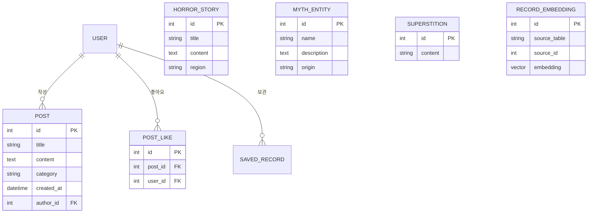

### Neo4j GraphDB 관계도

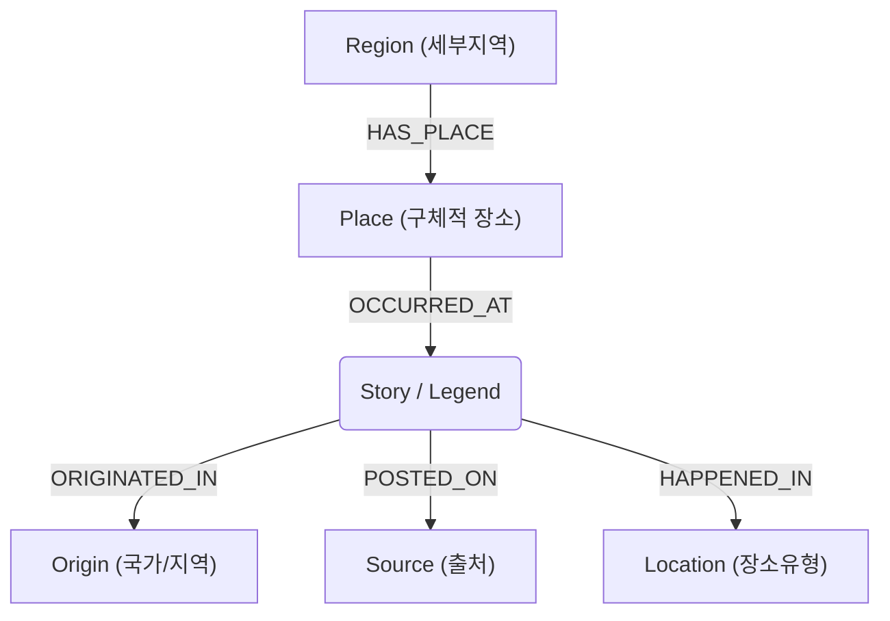

---

## 7. 주요 기능 시퀀스 다이어그램

프로젝트의 핵심 비즈니스 로직이 구현된 4가지 주요 기능에 대한 앱별 시퀀스 다이어그램입니다.

### 7.1. 기록 열람실 (LangGraph 챗봇)

기록 열람실에서 사용자 입력 의도를 분류하고, 검색(Semantic + Keyword)과 추천, 생성, 평가, 낭독(TTS) 흐름을 분기하여 처리하는 LangGraph 기반 파이프라인입니다.

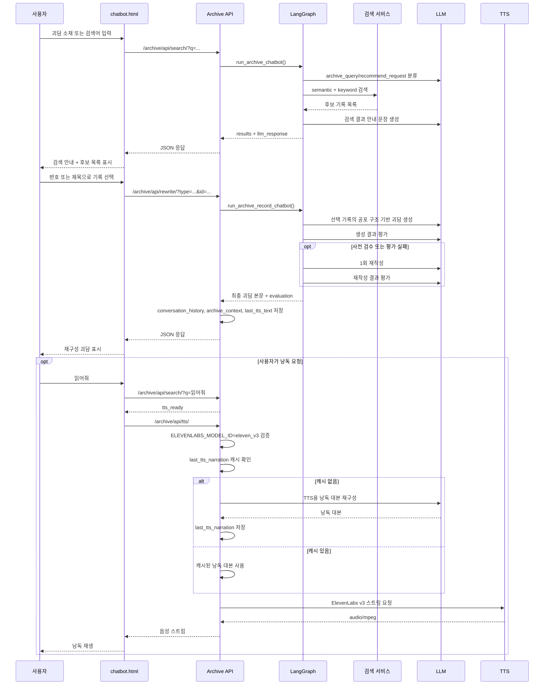

### 7.2. 지역 정보실 (Map UI & GraphDB 연동)

Neo4j GraphDB와 연동하여 지도 위에서 특정 지역의 괴담 및 장소 목록을 동적으로 렌더링하고 본문을 조회하는 흐름입니다.

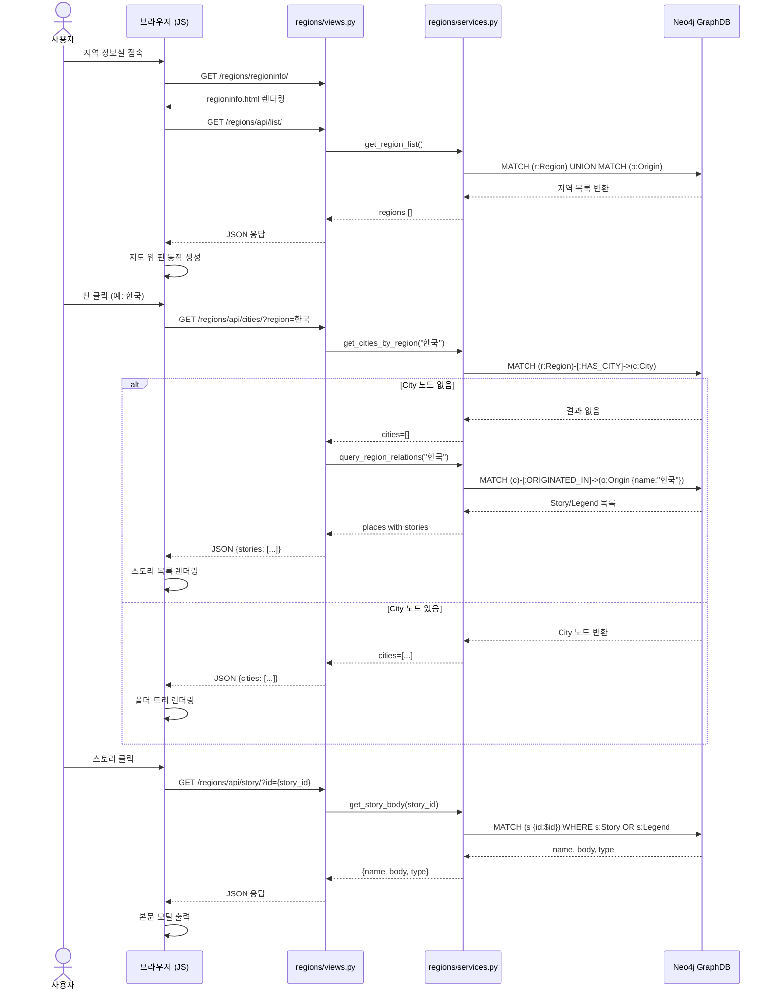

### 7.3. 신규 기록실 (AI 괴담 창작)

사용자가 제공한 키워드를 기반으로 LLM을 활용해 새로운 괴담을 창작하고, 생성된 데이터를 DB에 저장하는 흐름입니다.

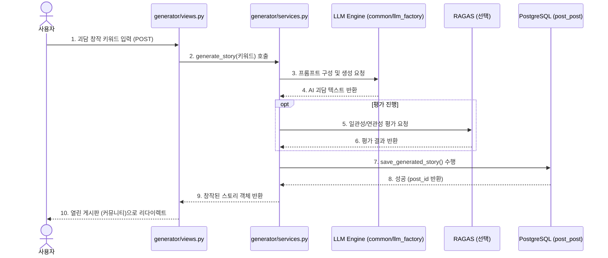

### 7.4. 사용자 인증 (로그인/회원가입)

보안을 위해 Django 내장 Session Auth를 사용하여 회원을 관리하고 인증 상태를 유지하는 흐름입니다.

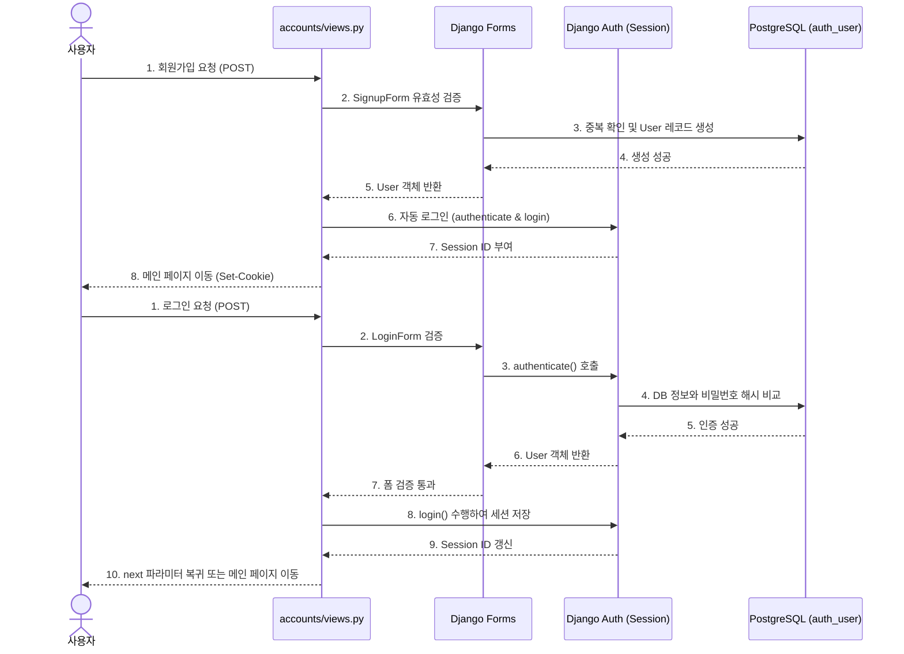

### 7.5. 열린 게시판 (커뮤니티 CRUD)

사용자가 직접 작성하는 열린 게시판의 작성, 상세 조회, 수정, 삭제 및 추천 기능을 PostgreSQL(`post_post`, `post_like`)에 저장/처리하는 흐름입니다.

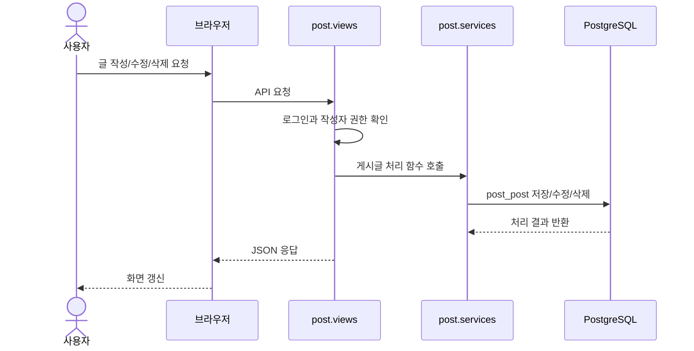

### ## 10. 데이터베이스 설계 (PostgreSQL 및 pgvector)

서비스 데이터의 안정적인 저장과 조회를 위해 PostgreSQL을 주 데이터베이스로 사용하며, 원본 괴담 및 외부 수집 데이터를 체계적으로 적재하고 pgvector를 활용하여 관리합니다.

---�은 `static/css/styles.css`, `static/js/flicker.js`에서 관리합니다.  
HTML 파일을 직접 여는 방식이 아니라 Django URLConf와 View를 통해 페이지를 렌더링합니다.

### 화면 연결 구조

```text
Browser 요청
        ↓
config/urls.py
        ↓
각 app/urls.py
        ↓
각 app/views.py
        ↓
templates/*.html 렌더링
        ↓
static/css, static/js, images 적용
        ↓
사용자 화면 출력

```

### 주요 페이지 및 UI 구현 특징

#### 메인 페이지

<div align="center">
  
</div>

- URL: /
- Template: templates/archive/index.html
- 서비스 진입 화면
- 로그인 상태에 따라 LOGIN / LOGOUT 표시 변경

#### 기록 열람실

<div align="center">
  
</div>

- URL: /archive/chatbot/
- Template: templates/archive/chatbot.html
- 괴담/기록 검색 화면
- 터미널 로그 형태의 대화형 UI 적용
- 사용자가 입력한 키워드를 기반으로 기록 검색 흐름 구성

#### 금기 자료실

<div align="center">
  
</div>

- URL: /archive/archive/
- Template: templates/archive/archive.html
- superstitions DB 목록 조회
- 오늘의 금기 조회 기능

#### 신규 기록실

<div align="center">
  
</div>

- URL: /generator/storymaker/
- Template: templates/generator/storymaker.html
- 괴담 생성을 위한 입력 폼 제공
- 게시 성공 시 열린 게시판 창작담 탭으로 이동

#### 열린 게시판

<div align="center">
  
</div>

- URL: /post/community/
- Template: templates/post/community.html
- 게시글 목록, 작성, 상세 조회 기능 제공
- 본인 글일 경우 수정/삭제 버튼 표시

#### 지역 정보실

<div align="center">
  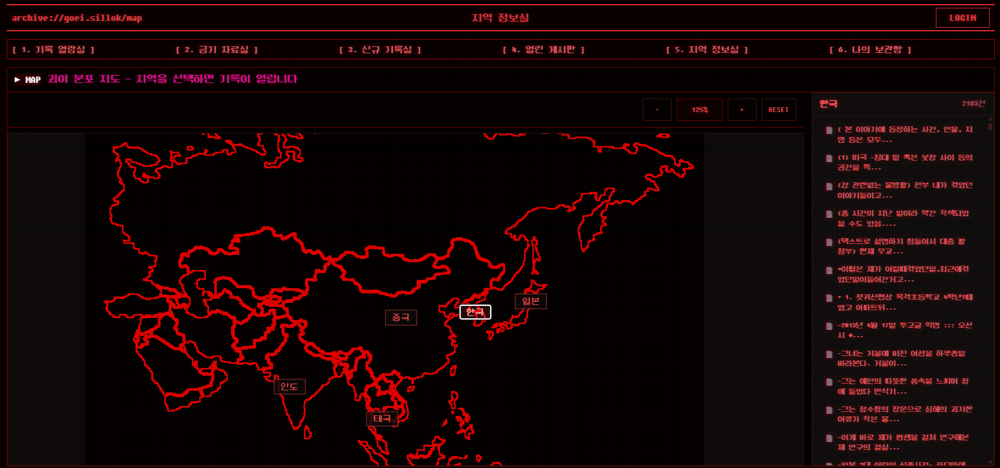
</div>

- URL: /regions/regioninfo/
- Template: templates/regions/regioninfo.html
- 지역 지도 기반 정보 화면
- 지도 이미지와 확대/축소/초기화 UI 구성
- 지역 기반 괴담/장소/관계 탐색 화면으로 사용

#### 로그인

<div align="center">
  
</div>

- URL: /accounts/login/
- Template: templates/accounts/login.html
- 로그인 Form 제공
- 인증 ### 12.1. 로그인 / 회원가입 및 보안

Django 기본 Session 인증 방식을 사용합니다.  
HTML 템플릿 기반 구조에 맞춰 DRF Token 방식 대신 Django Session으로 로그인 상태를 관리합니다.  
`request.user`, `@login_required`, CSRF Token을 사용해 인증이 필요한 페이지와 요청을 보호합니다.

### 인증 흐름

```text
> 회원가입 인증흐름

회원가입 Form POST
        ↓
SignupForm 검증
        ↓
User 생성
        ↓
authenticate / login
        ↓
Django Session 저장
        ↓
로그인 상태 유지
```

```text
> 로그인 인증흐름

로그인 Form POST
        ↓
LoginForm 검증
        ↓
authenticate
        ↓
login(request, user)
        ↓
Django Session 저장
        ↓
로그인 상태 유지
```

### 구현 기능

회원가입

- 아이디 중복 검사
- 비밀번호 8자 이상 검사
- 비밀번호 확인 일치 검사
- 회원가입 성공 시 자동 로그인
- next 파라미터가 있으면 안전한 URL 검증 후 이동

로그인

- 아이디 / 비밀번호 기반 인증
- 로그인 성공 시 Session 생성
- 로그인 실패 시 에러 메시지 출력
- next 파라미터 지원
- 비로그인 사용자가 보호 페이지 접근 시 로그인 페이지로 이동

로그아웃

- 현재 Session 삭제
- 메인 페이지로 리다이렉트

마이페이지 보호

- @login_required 사용
- 비로그인 접근 시 /accounts/login/?next=/accounts/mypage/ 이동
- 로그인 후 원래 목적지로 복귀

---

### 12.2. 기록 열람실 

기록 열람실 챗봇은 단순한 키워드 검색을 넘어, **LangGraph**를 활용하여 사용자의 의도(`intent`)에 따라 검색, 추천, 대화, 낭독, 생성 등 복합적인 AI 파이프라인을 동적으로 라우팅하여 제공합니다.

#### 1) 챗봇 API 및 LangGraph 처리 흐름
입력 의도(`intent`)를 분석하여 검색(`search_node`), 추천(`recommend_node`), 대화(`general_chat_node`), 낭독(`tts_node`) 등으로 분기합니다. 기록이 선택되면 `/archive/api/rewrite/`를 통해 선택 기록 기반의 괴담을 재구성(`generate_node`)하고, 자체 평가(`evaluation_node`)를 거칩니다.

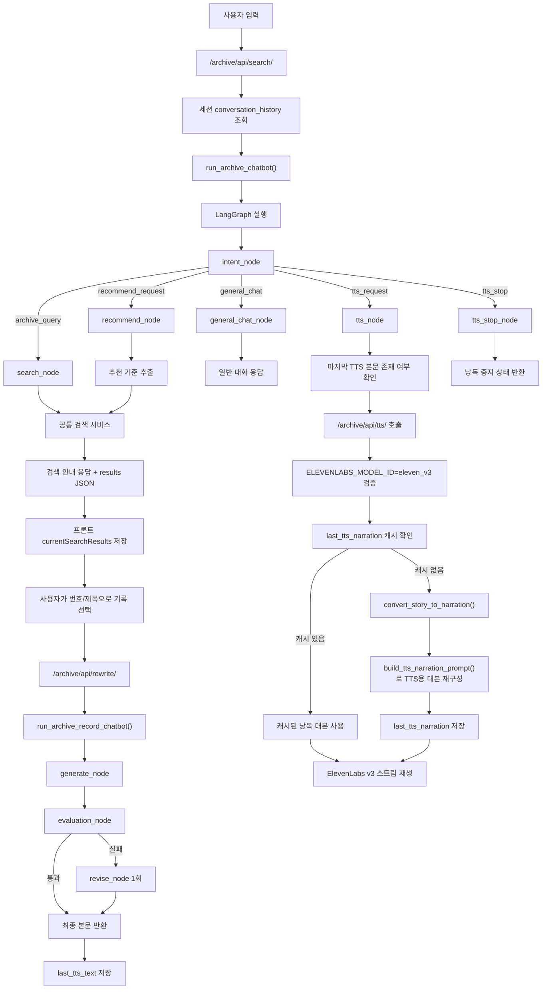

#### 2) 검색 및 추천 전략
- **통합 검색**: 의미 기반 검색(`pgvector`), 명시적 키워드 검색(PostgreSQL), 그리고 연관 키워드 확장(Neo4j)을 결합하여 결과를 반환합니다.
- **추천 검색**: 이전 대화, 최근 선택 기록, 생성 본문 등을 종합해 "비슷한 거 찾아줘", "그거 말고" 등 모호한 추천이나 제외 조건을 처리합니다.

#### 3) 생성 및 세션 연동
- 사용자가 선택한 원본 기록의 사건과 문장을 베끼지 않고, 핵심 공포 구조만 추출해 익명 커뮤니티 게시글형 괴담을 생성합니다.
- 서버의 세션(`conversation_history`, `archive_context`)과 프론트엔드의 `sessionStorage`를 나누어 안전하게 탐색 상태를 유지합니다.

---

### 12.3. AI 괴담 생성 

1. **사용자 요청**: `generator/storymaker/` 페이지에서 새로운 괴담 생성을 위한 키워드 입력 후 요청
2. **View-Service 라우팅**: `generator.views`가 요청을 받아 `generator.services.generate_story` 호출
3. **LLM 호출**: Service 내부에서 `common.llm_factory`를 이용해 모델 연결 후 프롬프트 기반 괴담 생성
4. **결과 평가 (선택적)**: RAGAS를 활용하여 생성된 이야기의 일관성/연관성 등을 평가
5. **저장 및 응답**: 생성 결과(`save_generated_story`)를 DB에 저장한 뒤, 화면에 결과를 반환하거나 열린 게시판으로 사용자를 유도

---

### 12.4. 지역 정보실 

**지역 정보실**은 Neo4j GraphDB와 연동하여 국가 및 지역별 관련 괴이 기록(Story/Legend)의 유기적인 관계를 지도 UI 기반으로 시각적으로 탐색하는 서비스입니다.
Django View를 거쳐 드래그 및 줌(Zoom) 기능이 지원되는 반응형 지도 화면을 렌더링하고, JavaScript `fetch()`와 Cypher Query 기반 API 비동기 조회를 통해 그래프 데이터를 실시간 가공하여 동적 스토리 목록으로 제공합니다.

### 데이터 흐름

`/regions/api/list/` API 호출 (초기 핀 배치 및 건수 집계)
        ↓
지도 핀 클릭 또는 맵 조작
        ↓
`/regions/api/cities/?region={지역명}` API 비동기(fetch) 요청
        ↓
`regions.services`에서 Neo4j `ORIGINATED_IN` 기반 조회
        ↓
지역별 스토리/레전드 목록 렌더링
        ↓
항목 클릭 시 `/regions/api/story/?id={id}` 본문 조회 및 모달 출력

### 주요 기능 및 UI 인터랙션

- **초기 핀 자동 배치**: 페이지 진입 시 Neo4j에서 `Region` 및 `Origin` 노드를 조회하여 지역 목록을 수집하고, 지리적 좌표 상수(`PIN_POSITIONS`) 기반으로 지도 위에 액티브 핀 버튼을 동적으로 매핑합니다.
- **드래그 & 줌 (Pan & Zoom)**: 바닐라 자바스크립트를 활용한 포인터 이벤트(Pointer Events) 제어로 스케일(scale)과 좌표값(translate)을 변환하여 자유로운 지도 탐색이 가능합니다. 툴바 내 +, -, RESET 버튼으로 55%~220% 범위의 줌 조절을 지원합니다.
- **지역별 스토리 목록 조회**: 핀 클릭 시 `ORIGINATED_IN` 관계를 역방향 탐색하여 해당 국가/지역에 연결된 `Story`/`Legend` 노드를 조회합니다. 본문(body)이 존재하는 항목만 필터링하여 반환하며, `Story` 노드(목격담)를 `Legend` 노드(신화/전설) 보다 우선 정렬하여 노출합니다.
- **괴담 본문 상세 모달**: 목록 내 항목 클릭 시 `/regions/api/story/?id={id}` API를 호출하여 원본 본문을 조회합니다. `Story`/`Legend` 노드 타입 구분 없이 단일 쿼리로 처리하며, 데이터 내 불필요한 스크립트 노이즈(CSS keyframes 등)를 프론트엔드에서 감지하여 필터링하는 전처리가 적용되어 있습니다.

### 구현 표준 및 아키텍처 원칙

- **GraphDB 결합 구조**: 출처 기원 관계(`ORIGINATED_IN`)를 중심으로 `Origin` 노드에 연결된 `Story`/`Legend` 데이터를 조회하는 단일 Cypher 쿼리를 설계했습니다. 한국의 경우 DC인사이드 목격담 2,103건, 일본 296건, 인도 33건 등 국가별 데이터를 실시간 반환합니다.
- **서버-클라이언트 분산 설계**: View는 요청 파싱 및 JSON 응답만 담당하고, 실제 Neo4j Cypher 트랜잭션 처리는 `regions.services` 계층으로 완전 분리하여 캡슐화를 준수했습니다.
- **다이나믹 UX 구성**: HTML 전체 리프레시 없는 부드러운 전환을 위해 클라이언트 중심의 비동기 `fetch()` 통신과 Vanilla JS 기반 동적 DOM 제어 방식을 적용했습니다.| 마이페이지 접속 시 본인 저장 데이터(`horror_stories`, `superstitions` 연동) 바인딩 |
| **UI-01** | 글리치 효과 구동 | 랜덤 간격 대기(`flicker.js`) 시 콘솔 에러 없이 무작위 화면 글리치 및 랜덤 괴이 이미지 팝업 연출 |
| **UI-04** | 컴포넌트 내부 스크롤 | 신규 기록실/금기 자료실에서 리스트 출력 영역만 브라우저 스크롤과 독립적으로 구동 |
| **REG-01** | 지역 목록 정상 로드 | 지역 정보실 접속 시 `/regions/api/list/` 호출 → 39개 지역 반환, 지도 핀 정상 배치 확인 |
| **REG-02** | 한국 핀 클릭 → 목격담 목록 | 한국 핀 클릭 → 공포 목격담 2,000건 이상 표시, 첫 항목 `type=Story` 확인 |
| **REG-03** | 일본 핀 클릭 → 전설/요괴 목록 | 일본 핀 클릭 → 일본 신화/요괴 `Legend` 노드 296건 표시 확인 |
| **REG-04** | 인도/태국 등 소규모 지역 조회 | 인도 33건, 태국 3건 정상 반환, 본문 없는 항목 미노출 확인 |
| **REG-05** | 스토리 본문 모달 조회 | 목록 내 항목 클릭 → 모달 팝업 후 본문 텍스트 정상 출력, `Story`/`Legend` 타입 모두 확인 |
| **REG-06** | 지도 드래그 & 줌 인터랙션 | +/- 버튼 클릭 시 55%~220% 범위 줌 동작, 드래그로 지도 이동, RESET으로 초기 상태 복귀 확인 |
| **REG-07** | 없는 지역 조회 (경계값) | `region=남극` 등 데이터 없는 지역 요청 → 에러 없이 빈 목록 반환 확인 |
| **REG-08** | 빈 파라미터 요청 | `region` 파라미터 없이 API 호출 → `{"status": "empty"}` 반환 확인 |
| **AI-01** | LLM 자체 평가/재작성 | LangGraph 생성 후 자체 평가(`evaluation_node`) 점수 미달 시 1회 `revise` 노드 실행 및 결과물 확인 |
| **AI-02** | TTS 스트리밍 연동 중지 | ElevenLabs 스트리밍 재생 중 "멈춰/중지" 입력 시 프론트 BGM 및 음성 즉시 정지 확인 |�상에서 의도적으로 제외하여 시스템 리소스 효율을 최적화했습니다.

---

## 11. GraphDB 설계 (Neo4j)

관계형 조회가 유리한 지역, 괴담, 신화 존재 간의 상호 관계를 구조적으로 탐색하기 위해 Neo4j를 분리 구성했습니다.

### 활용 목적

단순 텍스트 검색을 넘어 특정 국가/지역에 얽힌 괴담과 신화 존재를 의미 기반으로 연결하고, 이를 지도 UI와 연동하여 시각적으로 탐색할 수 있는 "지역 정보실" 기능에 활용됩니다.

### 주요 노드

| 노드 | 설명 |
|---|---|
| `Story` | DC인사이드 공포 목격담, 한국 괴담 (2,140건) |
| `Legend` | 세계 신화/요괴 (927건) |
| `Origin` | 국가/지역 출처 노드 (한국, 일본, 인도 등 39개) |
| `Region` | 한국 세부 행정 지역 (서울, 부산 등 29개) |
| `Place` | 구체적 장소 (325개) |
| `Location` | 장소 유형 (학교, 병원, 산/숲 등) |
| `Countermeasure` | 대처법/금기 |

### 그래프 관계도

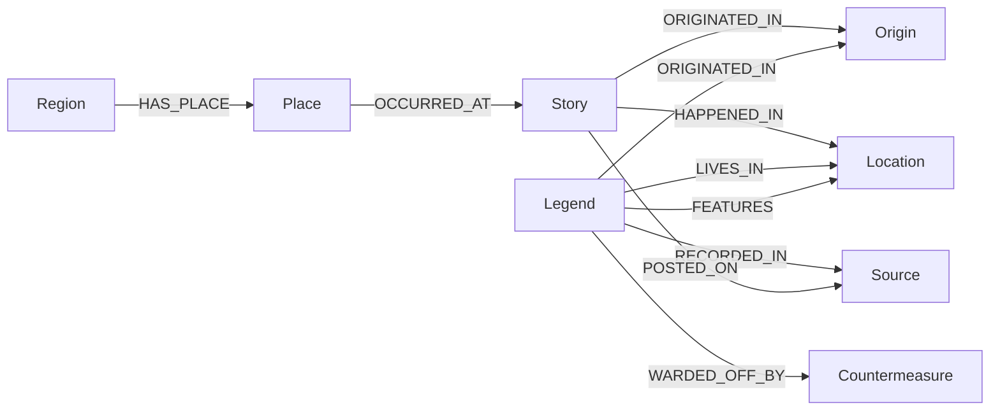

### 주요 관계 구조

| 관계 | 출발 노드 | 도착 노드 | 설명 |
|---|---|---|---|
| `ORIGINATED_IN` | Story / Legend | Origin | 괴담/전설의 국가 출처 연결 |
| `HAS_PLACE` | Region | Place | 지역 내 장소 연결 |
| `OCCURRED_AT` | Place | Story | 장소에서 발생한 사건 연결 |
| `HAPPENED_IN` | Story | Location | 사건 발생 장소 유형 연결 |
| `LIVES_IN` | Legend | Location | 신화 존재의 서식지 연결 |
| `WARDED_OFF_BY` | Legend | Countermeasure | 퇴치/대처법 연결 |
| `RECORDED_IN` | Legend | Source | 기록 출처 연결 |

### 지역 정보실 조회 흐름

지도 핀 클릭 (예: 한국)
        ↓
`/regions/api/cities/?region=한국`
        ↓
`MATCH (c)-[:ORIGINATED_IN]->(o:Origin {name: "한국"})`
`WHERE (c:Legend OR c:Story) AND c.body IS NOT NULL`
        ↓
지역별 괴담 목록 반환 (한국 2,103건 / 일본 296건 / 인도 33건 등)

---

## 12. 주요 애플리케이션 및 기능 구현

### 12.1. 지역 정보실 

**지역 정보실**은 Neo4j GraphDB와 연동하여 국가 및 지역별 관련 괴이 기록(Story/Legend)의 유기적인 관계를 지도 UI 기반으로 시각적으로 탐색하는 서비스입니다.
Django View를 거쳐 드래그 및 줌(Zoom) 기능이 지원되는 반응형 지도 화면을 렌더링하고, JavaScript `fetch()`와 Cypher Query 기반 API 비동기 조회를 통해 그래프 데이터를 실시간 가공하여 동적 스토리 목록으로 제공합니다.

### 데이터 흐름

`/regions/api/list/` API 호출 (초기 핀 배치 및 건수 집계)
        ↓
지도 핀 클릭 또는 맵 조작
        ↓
`/regions/api/cities/?region={지역명}` API 비동기(fetch) 요청
        ↓
`regions.services`에서 Neo4j `ORIGINATED_IN` 기반 조회
        ↓
지역별 스토리/레전드 목록 렌더링
        ↓
항목 클릭 시 `/regions/api/story/?id={id}` 본문 조회 및 모달 출력

### 주요 기능 및 UI 인터랙션

- **초기 핀 자동 배치**: 페이지 진입 시 Neo4j에서 `Region` 및 `Origin` 노드를 조회하여 지역 목록을 수집하고, 지리적 좌표 상수(`PIN_POSITIONS`) 기반으로 지도 위에 액티브 핀 버튼을 동적으로 매핑합니다.
- **드래그 & 줌 (Pan & Zoom)**: 바닐라 자바스크립트를 활용한 포인터 이벤트(Pointer Events) 제어로 스케일(scale)과 좌표값(translate)을 변환하여 자유로운 지도 탐색이 가능합니다. 툴바 내 +, -, RESET 버튼으로 55%~220% 범위의 줌 조절을 지원합니다.
- **지역별 스토리 목록 조회**: 핀 클릭 시 `ORIGINATED_IN` 관계를 역방향 탐색하여 해당 국가/지역에 연결된 `Story`/`Legend` 노드를 조회합니다. 본문(body)이 존재하는 항목만 필터링하여 반환하며, `Story` 노드(목격담)를 `Legend` 노드(신화/전설) 보다 우선 정렬하여 노출합니다.
- **괴담 본문 상세 모달**: 목록 내 항목 클릭 시 `/regions/api/story/?id={id}` API를 호출하여 원본 본문을 조회합니다. `Story`/`Legend` 노드 타입 구분 없이 단일 쿼리로 처리하며, 데이터 내 불필요한 스크립트 노이즈(CSS keyframes 등)를 프론트엔드에서 감지하여 필터링하는 전처리가 적용되어 있습니다.

### 구현 표준 및 아키텍처 원칙

- **GraphDB 결합 구조**: 출처 기원 관계(`ORIGINATED_IN`)를 중심으로 `Origin` 노드에 연결된 `Story`/`Legend` 데이터를 조회하는 단일 Cypher 쿼리를 설계했습니다. 한국의 경우 DC인사이드 목격담 2,103건, 일본 296건, 인도 33건 등 국가별 데이터를 실시간 반환합니다.
- **서버-클라이언트 분산 설계**: View는 요청 파싱 및 JSON 응답만 담당하고, 실제 Neo4j Cypher 트랜잭션 처리는 `regions.services` 계층으로 완전 분리하여 캡슐화를 준수했습니다.
- **다이나믹 UX 구성**: HTML 전체 리프레시 없는 부드러운 전환을 위해 클라이언트 중심의 비동기 `fetch()` 통신과 Vanilla JS 기반 동적 DOM 제어 방식을 적용했습니다.

---

### 12.2. AI 괴담 생성

1. **사용자 요청**: `generator/storymaker/` 페이지에서 새로운 괴담 생성을 위한 키워드 입력 후 요청
2. **View-Service 라우팅**: `generator.views`가 요청을 받아 `generator.services.generate_story` 호출
3. **LLM 호출**: Service 내부에서 `common.llm_factory`를 이용해 모델 연결 후 프롬프트 기반 괴담 생성
4. **결과 평가 (선택적)**: RAGAS를 활용하여 생성된 이야기의 일관성/연관성 등을 평가
5. **저장 및 응답**: 생성 결과(`save_generated_story`)를 DB에 저장한 뒤, 화면에 결과를 반환하거나 열린 게시판으로 사용자를 유도

---

### 12.3. 기록 열람실

기록 열람실 챗봇은 단순한 키워드 검색을 넘어, **LangGraph**를 활용하여 사용자의 의도(`intent`)에 따라 검색, 추천, 대화, 낭독, 생성 등 복합적인 AI 파이프라인을 동적으로 라우팅하여 제공합니다.

#### 1) 챗봇 API 및 LangGraph 처리 흐름
입력 의도(`intent`)를 분석하여 검색(`search_node`), 추천(`recommend_node`), 대화(`general_chat_node`), 낭독(`tts_node`) 등으로 분기합니다. 기록이 선택되면 `/archive/api/rewrite/`를 통해 선택 기록 기반의 괴담을 재구성(`generate_node`)하고, 자체 평가(`evaluation_node`)를 거칩니다.

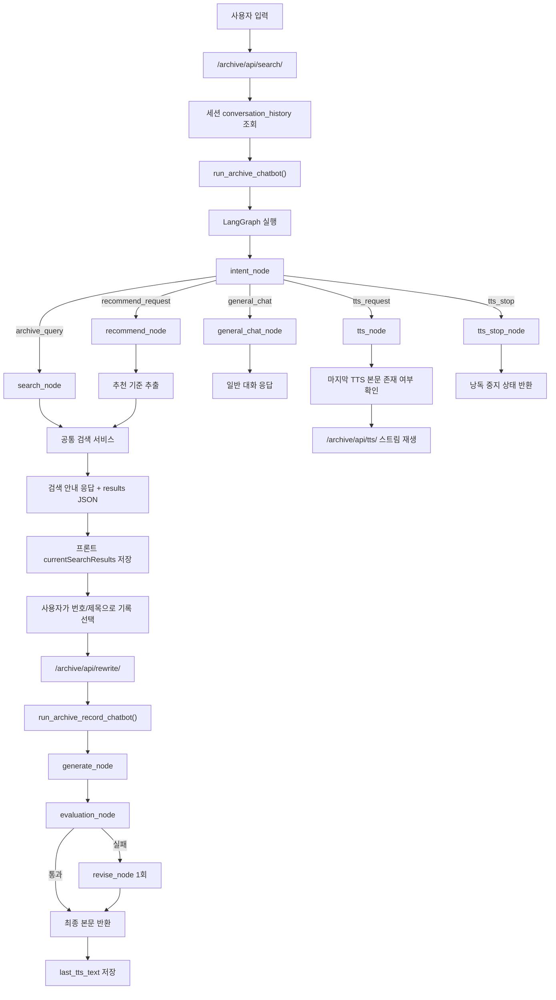

#### 2) 검색 및 추천 전략
- **통합 검색**: 의미 기반 검색(`pgvector`), 명시적 키워드 검색(PostgreSQL), 그리고 연관 키워드 확장(Neo4j)을 결합하여 결과를 반환합니다.
- **추천 검색**: 이전 대화, 최근 선택 기록, 생성 본문 등을 종합해 "비슷한 거 찾아줘", "그거 말고" 등 모호한 추천이나 제외 조건을 처리합니다.

#### 3) 생성 및 세션 연동
- 사용자가 선택한 원본 기록의 사건과 문장을 베끼지 않고, 핵심 공포 구조만 추출해 익명 커뮤니티 게시글형 괴담을 생성합니다.
- 서버의 세션(`conversation_history`, `archive_context`)과 프론트엔드의 `sessionStorage`를 나누어 안전하게 탐색 상태를 유지합니다.

### 12.4. 로그인 / 회원가입 및 보안

Django 기본 Session 인증 방식을 사용합니다.  
HTML 템플릿 기반 구조에 맞춰 DRF Token 방식 대신 Django Session으로 로그인 상태를 관리합니다.  
`request.user`, `@login_required`, CSRF Token을 사용해 인증이 필요한 페이지와 요청을 보호합니다.

### 인증 흐름

```text
> 회원가입 인증흐름

회원가입 Form POST
        ↓
SignupForm 검증
        ↓
User 생성
        ↓
authenticate / login
        ↓
Django Session 저장
        ↓
로그인 상태 유지
```

```text
> 로그인 인증흐름

로그인 Form POST
        ↓
LoginForm 검증
        ↓
authenticate
        ↓
login(request, user)
        ↓
Django Session 저장
        ↓
로그인 상태 유지
```

### 구현 기능

회원가입

- 아이디 중복 검사
- 비밀번호 8자 이상 검사
- 비밀번호 확인 일치 검사
- 회원가입 성공 시 자동 로그인
- next 파라미터가 있으면 안전한 URL 검증 후 이동

로그인

- 아이디 / 비밀번호 기반 인증
- 로그인 성공 시 Session 생성
- 로그인 실패 시 에러 메시지 출력
- next 파라미터 지원
- 비로그인 사용자가 보호 페이지 접근 시 로그인 페이지로 이동

로그아웃

- 현재 Session 삭제
- 메인 페이지로 리다이렉트

마이페이지 보호

- @login_required 사용
- 비로그인 접근 시 /accounts/login/?next=/accounts/mypage/ 이동
- 로그인 후 원래 목적지로 복귀

---

## 13. 테스트 및 평가

평가는 단일 기능의 동작 여부만 보지 않고 인증/세션, 정적 레이아웃 유지, 외부 API 및 AI 연동, 최종 게시판 매핑 등의 흐름을 분리해 확인했습니다.

### 주요 평가 기준

| 구분 | 평가 항목 | 통과 기준 |
|:---|:---|:---|
| **회원 관리/보안** | 로그인, 회원가입, 로그아웃, 탈퇴 | 정상적인 세션의 생성 및 파기, 폼 에러 노출, CSRF 보안 토큰 작동 확인 |
| **마이페이지 연동** | 보관함(금기/괴담), 작성 글 연동 | DB 연동을 통한 사용자별 정확한 데이터 바인딩 확인 |
| **Web UI / Effects** | 글리치 효과, 동적 스크롤, 랜덤 이미지 | 브라우저 에러 없는 정적 파일 연동 및 CSS 레이아웃 유지 연출 |
| **통합 연동 (E2E)** | 비로그인 제어, Next 파라미터, 게시판 연동 | 페이지 간 유기적인 데이터 매핑 흐름 및 보호된 라우팅 리다이렉트 확인 |
| **지역 데이터 로드** | 지도 핀 자동 배치, 지역 목록 API | 39개 지역 Origin/Region 노드 정상 반환 및 핀 렌더링 확인 |
| **지역별 괴담 조회** | 핀 클릭 시 스토리 목록 출력 | Neo4j ORIGINATED_IN 기반 조회로 지역별 괴담 정상 반환 |
| **본문 상세 조회** | 스토리 클릭 시 본문 모달 출력 | Story/Legend 노드 타입 관계없이 body 정상 반환 |
| **지도 인터랙션** | 드래그, 줌, 리셋 조작 | 브라우저 에러 없이 Pan & Zoom 정상 동작 |
| **예외 처리** | 없는 지역, 빈 파라미터 요청 | 에러 없이 빈 결과 또는 empty status 반환 |

### 대표 테스트 시나리오

| ID | 시나리오명 | 검증 포인트 및 세부 내용 |
|:---:|:---|:---|
| **SIGN-01** | 정상 회원가입 및 로그인 | 규칙에 맞는 폼 입력 시 `auth_user` 생성 및 즉시 자동 로그인되어 메인 리다이렉트 |
| **AUTH-02** | 로그인 실패 처리 | 틀린 계정 정보 입력 시 폼 에러 메시지 노출 및 세션 생성 차단 |
| **AUTH-03** | CSRF 보안 검증 | 변조되거나 누락된 CSRF 토큰 전송 시 `403 Forbidden` 발생 및 접근 차단 |
| **MY-02** | 보관함 데이터 매핑 | 마이페이지 접속 시 본인 저장 데이터(`horror_stories`, `superstitions` 연동) 바인딩 |
| **UI-01** | 글리치 효과 구동 | 랜덤 간격 대기(`flicker.js`) 시 콘솔 에러 없이 무작위 화면 글리치 및 랜덤 괴이 이미지 팝업 연출 |
| **UI-04** | 컴포넌트 내부 스크롤 | 신규 기록실/금기 자료실에서 리스트 출력 영역만 브라우저 스크롤과 독립적으로 구동 |
| **REG-01** | 지역 목록 정상 로드 | 지역 정보실 접속 시 `/regions/api/list/` 호출 → 39개 지역 반환, 지도 핀 정상 배치 확인 |
| **REG-02** | 한국 핀 클릭 → 목격담 목록 | 한국 핀 클릭 → 공포 목격담 2,000건 이상 표시, 첫 항목 `type=Story` 확인 |
| **REG-03** | 일본 핀 클릭 → 전설/요괴 목록 | 일본 핀 클릭 → 일본 신화/요괴 `Legend` 노드 296건 표시 확인 |
| **REG-04** | 인도/태국 등 소규모 지역 조회 | 인도 33건, 태국 3건 정상 반환, 본문 없는 항목 미노출 확인 |
| **REG-05** | 스토리 본문 모달 조회 | 목록 내 항목 클릭 → 모달 팝업 후 본문 텍스트 정상 출력, `Story`/`Legend` 타입 모두 확인 |
| **REG-06** | 지도 드래그 & 줌 인터랙션 | +/- 버튼 클릭 시 55%~220% 범위 줌 동작, 드래그로 지도 이동, RESET으로 초기 상태 복귀 확인 |
| **REG-07** | 없는 지역 조회 (경계값) | `region=남극` 등 데이터 없는 지역 요청 → 에러 없이 빈 목록 반환 확인 |
| **REG-08** | 빈 파라미터 요청 | `region` 파라미터 없이 API 호출 → `{"status": "empty"}` 반환 확인 |

### E2E 테스트 (통합 흐름)

| ID | 목적 | 흐름 |
|:---:|:---|:---|
| **INT-01** | 비로그인 유저 접근 제한 | 비로그인 상태로 접근 -> `로그인 페이지(?next=)`로 리다이렉트 |
| **INT-02** | 로그인 후 파라미터 복귀 | 차단 후 로그인 성공 -> 메인 페이지가 아닌 원래 목적지로 자동 이동 |
| **INT-03** | AI 괴담 창작담 게시판 연동 | 신규 기록실 결과물 -> `게시판 게시` 클릭 -> 커뮤니티 작성 폼으로 유실 없이 매핑 |
| **INT-04** | 지역 핀 클릭 → 본문 조회 흐름 | 지도 접속 → 한국 핀 클릭 → 목록 로드 → 스토리 클릭 → 본문 모달 출력까지 API 정상 동작 확인 |
| **INT-05** | Neo4j 연결 장애 시 에러 처리 | Neo4j 미기동 상태에서 핀 클릭 → 오류 메시지 출력, 페이지 크래시 없음 확인 |
| **INT-06** | 대용량 데이터 스크롤 | 한국(2,103건) 목록 출력 후 패널 내부 스크롤 독립 동작, 브라우저 전체 스크롤 미영향 확인 |

### 개발 로드맵 (우선순위)

| ID | 진행 항목 | 상세 내용 |
|:---:|:---|:---|
| **P-01** | 인증 및 보안 기반 마련 | `accounts` 회원가입/로그인/세션, CSRF 처리 |
| **P-02** | 오컬트 UI 연출 적용 | 정적 자산(CSS/JS) 연동 및 `flicker.js` 화면 레이아웃 안정성 점검 |
| **P-03** | 마이페이지 DB 매핑 | 사용자 정보, 보관함 데이터(`PostgreSQL`) 바인딩 점검 |
| **P-04** | 컴포넌트 내부 스크롤 | 금기 자료실/신규 기록실 내 대량 텍스트 출력부 독자 스크롤 최적화 |
| **P-05** | 통합 권한/매핑 점검 | 비로그인 권한 제어 및 `AI 생성기` -> `커뮤니티` 연동 데이터 매핑 흐름 검증 |

---

## 14. 기대 효과 및 결론

### 기대 효과

- **데이터 기반 아카이빙**: 파편화된 지역 괴담과 금기 지식을 효율적으로 탐색할 수 있습니다.
- **창작 활성화**: 단순 게시판을 넘어 LLM 기반 스토리 생성 기능을 제공하여 유저의 참여도와 콘텐츠 생산력을 극대화합니다.
- **몰입감 강화**: 웹 기술(JS 글리치, 픽셀 폰트, 오디오 루프 등)을 적절히 혼합하여 기존 서비스들과 차별화된 오싹한 분위기와 재미를 선사합니다.

### 결론

본 프로젝트는 Django의 풀스택 웹 개발 프레임워크 구조 위에 RDB(PostgreSQL)와 GraphDB(Neo4j)를 하이브리드 형식으로 적용했습니다. 각 데이터 특성에 맞는 DB 구성과 AI 기술의 연계로, 사용자 친화적이고 독창적인 웹서비스 아키텍처를 성공적으로 구현했습니다.

---

## 15. 팀원 회고

### [김민경]

이번 프로젝트에서 가장 어려웠던 점은 AI가 원하는 분위기와 문체를 안정적으로 따라오게 만드는 것이었다. 처음부터 평가와 재생성 흐름을 설계해 생성 결과의 안정성을 높이고자 했지만, 프롬프트가 길어질수록 오히려 핵심 지시가 흐려지는 문제가 있었다. 특히 괴담이 실제 커뮤니티 후기글처럼 보이기보다 문학적인 단편소설처럼 생성되는 경우가 있어, 문체 기준을 더 명확히 정리하고 중복되는 지시를 줄이는 방식으로 개선했다. 이 과정을 통해 AI 기능은 단순히 생성 모델을 호출하는 것만으로는 충분하지 않고, 원하는 결과를 얻기 위한 프롬프트 구조와 검수 기준을 계속 다듬어야 한다는 점을 배웠다. 또한 일정이 예상보다 밀리는 순간들이 있었기 때문에, 남은 작업을 계속 확인하며 우선순위를 다시 정리하는 과정도 중요했다. 모든 기능을 완벽하게 가져가기보다는 현재 상황에서 꼭 필요한 부분부터 마무리하려고 했고, 팀원들과 진행 상황을 맞춰 보며 프로젝트를 끝까지 완성하는 경험을 할 수 있었다.

### [권환성]

이번 프로젝트에서 Web UI와 사용자 인증 기능을 구현하며 화면과 서버 기능이 긴밀하게 연결된다는 점을 배웠습니다.
특히 팀원 간 파일 구조와 URL 규칙을 미리 통일하는 것이 원활한 협업에 중요하다고 느꼈습니다.
로그인과 게시글 관리 기능을 통해 세션, CSRF, 작성자 권한 검증의 중요성도 이해할 수 있었습니다.
또한 시각적인 연출뿐만 아니라 사용성과 안정성을 함께 고려하는 경험을 쌓았습니다.
앞으로는 더욱 완성도 높은 서비스를 만들고 싶습니다.

### [김한솔]

이번 프로젝트에서 데이터 수집 및 전처리, Neo4j GraphDB 설계와 적재, 벡터 임베딩, 그리고 지역 정보실 구현을 담당했습니다.

처음에는 크롤링한 데이터를 그대로 Neo4j에 넣으면 될 것이라고 생각했는데, 막상 지역 정보실을 구현하다 보니 데이터 품질 문제가 생각보다 심각했습니다. 나무위키에서 가져온 mythology 데이터에 게임 등장 목록, 애니 캐릭터 설명 같은 내용이 섞여 있었고, DC인사이드 데이터는 Neo4j에는 있었지만 Region 노드와 연결이 전혀 되어 있지 않아 지역 정보실에서 아무것도 뜨지 않는 문제가 있었습니다.

결국 mythology 데이터에서 비공포 항목 96개를 직접 필터링하고, Neo4j 조회 방식을 Region 체인 기반에서 ORIGINATED_IN 기반으로 전면 전환했습니다. 덕분에 한국 2,103건, 일본 296건 등 지역별 데이터가 정상적으로 조회되기 시작했을 때 꽤 뿌듯했습니다.

GraphDB를 처음 설계할 때는 관계만 잘 만들면 된다고 생각했지만, 실제로는 데이터 품질이 구조보다 훨씬 중요하다는 것을 느꼈습니다. 쿼리가 아무리 잘 짜여 있어도 데이터가 없거나 깨져 있으면 의미가 없었습니다. 데이터 파이프라인을 처음부터 더 꼼꼼히 검증하면서 구축했으면 어땠을까 하는 아쉬움이 남습니다.

### [박송원]

이번 프로젝트에서 LLM이 생성하는 괴담이 그냥 답변에 그치지 않고, 실제 인터넷 커뮤니티 글의 생생한 실화처럼 느껴지도록 프롬프트 엔지니어링에 집중했습니다. 특히 작위적인 소설투를 배제하고 구어체를 적용하는 것과, 'Show, don\'t tell' 원칙에 따라 귀신이나 금기를 직접적으로 설명하지 않고 일상적인 행동과 심리를 통해 은연중에 공포를 유발하도록 세밀한 제약을 설계하는 과정이 가장 큰 고민이자 흥미로운 도전이었습니다. 사용자가 입력하는 단편적인 조건들만으로도 나름대로 현실감 넘치고 무서운 괴담이 자동 생성되는 파이프라인을 완성할 수 있었고, 고도화된 프롬프트 설계를 희망하게 되면서 고도화된 프롬프트 설계가 서비스 품질에 얼마나 큰 영향을 미치는지 다시 한번 깨닫는 소중한 경험이었습니다.

### [이재강]

- [회고 내용 작성]
