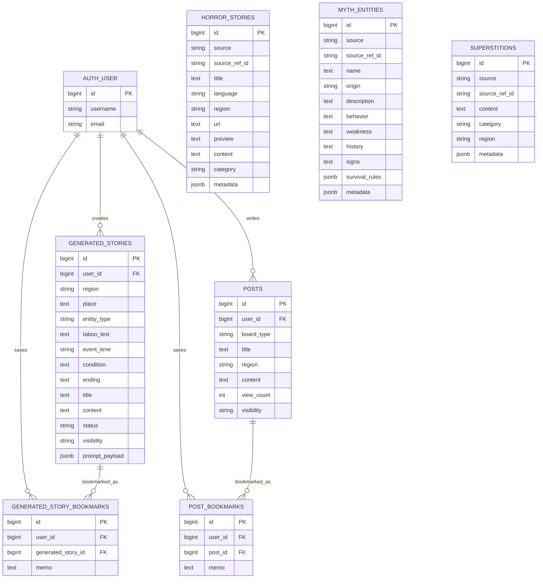

# PostgreSQL ERD 계획

## 1. 목적

이 문서는 괴이 실록 서비스에서 PostgreSQL이 담당할 데이터 구조를 설계하기 위한 ERD 계획서이다.

PostgreSQL은 회원, 게시글, 생성 괴담, 검색용 괴담/신화/미신 데이터를 저장한다. Neo4j는 지역, 장소, 괴이, 금기, 괴담 사이의 그래프 관계 조회 용도로 분리한다.

테이블별 역할과 컬럼 의미는 별도 설명 문서인 [`postgresql_erd_explanation.md`](./postgresql_erd_explanation.md)에서 확인한다.

PostgreSQL 구현 참고용 SQL과 적재 계획은 [`../PostgreSQL/`](../PostgreSQL/) 폴더에서 관리한다.

## 2. 설계 기준 자료

### 화면/기능 문서

| 파일 | ERD 반영 내용 |
| --- | --- |
| `docs/service-planning.md` | 서비스 범위, MVP 기능, 데이터 구조 초안 |
| `docs/requirements-definition.csv` | 기능 요구사항, PostgreSQL/Neo4j 역할 분리 |
| `docs/screen-design.md` | 화면별 템플릿, URL, 기능 흐름 |

### PostgreSQL 후보 데이터

| 파일 | 개수 | 주요 컬럼 | 용도 |
| --- | ---: | --- | --- |
| `docs/verified_korean_horror_master.json` | 224 | `id`, `title`, `url`, `source`, `category`, `region`, `content` | 검증된 한국 괴담/도시전설 데이터 |
| `docs/ultimate_global_mythology_1000.json` | 1016 | `id`, `name`, `origin`, `habitats`, `behavior`, `weakness`, `source_site`, `source_url`, `history`, `signs`, `survival_rules`, `description` | 신화/전설/괴이 존재 데이터 |
| `docs/misin.json` | 214 | `id`, `content` | 미신/금기 문장 데이터 |

## 3. PostgreSQL 담당 범위

PostgreSQL에 저장할 데이터는 다음과 같다.

```text
회원/인증
목격담/창작담 게시글
AI 생성 괴담
나의 보관함
괴담/공포 이야기 원천 데이터
신화/전설/괴이 존재 데이터
미신 문장 데이터
```

## 4. PostgreSQL 제외 범위

다음 항목은 PostgreSQL ERD의 핵심 테이블로 설계하지 않는다.

```text
Neo4j nodes.csv
Neo4j edges.csv
Graph RAG
embedding / vector search
LLM 호출 상세 로그
댓글, 추천, 신고
검색용 키워드 테이블
```

`nodes.csv`와 `edges.csv`는 Neo4j 적재용 데이터이므로 PostgreSQL ERD에서는 제외한다. 단, PostgreSQL의 괴담/금기/지역 데이터가 Neo4j 노드와 연결될 필요가 생기면 추후 `graph_node_id` 같은 참조 컬럼만 추가하는 방식을 검토한다.

`docs/global_horror_database.json`은 PostgreSQL 초기 설계 대상에서 제외한다. 해당 파일을 삭제하거나 사용하지 않는 방향이면, 괴담 원천 데이터는 `docs/verified_korean_horror_master.json`을 기준으로 적재한다.

## 5. 화면별 테이블 매핑

| 화면 | App | 필요한 테이블 |
| --- | --- | --- |
| 시작 화면 | `archive` | 직접 저장 없음, 검색 진입 |
| 기록 열람실 | `archive` | `horror_stories`, `myth_entities`, `superstitions` |
| 금기 자료실 | `archive` | `superstitions` |
| 신규 기록실 | `generator` | `generated_stories`, Django `auth_user` |
| 열린 게시판 | `post` | `posts`, Django `auth_user` |
| 지역 정보실 | `regions` | PostgreSQL 저장 대상 아님, 상세 관계는 Neo4j |
| 로그인/회원가입 | `accounts` | Django 기본 `auth_user` |
| 나의 보관함 | `accounts` | `generated_story_bookmarks`, `post_bookmarks` |

## 6. 1차 테이블 후보

### accounts 영역

| 테이블 | 목적 |
| --- | --- |
| `auth_user` | Django 기본 User 테이블 |

MVP에서는 Django 기본 `auth_user` 사용을 우선한다. 추가 프로필 정보가 필요하면 `user_profiles`를 별도로 둔다.

### archive 영역

| 테이블 | 목적 |
| --- | --- |
| `horror_stories` | 괴담/공포 이야기 원천 데이터 저장 |
| `myth_entities` | 신화/전설/괴이 존재 데이터 저장 |
| `superstitions` | `misin.json`의 미신/금기 문장을 원문 그대로 저장 |

### generator 영역

| 테이블 | 목적 |
| --- | --- |
| `generated_stories` | 사용자가 입력 조건으로 생성한 괴담 저장 |

### post 영역

| 테이블 | 목적 |
| --- | --- |
| `posts` | 목격담/창작담 게시글 저장 |

댓글, 추천, 신고는 MVP 제외이므로 1차 ERD에서는 만들지 않는다.

### 나의 보관함 영역

| 테이블 | 목적 |
| --- | --- |
| `generated_story_bookmarks` | 사용자가 저장한 AI 생성 괴담 연결 |
| `post_bookmarks` | 사용자가 저장한 게시글 연결 |

키워드는 원본 JSON에 없고 현재 사용 계획도 없으므로 `keywords`, `story_keywords`, `entity_keywords` 테이블은 만들지 않는다. 검색은 제목/본문 기반 PostgreSQL 검색으로 시작한다.

## 7. 주요 컬럼 초안

### horror_stories

`verified_korean_horror_master.json`을 저장하는 중심 테이블이다.

| 컬럼 | 타입 | 설명 |
| --- | --- | --- |
| `id` | `BIGSERIAL PK` | 내부 고유 ID |
| `source` | `VARCHAR(100)` | 출처 |
| `source_ref_id` | `VARCHAR(100)` | 원본 ID 또는 story_id |
| `title` | `TEXT` | 제목 |
| `language` | `VARCHAR(20)` | 언어, 기본값 `ko` |
| `region` | `VARCHAR(100)` | 화면 표시용 지역명 |
| `url` | `TEXT` | 원문 URL |
| `preview` | `TEXT` | 요약/미리보기, import 시 `content` 일부로 생성 가능 |
| `content` | `TEXT` | 전체 본문 |
| `category` | `VARCHAR(100)` | 분류 |
| `metadata` | `JSONB` | 원본 보존 또는 추후 확장 데이터 |
| `created_at` | `TIMESTAMPTZ` | 생성일 |
| `updated_at` | `TIMESTAMPTZ` | 수정일 |

주의: `url`은 원천 데이터 품질 확인 전까지 unique로 묶지 않는다. 대신 seed/import를 여러 번 실행해도 중복 적재되지 않도록 `source`, `source_ref_id` 조합은 unique로 둔다.

### myth_entities

| 컬럼 | 타입 | 설명 |
| --- | --- | --- |
| `id` | `BIGSERIAL PK` | 내부 고유 ID |
| `source` | `VARCHAR(100)` | 데이터셋 출처, 기본값 `ultimate_global_mythology_1000` |
| `source_ref_id` | `VARCHAR(100)` | 원본 ID |
| `name` | `TEXT` | 존재 이름 |
| `origin` | `VARCHAR(255)` | 기원/분류 |
| `description` | `TEXT` | 설명 |
| `behavior` | `TEXT` | 행동 |
| `weakness` | `TEXT` | 약점 |
| `history` | `TEXT` | 역사/전승 |
| `signs` | `TEXT` | 징후 |
| `survival_rules` | `JSONB` | 생존 규칙 리스트 |
| `source_site` | `VARCHAR(100)` | 출처 사이트 |
| `source_url` | `TEXT` | 출처 URL |
| `metadata` | `JSONB` | `habitats` 등 가변 데이터 |

### superstitions

`misin.json`은 별도 가공 없이 원문 문장 그대로 이 테이블에 저장한다.

| 컬럼 | 타입 | 설명 |
| --- | --- | --- |
| `id` | `BIGSERIAL PK` | 내부 고유 ID |
| `source` | `VARCHAR(100)` | 데이터셋 출처, 기본값 `misin` |
| `source_ref_id` | `VARCHAR(100)` | `misin.json` 원본 ID |
| `content` | `TEXT` | 미신/금기 문장 |
| `category` | `VARCHAR(100) NULL` | 추후 분류 |
| `region` | `VARCHAR(100) NULL` | 화면 표시용 지역명 |
| `metadata` | `JSONB` | 추후 확장 |

### generated_stories

| 컬럼 | 타입 | 설명 |
| --- | --- | --- |
| `id` | `BIGSERIAL PK` | 생성 괴담 ID |
| `user_id` | `BIGINT FK` | 작성자 |
| `region` | `VARCHAR(100)` | 사용자가 입력한 지역 |
| `place` | `TEXT` | 장소 |
| `entity_type` | `VARCHAR(100)` | 귀신, 요괴, 저주 등 |
| `taboo_text` | `TEXT` | 사용자가 입력한 금기 문장 |
| `event_time` | `VARCHAR(100)` | 발생 시간 |
| `condition` | `TEXT` | 발생 조건 |
| `ending` | `TEXT` | 결말 입력 |
| `title` | `TEXT` | 생성 결과 제목 |
| `content` | `TEXT` | 생성 결과 본문 |
| `status` | `VARCHAR(30)` | draft, saved 등 |
| `visibility` | `VARCHAR(30)` | private, public 등 |
| `prompt_payload` | `JSONB` | LLM 입력 조건 |
| `created_at` | `TIMESTAMPTZ` | 생성일 |
| `updated_at` | `TIMESTAMPTZ` | 수정일 |

### posts

| 컬럼 | 타입 | 설명 |
| --- | --- | --- |
| `id` | `BIGSERIAL PK` | 게시글 ID |
| `user_id` | `BIGINT FK` | 작성자 |
| `board_type` | `VARCHAR(30)` | witness, creation |
| `title` | `TEXT` | 제목 |
| `region` | `VARCHAR(100)` | 사용자가 입력한 지역 |
| `content` | `TEXT` | 본문 |
| `view_count` | `INTEGER` | 조회수 |
| `visibility` | `VARCHAR(30)` | public, private |
| `created_at` | `TIMESTAMPTZ` | 생성일 |
| `updated_at` | `TIMESTAMPTZ` | 수정일 |

### generated_story_bookmarks

| 컬럼 | 타입 | 설명 |
| --- | --- | --- |
| `id` | `BIGSERIAL PK` | 생성 괴담 보관 ID |
| `user_id` | `BIGINT FK` | 사용자 |
| `generated_story_id` | `BIGINT FK` | 저장한 생성 괴담 |
| `memo` | `TEXT` | 사용자 메모 |
| `created_at` | `TIMESTAMPTZ` | 저장일 |

제약:

```sql
UNIQUE (user_id, generated_story_id)
```

### post_bookmarks

| 컬럼 | 타입 | 설명 |
| --- | --- | --- |
| `id` | `BIGSERIAL PK` | 게시글 보관 ID |
| `user_id` | `BIGINT FK` | 사용자 |
| `post_id` | `BIGINT FK` | 저장한 게시글 |
| `memo` | `TEXT` | 사용자 메모 |
| `created_at` | `TIMESTAMPTZ` | 저장일 |

제약:

```sql
UNIQUE (user_id, post_id)
```

## 8. 주요 관계

```text
auth_user 1:N generated_stories
auth_user 1:N posts
auth_user 1:N generated_story_bookmarks
auth_user 1:N post_bookmarks

generated_stories 1:N generated_story_bookmarks
posts 1:N post_bookmarks
```

## 9. Mermaid ERD 초안

아래 Mermaid 코드는 Mermaid를 지원하는 Markdown 미리보기에서 ERD 그림으로 렌더링된다.

VS Code 기본 미리보기에서 코드블록으로만 보이면 `Markdown Preview Mermaid Support` 확장을 설치하거나, GitHub에 올린 뒤 Markdown 미리보기에서 확인한다.



## 10. PostgreSQL 제약 조건 계획

초기 제약 조건은 원천 데이터 재적재에 필요한 최소 범위만 강하게 잡는다.

| 대상 | 제약 |
| --- | --- |
| `horror_stories.url` | 중복 가능성이 있어 unique 보류 |
| `horror_stories.source + source_ref_id` | `UNIQUE` |
| `myth_entities.source + source_ref_id` | `UNIQUE` |
| `superstitions.source + source_ref_id` | `UNIQUE` |
| `generated_story_bookmarks.user_id + generated_story_id` | `UNIQUE` |
| `post_bookmarks.user_id + post_id` | `UNIQUE` |

## 11. JSONB 사용 기준

다음 데이터는 구조가 변할 수 있으므로 PostgreSQL `JSONB`로 보존한다.

```text
horror_stories.metadata
myth_entities.metadata
myth_entities.survival_rules
superstitions.metadata
generated_stories.prompt_payload
```

조회가 자주 발생하고 화면에서 직접 필터링해야 하는 값은 추후 일반 컬럼으로 승격한다.

## 12. Django 모델 작성 순서

1. `archive.models.HorrorStory`
2. `archive.models.MythEntity`
3. `archive.models.Superstition`
4. `generator.models.GeneratedStory`
5. `post.models.Post`
6. `accounts.models.GeneratedStoryBookmark`
7. `accounts.models.PostBookmark`

Django 기본 `auth.User`를 우선 사용하고, 별도 `User` 테이블을 직접 만들지 않는다.

구현 시 ERD의 테이블명과 Django가 실제 생성하는 테이블명을 맞추기 위해 각 모델에 `Meta.db_table`을 명시한다.

| 모델 | 실제 테이블명 |
| --- | --- |
| `HorrorStory` | `horror_stories` |
| `MythEntity` | `myth_entities` |
| `Superstition` | `superstitions` |
| `GeneratedStory` | `generated_stories` |
| `Post` | `posts` |
| `GeneratedStoryBookmark` | `generated_story_bookmarks` |
| `PostBookmark` | `post_bookmarks` |

## 13. Docker/PostgreSQL 연결 계획

ERD 확정 후 진행 순서는 다음과 같다.

```text
1. docker-compose.yaml에 postgres 서비스 추가
2. .env.example에 PostgreSQL 환경변수 추가
3. `config/settings.py`의 PostgreSQL 연결값이 Docker 환경변수와 맞는지 검증
4. 각 앱 models.py 작성
5. python manage.py makemigrations
6. python manage.py migrate
7. docs JSON 데이터를 적재하는 seed/import 스크립트 작성
8. Django shell 또는 SQL로 적재 결과 확인
```

예상 환경변수:

```text
POSTGRES_DB=goei_sillok
POSTGRES_USER=goei
POSTGRES_PASSWORD=goei_password
POSTGRES_HOST=db
POSTGRES_PORT=5432
```

## 14. 초기 데이터 적재 계획

| 데이터 | 대상 테이블 | 비고 |
| --- | --- | --- |
| `docs/verified_korean_horror_master.json` | `horror_stories` | `category`, `region` 컬럼 반영 |
| `docs/ultimate_global_mythology_1000.json` | `myth_entities` | `source`는 `ultimate_global_mythology_1000`, `habitats`는 metadata에 보존 |
| `docs/misin.json` | `superstitions` | `source`는 `misin`, 원문 문장 그대로 저장 |

## 15. 결정된 사항

현재 ERD 계획에서 확정한 사항은 다음과 같다.

```text
misin.json은 superstitions 테이블에 원문 그대로 저장한다.
bookmarks는 대상별 테이블로 분리한다.
regions는 Neo4j에서 관리하고 PostgreSQL에는 문자열 컬럼만 둔다.
keywords 테이블은 사용하지 않는다.
taboos, taboo_categories, daily_taboos 테이블은 1차 ERD에서 만들지 않는다.
ERD의 사용자 테이블은 Django 기본 auth_user를 의미한다.
generated_stories의 금기 입력값은 taboo_text 컬럼에 저장한다.
```

## 16. 구현 검토 후 보정 사항

기존 1차 계획은 유지하되, 실제 PostgreSQL/Django 구현에서 중복 적재와 테이블명 혼선을 줄이기 위해 다음 내용을 반영한다.

| 항목 | 기존 계획 | 보정 후 계획 | 이유 |
| --- | --- | --- | --- |
| 원천 데이터 unique | unique 보류 | `source + source_ref_id` 중심 unique | seed/import 재실행 시 중복 적재 방지 |
| Django 테이블명 | ERD 테이블명만 표기 | 모델별 `Meta.db_table` 명시 | Django 기본 테이블명과 ERD 이름 불일치 방지 |
| `language` | 일반 컬럼 | 기본값 `ko` | 원본 JSON에 언어 컬럼이 없음 |
| `preview` | 일반 컬럼 | import 시 `content` 일부로 생성 가능 | 원본 JSON에 preview 컬럼이 없음 |
| `myth_entities` 출처 | `source_site`만 사용 | `source` 컬럼 추가 | 여러 JSON 추가 시 원본 ID 충돌 방지 |
| 생성 괴담 금기 컬럼 | `taboo` | `taboo_text` | 별도 `taboos` 테이블 FK로 오해 방지 |
| 사용자 테이블 표기 | `USERS` | `AUTH_USER` 또는 Django `auth_user` | 별도 users 테이블 생성 오해 방지 |
| PostgreSQL 연결 계획 | DATABASES 변경 | 기존 PostgreSQL 설정 검증 | 현재 settings.py가 이미 PostgreSQL을 사용 |

## 17. 1차 결론

MVP 기준 PostgreSQL ERD는 다음 테이블을 중심으로 시작한다.

```text
auth_user
horror_stories
myth_entities
superstitions
generated_stories
posts
generated_story_bookmarks
post_bookmarks
```

이 구조는 화면 기능과 JSON 원천 데이터를 모두 수용하면서도 Neo4j 관계 데이터와 역할을 분리할 수 있다.

## 18. ERDCloud Import용 SQL

ERDCloud의 Import 창에는 아래 SQL을 붙여넣어 1차 ERD를 생성한다.

```sql
CREATE TABLE auth_user (
    id BIGINT PRIMARY KEY,
    username VARCHAR(150) NOT NULL,
    email VARCHAR(254)
);

CREATE TABLE horror_stories (
    id BIGSERIAL PRIMARY KEY,
    source VARCHAR(100) NOT NULL,
    source_ref_id VARCHAR(100) NOT NULL,
    title TEXT NOT NULL,
    language VARCHAR(20) DEFAULT 'ko',
    region VARCHAR(100),
    url TEXT,
    preview TEXT,
    content TEXT NOT NULL,
    category VARCHAR(100),
    metadata JSONB DEFAULT '{}'::jsonb,
    created_at TIMESTAMPTZ,
    updated_at TIMESTAMPTZ,
    UNIQUE (source, source_ref_id)
);

CREATE TABLE myth_entities (
    id BIGSERIAL PRIMARY KEY,
    source VARCHAR(100) NOT NULL DEFAULT 'ultimate_global_mythology_1000',
    source_ref_id VARCHAR(100) NOT NULL,
    name TEXT NOT NULL,
    origin VARCHAR(255),
    description TEXT,
    behavior TEXT,
    weakness TEXT,
    history TEXT,
    signs TEXT,
    survival_rules JSONB DEFAULT '[]'::jsonb,
    source_site VARCHAR(100),
    source_url TEXT,
    metadata JSONB DEFAULT '{}'::jsonb,
    UNIQUE (source, source_ref_id)
);

CREATE TABLE superstitions (
    id BIGSERIAL PRIMARY KEY,
    source VARCHAR(100) NOT NULL DEFAULT 'misin',
    source_ref_id VARCHAR(100) NOT NULL,
    content TEXT NOT NULL,
    category VARCHAR(100),
    region VARCHAR(100),
    metadata JSONB DEFAULT '{}'::jsonb,
    UNIQUE (source, source_ref_id)
);

CREATE TABLE generated_stories (
    id BIGSERIAL PRIMARY KEY,
    user_id BIGINT NOT NULL REFERENCES auth_user(id),
    region VARCHAR(100),
    place TEXT,
    entity_type VARCHAR(100),
    taboo_text TEXT,
    event_time VARCHAR(100),
    condition TEXT,
    ending TEXT,
    title TEXT,
    content TEXT,
    status VARCHAR(30),
    visibility VARCHAR(30),
    prompt_payload JSONB DEFAULT '{}'::jsonb,
    created_at TIMESTAMPTZ,
    updated_at TIMESTAMPTZ
);

CREATE TABLE posts (
    id BIGSERIAL PRIMARY KEY,
    user_id BIGINT NOT NULL REFERENCES auth_user(id),
    board_type VARCHAR(30),
    title TEXT NOT NULL,
    region VARCHAR(100),
    content TEXT NOT NULL,
    view_count INTEGER DEFAULT 0,
    visibility VARCHAR(30),
    created_at TIMESTAMPTZ,
    updated_at TIMESTAMPTZ
);

CREATE TABLE generated_story_bookmarks (
    id BIGSERIAL PRIMARY KEY,
    user_id BIGINT NOT NULL REFERENCES auth_user(id),
    generated_story_id BIGINT NOT NULL REFERENCES generated_stories(id),
    memo TEXT,
    created_at TIMESTAMPTZ,
    UNIQUE (user_id, generated_story_id)
);

CREATE TABLE post_bookmarks (
    id BIGSERIAL PRIMARY KEY,
    user_id BIGINT NOT NULL REFERENCES auth_user(id),
    post_id BIGINT NOT NULL REFERENCES posts(id),
    memo TEXT,
    created_at TIMESTAMPTZ,
    UNIQUE (user_id, post_id)
);
```

ERDCloud에서 타입 오류가 나면 아래처럼 단순 타입으로 바꿔 다시 import한다.

```text
JSONB -> JSON
TIMESTAMPTZ -> TIMESTAMP
BIGSERIAL -> BIGINT
```
