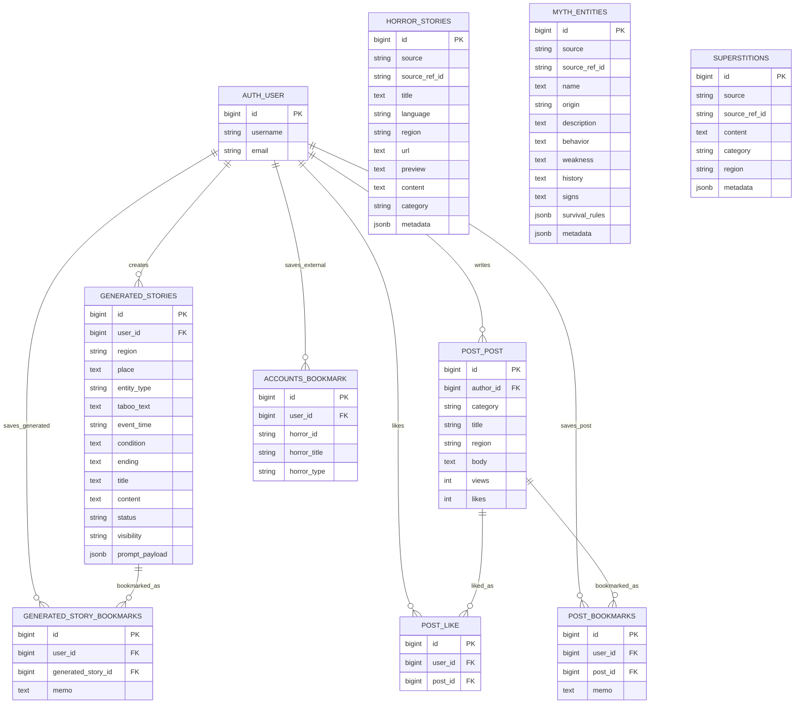

# PostgreSQL ERD 계획

## 1. 목적

이 문서는 괴이 실록 서비스에서 PostgreSQL에 저장할 데이터를 기준으로 ERD를 정리한 계획서다.

현재 ERD는 다음 범위를 다룬다.

- Django 기본 회원 테이블
- 기록 열람실 원천 데이터
- AI 생성 괴담
- 열린 게시판
- 좋아요
- 나의 보관함

Neo4j가 담당하는 지역 관계, 괴이와 장소의 그래프 관계, RAG 탐색용 노드/엣지는 PostgreSQL ERD에서 제외한다.

## 2. 기준 데이터

| 파일 | PostgreSQL 반영 |
| --- | --- |
| `database/data/verified_korean_horror_master.json` | 한국 괴담 원천 데이터 |
| `database/data/ultimate_global_mythology_1000.json` | 세계 신화/괴이 존재 데이터 |
| `database/data/misin.json` | 미신/금기 문장 데이터 |

`global_horror_database.json`은 현재 사용하지 않기로 결정했으므로 ERD 대상에서 제외한다.

## 3. 테이블 목록

| 영역 | 테이블 | 목적 |
| --- | --- | --- |
| accounts | `auth_user` | Django 기본 사용자 |
| archive | `horror_stories` | 한국 괴담 원천 데이터 |
| archive | `myth_entities` | 신화/괴이 존재 데이터 |
| archive | `superstitions` | 미신/금기 문장 데이터 |
| generator | `generated_stories` | 사용자가 만든 AI 생성 괴담 |
| post | `post_post` | 열린 게시판 게시글 |
| post | `post_like` | 게시글 좋아요 기록 |
| accounts | `accounts_bookmark` | Neo4j/외부 괴담 자료 보관 기록 |
| accounts | `generated_story_bookmarks` | AI 생성 괴담 보관 기록 |
| accounts | `post_bookmarks` | 게시글 보관 기록 |

## 4. 현재 models.py 기준 테이블명

이번 ERD는 현재 Django `models.py`와 기존 migration 흐름을 우선한다.

따라서 `Meta.db_table`이 없는 모델은 Django 기본 테이블명을 그대로 ERD에 반영한다.

| 모델 | 실제 ERD 테이블명 | 기준 |
| --- | --- | --- |
| `post.Post` | `post_post` | Django 기본 테이블명 |
| `post.Like` | `post_like` | Django 기본 테이블명 |
| `accounts.Bookmark` | `accounts_bookmark` | Django 기본 테이블명 |
| `generator.GeneratedStory` | `generated_stories` | `Meta.db_table` 지정 |
| `accounts.GeneratedStoryBookmark` | `generated_story_bookmarks` | `Meta.db_table` 지정 |
| `accounts.PostBookmark` | `post_bookmarks` | `Meta.db_table` 지정 |

이 방식은 테이블명이 조금 길어질 수 있지만, 팀원이 이미 작성한 Django 모델과 migration 흐름을 덜 흔든다는 장점이 있다.

## 5. 화면별 테이블 매핑

| 화면 | 주요 테이블 |
| --- | --- |
| 로그인/회원가입 | `auth_user`, `django_session` |
| 기록 열람실 | `horror_stories`, `myth_entities`, `superstitions` |
| 금기 자료실 | `superstitions` |
| 신규 기록실 | `generated_stories` |
| 열린 게시판 | `post_post`, `post_like` |
| 지역 정보실 | PostgreSQL 직접 테이블 없음, Neo4j 담당 |
| 나의 보관함 | `accounts_bookmark`, `generated_story_bookmarks`, `post_bookmarks` |

## 6. 주요 관계

```text
auth_user 1:N generated_stories
auth_user 1:N post_post
auth_user 1:N post_like
auth_user 1:N accounts_bookmark
auth_user 1:N generated_story_bookmarks
auth_user 1:N post_bookmarks

post_post 1:N post_like
post_post 1:N post_bookmarks
generated_stories 1:N generated_story_bookmarks
```

## 7. 컬럼 초안

### auth_user

Django 기본 사용자 테이블이다. 직접 새로 만들지 않고 Django 인증 시스템이 생성한 테이블을 사용한다.

| 컬럼 | 타입 | 설명 |
| --- | --- | --- |
| `id` | `BIGINT PK` | 사용자 ID |
| `username` | `VARCHAR(150)` | 로그인 ID |
| `email` | `VARCHAR(254)` | 이메일 |

### horror_stories

한국 괴담 원천 데이터를 저장한다.

| 컬럼 | 타입 | 설명 |
| --- | --- | --- |
| `id` | `BIGSERIAL PK` | 내부 ID |
| `source` | `VARCHAR(100)` | 데이터 출처 |
| `source_ref_id` | `VARCHAR(100)` | 원천 데이터 ID |
| `title` | `TEXT` | 제목 |
| `language` | `VARCHAR(20)` | 언어, 기본값 `ko` |
| `region` | `VARCHAR(100)` | 화면 표시용 지역명 |
| `url` | `TEXT` | 원문 URL |
| `preview` | `TEXT` | 목록용 미리보기 |
| `content` | `TEXT` | 본문 |
| `category` | `VARCHAR(100)` | 분류 |
| `metadata` | `JSONB` | 원천 보존/확장 데이터 |
| `created_at` | `TIMESTAMPTZ` | 생성일 |
| `updated_at` | `TIMESTAMPTZ` | 수정일 |

제약:

```sql
UNIQUE (source, source_ref_id)
```

### myth_entities

세계 신화, 전설, 괴이 존재 데이터를 저장한다.

| 컬럼 | 타입 | 설명 |
| --- | --- | --- |
| `id` | `BIGSERIAL PK` | 내부 ID |
| `source` | `VARCHAR(100)` | 데이터셋 출처 |
| `source_ref_id` | `VARCHAR(100)` | 원천 데이터 ID |
| `name` | `TEXT` | 존재 이름 |
| `origin` | `VARCHAR(255)` | 기원/문화권 |
| `description` | `TEXT` | 설명 |
| `behavior` | `TEXT` | 행동 특성 |
| `weakness` | `TEXT` | 약점 |
| `history` | `TEXT` | 역사/전승 |
| `signs` | `TEXT` | 출현 징후 |
| `survival_rules` | `JSONB` | 생존 규칙 목록 |
| `source_site` | `VARCHAR(100)` | 출처 사이트 |
| `source_url` | `TEXT` | 출처 URL |
| `metadata` | `JSONB` | habitats 등 가변 데이터 |

제약:

```sql
UNIQUE (source, source_ref_id)
```

### superstitions

`misin.json`의 미신/금기 문장을 단순 저장한다.

| 컬럼 | 타입 | 설명 |
| --- | --- | --- |
| `id` | `BIGSERIAL PK` | 내부 ID |
| `source` | `VARCHAR(100)` | 데이터셋 출처 |
| `source_ref_id` | `VARCHAR(100)` | 원천 데이터 ID |
| `content` | `TEXT` | 미신/금기 문장 |
| `category` | `VARCHAR(100)` | 추후 분류용 |
| `region` | `VARCHAR(100)` | 추후 지역 표시용 |
| `metadata` | `JSONB` | 확장 데이터 |

제약:

```sql
UNIQUE (source, source_ref_id)
```

### generated_stories

사용자가 신규 기록실에서 입력한 조건과 AI가 생성한 괴담 결과를 저장한다.

| 컬럼 | 타입 | 설명 |
| --- | --- | --- |
| `id` | `BIGSERIAL PK` | 생성 괴담 ID |
| `user_id` | `BIGINT FK` | 작성자 |
| `region` | `VARCHAR(100)` | 입력 지역 |
| `place` | `TEXT` | 입력 장소 |
| `entity_type` | `VARCHAR(100)` | 괴이 유형 |
| `taboo_text` | `TEXT` | 입력 금기 문장 |
| `event_time` | `VARCHAR(100)` | 발생 시간 |
| `condition` | `TEXT` | 발생 조건 |
| `ending` | `TEXT` | 결말 조건 |
| `title` | `TEXT` | 생성 결과 제목 |
| `content` | `TEXT` | 생성 결과 본문 |
| `status` | `VARCHAR(30)` | `draft`, `saved` |
| `visibility` | `VARCHAR(30)` | `private`, `public` |
| `prompt_payload` | `JSONB` | AI 입력 조건 원본 |
| `created_at` | `TIMESTAMPTZ` | 생성일 |
| `updated_at` | `TIMESTAMPTZ` | 수정일 |

### post_post

열린 게시판의 목격담/창작담 게시글을 저장한다.

| 컬럼 | 타입 | 설명 |
| --- | --- | --- |
| `id` | `BIGSERIAL PK` | 게시글 ID |
| `author_id` | `BIGINT FK NULL` | 작성자 |
| `category` | `VARCHAR(15)` | `WITNESS`, `CREATION` |
| `title` | `VARCHAR(200)` | 제목 |
| `region` | `VARCHAR(100)` | 지역명 |
| `body` | `TEXT` | 본문 |
| `views` | `INTEGER` | 조회수 |
| `likes` | `INTEGER` | 좋아요 수 캐시 |
| `created_at` | `TIMESTAMPTZ` | 작성일 |

주의:

- 기존 ERD의 `board_type`, `content`, `view_count`, `updated_at`, `visibility`와 현재 모델의 컬럼명이 다르다.
- 현재 모델 기준으로는 `category`, `body`, `views`, `likes`를 사용한다.
- ERD와 모델을 완전히 맞추려면 둘 중 하나를 기준으로 다시 정렬해야 한다.

### post_like

사용자가 게시글에 누른 좋아요 기록을 저장한다.

| 컬럼 | 타입 | 설명 |
| --- | --- | --- |
| `id` | `BIGSERIAL PK` | 좋아요 ID |
| `user_id` | `BIGINT FK` | 좋아요를 누른 사용자 |
| `post_id` | `BIGINT FK` | 좋아요 대상 게시글 |
| `created_at` | `TIMESTAMPTZ` | 좋아요 누른 시각 |

제약:

```sql
UNIQUE (user_id, post_id)
```

### accounts_bookmark

Neo4j 노드, 외부 원천 데이터, 기타 PostgreSQL 모델로 직접 관리하지 않는 괴담 자료의 보관 기록이다.

| 컬럼 | 타입 | 설명 |
| --- | --- | --- |
| `id` | `BIGSERIAL PK` | 보관 기록 ID |
| `user_id` | `BIGINT FK` | 사용자 |
| `horror_id` | `VARCHAR(100)` | 외부 콘텐츠 ID |
| `horror_title` | `VARCHAR(255)` | 외부 콘텐츠 제목 |
| `horror_type` | `VARCHAR(50)` | 외부 콘텐츠 종류 |
| `created_at` | `TIMESTAMPTZ` | 저장일 |

제약:

```sql
UNIQUE (user_id, horror_id)
```

### generated_story_bookmarks

AI 생성 괴담을 나의 보관함에 저장한 기록이다.

| 컬럼 | 타입 | 설명 |
| --- | --- | --- |
| `id` | `BIGSERIAL PK` | 보관 기록 ID |
| `user_id` | `BIGINT FK` | 사용자 |
| `generated_story_id` | `BIGINT FK` | 저장한 AI 생성 괴담 |
| `memo` | `TEXT` | 사용자 메모 |
| `created_at` | `TIMESTAMPTZ` | 저장일 |

제약:

```sql
UNIQUE (user_id, generated_story_id)
```

### post_bookmarks

열린 게시판 글을 나의 보관함에 저장한 기록이다.

| 컬럼 | 타입 | 설명 |
| --- | --- | --- |
| `id` | `BIGSERIAL PK` | 보관 기록 ID |
| `user_id` | `BIGINT FK` | 사용자 |
| `post_id` | `BIGINT FK` | 저장한 게시글 |
| `memo` | `TEXT` | 사용자 메모 |
| `created_at` | `TIMESTAMPTZ` | 저장일 |

제약:

```sql
UNIQUE (user_id, post_id)
```

## 8. Mermaid ERD

아래 코드는 Mermaid를 지원하는 Markdown 미리보기에서 ERD 그림으로 렌더링된다.

VS Code에서 코드로만 보이면 `Markdown Preview Mermaid Support` 확장을 설치하거나 GitHub 미리보기에서 확인한다.



## 9. ERDCloud Import용 SQL 초안

ERDCloud Import 창에는 아래 SQL을 붙여 넣어 테이블 초안을 만들 수 있다.

```sql
CREATE TABLE auth_user (
    id BIGINT PRIMARY KEY,
    username VARCHAR(150) NOT NULL,
    email VARCHAR(254)
);

CREATE TABLE horror_stories (
    id BIGSERIAL PRIMARY KEY,
    source VARCHAR(100) NOT NULL,
    source_ref_id VARCHAR(100) NOT NULL,
    title TEXT NOT NULL,
    language VARCHAR(20) DEFAULT 'ko',
    region VARCHAR(100),
    url TEXT,
    preview TEXT,
    content TEXT NOT NULL,
    category VARCHAR(100),
    metadata JSONB DEFAULT '{}'::jsonb,
    created_at TIMESTAMPTZ,
    updated_at TIMESTAMPTZ,
    UNIQUE (source, source_ref_id)
);

CREATE TABLE myth_entities (
    id BIGSERIAL PRIMARY KEY,
    source VARCHAR(100) NOT NULL DEFAULT 'ultimate_global_mythology_1000',
    source_ref_id VARCHAR(100) NOT NULL,
    name TEXT NOT NULL,
    origin VARCHAR(255),
    description TEXT,
    behavior TEXT,
    weakness TEXT,
    history TEXT,
    signs TEXT,
    survival_rules JSONB DEFAULT '[]'::jsonb,
    source_site VARCHAR(100),
    source_url TEXT,
    metadata JSONB DEFAULT '{}'::jsonb,
    UNIQUE (source, source_ref_id)
);

CREATE TABLE superstitions (
    id BIGSERIAL PRIMARY KEY,
    source VARCHAR(100) NOT NULL DEFAULT 'misin',
    source_ref_id VARCHAR(100) NOT NULL,
    content TEXT NOT NULL,
    category VARCHAR(100),
    region VARCHAR(100),
    metadata JSONB DEFAULT '{}'::jsonb,
    UNIQUE (source, source_ref_id)
);

CREATE TABLE generated_stories (
    id BIGSERIAL PRIMARY KEY,
    user_id BIGINT NOT NULL REFERENCES auth_user(id),
    region VARCHAR(100),
    place TEXT,
    entity_type VARCHAR(100),
    taboo_text TEXT,
    event_time VARCHAR(100),
    condition TEXT,
    ending TEXT,
    title TEXT,
    content TEXT,
    status VARCHAR(30),
    visibility VARCHAR(30),
    prompt_payload JSONB DEFAULT '{}'::jsonb,
    created_at TIMESTAMPTZ,
    updated_at TIMESTAMPTZ
);

CREATE TABLE post_post (
    id BIGSERIAL PRIMARY KEY,
    author_id BIGINT REFERENCES auth_user(id),
    category VARCHAR(15) NOT NULL DEFAULT 'WITNESS',
    title VARCHAR(200) NOT NULL,
    region VARCHAR(100) DEFAULT '지역 미상',
    body TEXT NOT NULL,
    views INTEGER DEFAULT 0,
    likes INTEGER DEFAULT 0,
    created_at TIMESTAMPTZ
);

CREATE TABLE post_like (
    id BIGSERIAL PRIMARY KEY,
    user_id BIGINT NOT NULL REFERENCES auth_user(id),
    post_id BIGINT NOT NULL REFERENCES post_post(id),
    created_at TIMESTAMPTZ,
    UNIQUE (user_id, post_id)
);

CREATE TABLE accounts_bookmark (
    id BIGSERIAL PRIMARY KEY,
    user_id BIGINT NOT NULL REFERENCES auth_user(id),
    horror_id VARCHAR(100) NOT NULL,
    horror_title VARCHAR(255) NOT NULL,
    horror_type VARCHAR(50) DEFAULT 'Story',
    created_at TIMESTAMPTZ,
    UNIQUE (user_id, horror_id)
);

CREATE TABLE generated_story_bookmarks (
    id BIGSERIAL PRIMARY KEY,
    user_id BIGINT NOT NULL REFERENCES auth_user(id),
    generated_story_id BIGINT NOT NULL REFERENCES generated_stories(id),
    memo TEXT,
    created_at TIMESTAMPTZ,
    UNIQUE (user_id, generated_story_id)
);

CREATE TABLE post_bookmarks (
    id BIGSERIAL PRIMARY KEY,
    user_id BIGINT NOT NULL REFERENCES auth_user(id),
    post_id BIGINT NOT NULL REFERENCES post_post(id),
    memo TEXT,
    created_at TIMESTAMPTZ,
    UNIQUE (user_id, post_id)
);
```

ERDCloud에서 타입 오류가 나면 아래처럼 단순 타입으로 바꿔서 다시 import한다.

```text
JSONB -> JSON
TIMESTAMPTZ -> TIMESTAMP
BIGSERIAL -> BIGINT
```

## 10. 다음 작업

1. 현재 models.py 기준 테이블명으로 ERD를 유지한다.
2. `database/PostgreSQL` 폴더의 SQL, query, seed 문서를 같은 테이블명으로 맞춘다.
3. 모델과 ERD가 일치하면 `makemigrations`를 진행한다.
4. `migrate` 후 실제 PostgreSQL 테이블 목록과 ERD를 비교한다.
