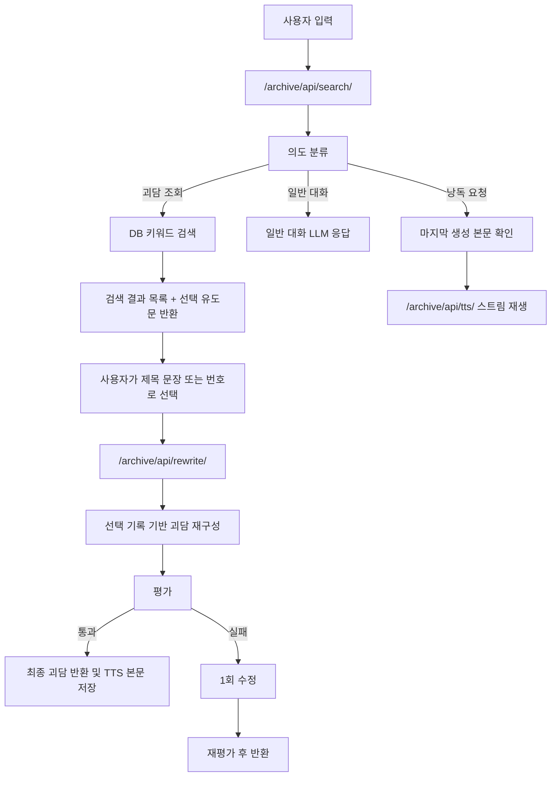

# Archive 챗봇 구현 정리

이 문서는 현재 코드에 반영된 `archive` 앱 챗봇 구현 내용을 정리한다.

## 1. 적용 범위

- 대상 화면: `templates/archive/chatbot.html`
- 주요 API:
  - `/archive/api/search/`
  - `/archive/api/rewrite/`
  - `/archive/api/tts/`
- 주요 서비스:
  - `archive/services/graph.py`
  - `archive/services/prompt.py`
  - `archive/services/formatter.py`
  - `archive/services/session_state.py`
  - `archive/services/tts.py`
- LLM 팩토리: `common/llm_factory.py`

## 2. 전체 대화 흐름



## 3. 의도 분기

`archive/services/graph.py`에서 입력 문장을 아래 세 종류로 분류한다.

| intent | 조건 | 동작 |
|---|---|---|
| `archive_query` | 괴담, 조회, 검색, 금기, 귀신, 도시전설 등 포함 | DB 키워드 검색 |
| `general_chat` | 조회 키워드가 없는 일반 대화 | LLM 일반 대화 응답 |
| `tts_request` | 읽어줘, 낭독, 들려줘, 재생 등 포함 | LLM 호출 없이 TTS 상태 반환 |

일반 대화도 이전 대화 기록을 프롬프트에 넣어 흐름을 참고한다.

## 4. DB 키워드 검색

키워드는 `extract_keywords()`에서 간단한 규칙으로 추출한다.

검색 대상 모델은 다음과 같다.

| 모델 | 검색 필드 |
|---|---|
| `HorrorStory` | `title`, `content`, `preview`, `region`, `category` |
| `MythEntity` | `name`, `origin`, `description`, `behavior`, `weakness`, `history`, `signs` |
| `Superstition` | `content`, `category`, `region` |

검색 결과는 키워드 등장 횟수 기반 점수로 정렬하고 최대 5건을 반환한다.

## 5. 목록 선택 방식

첫 검색에서는 바로 괴담을 생성하지 않는다.

1. DB 검색 결과 목록을 보여준다.
2. LLM이 각 기록에 짧은 불길한 선택 유도문을 붙인다.
3. 사용자는 번호 또는 제목이 포함된 문장으로 기록을 선택한다.
4. 선택 후 `/archive/api/rewrite/`에서 해당 원본 기록을 기준으로 괴담을 재구성한다.

프론트에서는 `findSelectedRecord()`가 제목 전체 또는 제목 토큰 포함 여부로 선택 기록을 찾는다.

## 6. 생성, 평가, 1회 수정

선택된 원본 기록은 `run_generation_pipeline()`을 통해 처리한다.

1. `generate_node`
   - 키워드, 원본 본문, 이전 대화 기록을 바탕으로 괴담 본문 생성
2. `evaluation_node`
   - 아래 네 기준을 JSON으로 평가
   - `keyword_passed`
   - `consistency_passed`
   - `style_passed`
   - `atmosphere_passed`
3. `revise_node`
   - 평가 실패 시 1회만 수정
   - 실패한 초안과 평가 피드백을 함께 전달해 새로 생성보다 수정에 가깝게 처리
4. 재평가 후 결과 반환

평가 JSON 파싱에 실패하면 불합격으로 처리한다.

## 7. 프롬프트 구성

프롬프트는 `archive/services/prompt.py`에 모여 있다.

| 함수 | 역할 |
|---|---|
| `build_general_chat_prompt` | 기록 열람실 기본 말투의 일반 대화 |
| `build_search_choice_prompt` | 검색 결과 목록 선택 유도 |
| `build_generation_prompt` | 원본 기록 기반 괴담 생성 |
| `build_evaluation_prompt` | 생성 결과 평가 |
| `build_revision_prompt` | 실패 초안 수정 |

대화 기록과 원본 기록 포맷팅은 `archive/services/formatter.py`에서 처리한다.

## 8. 세션 상태

`archive/services/session_state.py`에서 archive 챗봇 상태를 세션에 저장한다.

| 값 | 용도 |
|---|---|
| `conversation_history` | 최근 대화 기록 저장 |
| `last_search_results` | 마지막 검색 결과 저장 |
| `last_tts_text` | 마지막으로 생성된 괴담 본문 저장 |
| `last_tts_error` | 마지막 TTS 오류 메시지 저장 |

세션 키는 로그인 사용자와 익명 사용자를 분리한다.

- 로그인 사용자: `archive_*_user_{user.id}`
- 익명 사용자: `archive_*_anonymous`

로그아웃 시 archive 관련 사용자 세션 기록도 제거할 수 있도록 `clear_user_archive_session()`이 준비되어 있다.

## 9. TTS

TTS는 ElevenLabs 스트리밍 API를 사용한다.

필요한 환경변수:

```env
ELEVENLABS_API_KEY=
ELEVENLABS_VOICE_ID=
ELEVENLABS_MODEL_ID=
```

동작 방식:

1. `/archive/api/rewrite/`가 생성된 괴담 본문을 `last_tts_text`에 저장한다.
2. 사용자가 `읽어줘` 같은 문장을 입력한다.
3. `/archive/api/search/`가 `tts_request`로 분기한다.
4. 프론트가 `/archive/api/tts/`를 오디오 스트림으로 연다.
5. 서버는 `StreamingHttpResponse`로 `audio/mpeg`를 반환한다.

`eleven_v3` 모델에서는 `optimize_streaming_latency`를 붙이지 않는다.
그 외 모델에서는 `optimize_streaming_latency=1`을 사용한다.

TTS 실패 시 ElevenLabs 오류 메시지를 `last_tts_error`에 저장하고, 프론트는 `/archive/api/tts/?error=1` 또는 `/archive/api/tts/?diagnose=1`로 원인을 표시한다.

## 10. YouTube 배경음

`읽어줘` 입력 시 YouTube 배경음 iframe을 함께 생성한다.

- 영상 ID: `0br9VKMgdW0`
- iframe 크기: `220px x 220px`
- 화면 오른쪽 아래에 배치
- 검은 레이어로 덮어 화면 노출을 줄임
- YouTube IFrame API `postMessage`로 볼륨을 `50`으로 설정
- TTS 중지 또는 종료 시 iframe 제거

브라우저 자동재생 정책에 따라 YouTube 재생은 환경별로 제한될 수 있다.

## 11. 오류 처리

| 상황 | 처리 |
|---|---|
| 빈 검색어 | `status: empty` 반환 |
| DB 오류 | 503 JSON 응답 |
| Groq rate limit | 429 JSON 응답 |
| LLM 생성 오류 | 503 JSON 응답 |
| 선택 기록 없음 | 404 JSON 응답 |
| TTS 본문 없음 | 400 JSON 응답 |
| ElevenLabs 설정 없음 | 400 JSON 응답 |
| ElevenLabs 생성 실패 | 503 JSON 응답 및 오류 메시지 저장 |

## 12. LLM 설정

현재 공통 LLM 팩토리는 Groq 기반이다.

| 함수 | 모델 |
|---|---|
| `get_llm()` | `openai/gpt-oss-120b` |
| `get_post_generation_llm()` | `openai/gpt-oss-120b` |

`get_post_generation_llm()`에는 `temperature=0.5`가 지정되어 있다.
