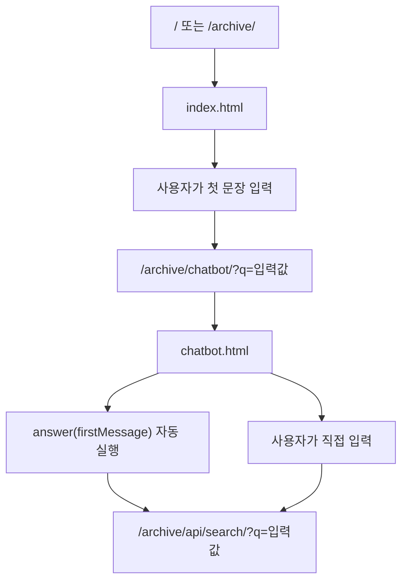
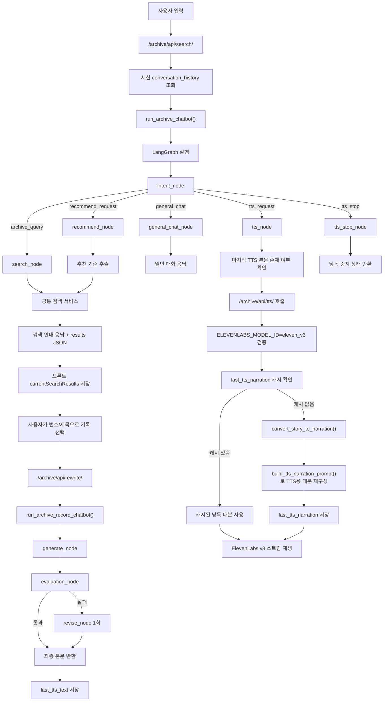
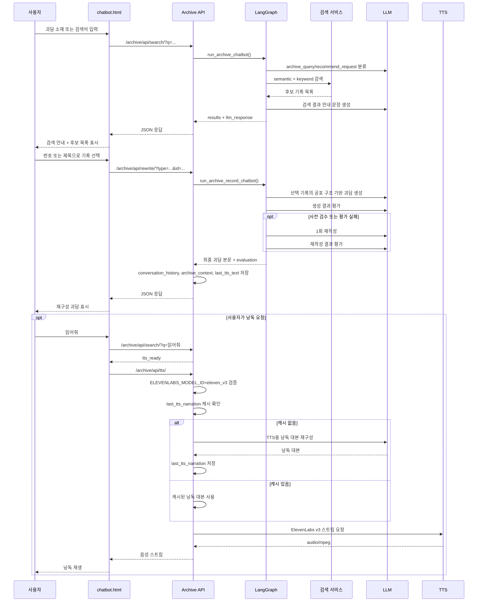

# 기록 열람실 챗봇 구현 흐름 정리

이 문서는 현재 코드에 반영된 기록 열람실 챗봇의 화면, API, LangGraph, 검색, 추천, 생성, 평가, TTS 흐름만 정리한다.

## 1. 적용 범위

- 진입 화면:
  - `templates/archive/index.html`
  - `templates/archive/chatbot.html`
- URL 설정:
  - `config/urls.py`
  - `archive/urls.py`
- 주요 API:
  - `/archive/api/search/`
  - `/archive/api/rewrite/`
  - `/archive/api/tts/`
- 주요 서비스:
  - `archive/services/graph.py`
  - `archive/services/graph_nodes.py`
  - `archive/services/archive_search.py`
  - `archive/services/keyword_extractor.py`
  - `archive/services/search_relevance.py`
  - `archive/services/search_policy.py`
  - `archive/services/prompt.py`
  - `archive/services/formatter.py`
  - `archive/services/session_state.py`
  - `archive/services/tts.py`
  - `common/llm_factory.py`

## 2. URL 진입 흐름

`config/urls.py`에서 루트 `/`는 `archive.views.index`로 연결되고, 기록 열람실 챗봇은 `archive.urls`의 챗봇 경로와 API 경로를 사용한다.

| URL | View | 역할 |
|---|---|---|
| `/` | `archive.views.index` | 프로젝트 첫 화면 |
| `/archive/` | `archive.views.index` | archive 첫 화면 |
| `/archive/chatbot/` | `archive.views.chatbot` | 기록 열람실 챗봇 화면 |
| `/archive/list/` | `archive.views.chatbot` | 챗봇 화면 별칭 |
| `/archive/search/` | `archive.views.chatbot` | 챗봇 화면 별칭 |
| `/archive/api/search/` | `archive.views.sillok_search_api` | 대화, 검색, 추천, TTS 명령 처리 |
| `/archive/api/rewrite/` | `archive.views.sillok_rewrite_api` | 선택 기록 기반 괴담 재구성 |
| `/archive/api/tts/` | `archive.views.sillok_tts_api` | 낭독 본문 저장, 진단, 음성 스트리밍 |

첫 화면의 입력은 직접 API를 호출하지 않고 `/archive/chatbot/?q=...`로 이동한다. 챗봇 화면은 쿼리스트링의 `q` 값을 읽어 첫 메시지처럼 처리한다.

## 3. 전체 화면 흐름



챗봇 화면은 검색 결과를 브라우저의 `currentSearchResults`와 `sessionStorage`에 보관한다. 사용자가 번호나 제목을 입력하면 서버 세션이 아니라 프론트 상태에 저장된 마지막 검색 결과에서 선택 기록을 찾는다.

`chatbot()` view는 화면 진입 시 `clear_user_archive_session()`으로 서버의 archive 대화/맥락/TTS 상태를 초기화한다. 브라우저 쪽 채팅 로그와 마지막 검색 결과는 `chatbot.html`의 `sessionStorage` 복원 로직이 별도로 관리한다.

## 4. 챗봇 API 흐름



`/archive/api/search/`는 검색 의도에서 괴담 본문을 바로 생성하지 않는다. 먼저 관련 기록 목록을 JSON으로 반환하고, 사용자가 특정 기록을 고른 뒤 `/archive/api/rewrite/`에서 재구성한다.

공통 검색 서비스는 내부에서 pgvector 의미 검색, Neo4j 관련 키워드 확장, PostgreSQL 키워드 검색을 병합한다.

검색 안내용 `llm_response`는 기록 목록을 직접 나열하지 않는다. `build_search_choice_prompt()`는 검색어와 연결된 불길한 단서를 4~6문장으로 말하게 하고, 실제 결과 목록은 `chatbot.html`이 `data.results`를 순회하면서 별도로 출력한다.

### 챗봇 시퀀스 다이어그램



## 5. LangGraph 노드

archive 챗봇은 LangGraph로 입력 의도에 따라 노드 흐름을 분기한다.

| 노드 | 함수 | 역할 |
|---|---|---|
| `intent` | `intent_node` | 사용자 입력 의도와 검색 분류 추출 |
| `general_chat` | `general_chat_node` | 검색 대상이 없는 일반 대화 응답 |
| `recommend` | `recommend_node` | 최근 맥락 또는 분류 키워드 기준 추천 검색 |
| `tts` | `tts_node` | 낭독 요청 상태 반환 |
| `tts_stop` | `tts_stop_node` | 낭독 중지 요청 상태 반환 |
| `search` | `search_node` | 검색 결과 안내 응답 |
| `generate` | `generate_node` | 선택 기록 기반 괴담 본문 생성 |
| `evaluate` | `evaluation_node` | 생성 결과 평가 |
| `revise` | `revise_node` | 평가 실패 시 1회 수정 |

의도별 분기 기준은 다음과 같다.

| intent | 조건 | 다음 흐름 |
|---|---|---|
| `archive_query` | 구체 소재가 있는 괴담/조회/검색/추천 요청 | `search` |
| `recommend_request` | "추천해줘", "비슷한 거"처럼 최근 기록 기준 추천 요청 | `recommend` |
| `general_chat` | 인사, 감사, 잡담, 검색 대상이 불분명한 문장 | `general_chat` |
| `tts_request` | 정규화한 입력이 `읽어줘` 단독 명령인 경우 | `tts` |
| `tts_stop` | 멈춰, 중지, 정지, 그만, stop, 스톱 등 | `tts_stop` |

프론트에서는 `멈춰` 계열 입력을 `isTtsStopCommand()`가 먼저 처리해 오디오와 YouTube BGM을 즉시 정리한다. 서버의 `tts_stop` 분기는 API로 들어온 중지 요청까지 받을 수 있는 보조 흐름이다.

특정 기록이 이미 `source_story`로 들어온 경우에는 `intent` 분류를 건너뛰고 `generate` 흐름으로 진행한다. 이 경로는 `/archive/api/rewrite/`에서 사용된다.

## 6. 입력 분류와 query_analysis

`build_intent_classification_prompt()`는 `intent + keywords` 외에도 검색과 추천에 필요한 세부 필드를 함께 반환하도록 구성되어 있다.

| 필드 | 의미 |
|---|---|
| `intent` | LangGraph 라우팅용 의도 |
| `keywords` | 기존 검색 호환용 키워드 목록 |
| `command_terms` | 찾아줘, 추천해줘, 알려줘 같은 요청 표현 |
| `genre_terms` | 괴담, 도시전설, 목격담 같은 장르/자료 유형 |
| `modifier_terms` | 아주 무서운, 짧은, 실화 같은 수식 조건 |
| `core_keywords` | 실제 검색 대상인 장소, 존재, 사물, 사건, 행위 |
| `include_terms` | 새로 포함하고 싶은 검색 조건 |
| `exclude_terms` | 사용자가 직접 말한 제외 조건 |
| `recommendation_mode` | `similar`, `different`, `exclude_only` 중 추천 방향 |
| `exclude_reference` | 최근 검색어, 최근 선택 기록, 최근 결과, 최근 유형/장르 등 제외 참조 |
| `exclude_scope` | 제외 범위. `topic`, `record`, `type`, `genre` 등 |
| `search_query` | pgvector 임베딩 검색에 사용할 짧은 검색 문장 |

`graph_nodes.py`는 LLM 분류가 실패하거나 필요한 필드가 비었을 때 규칙 기반으로 폴백한다.

- `tts_stop` 마커를 먼저 확인한다.
- `tts_request` 마커를 확인한다.
- 추천 마커가 있고 새 소재가 있으면 `archive_query`로 보낸다.
- 추천 마커만 있으면 `recommend_request`로 보낸다.
- 검색 마커가 있으면 `extract_keywords()` 기반 `archive_query`로 보낸다.
- 단순 일반 대화는 `general_chat`으로 보낸다.

`search_query`가 없으면 `core_keywords`, `modifier_terms`, `genre_terms`를 순서대로 합쳐 만들고, 그래도 비어 있으면 기존 키워드나 원문을 사용한다. 추천/검색에서 제외 조건이 있으면 `archive_context`의 최근 검색어, 최근 선택 기록, 최근 결과 타입을 기준으로 필터링한다.

## 7. 검색 흐름

`archive/services/archive_search.py`의 `search_archive_records_for_question()`이 검색을 담당한다. 현재 검색은 의미 기반 검색과 키워드 기반 검색을 병합한다.

1. `search_node` 또는 `recommend_node`가 `query_analysis.search_query`를 semantic query로 넘긴다.
2. `search_archive_records_by_semantic_query()`가 `record_embeddings`의 `content` 청크 임베딩과 pgvector cosine similarity를 비교한다.
3. semantic 결과는 `ARCHIVE_SEMANTIC_MIN_SIMILARITY` 이상만 사용한다. 기본값은 archive 내부에서 `0.5`로 읽는다.
4. Neo4j 연결이 가능하면 `get_neo4j_related_keywords()`로 관련 키워드를 확장한다.
5. `search_archive_records_by_keywords()`가 PostgreSQL 모델을 명시적 필드 검색한다.
6. 키워드 결과가 없으면 `extract_fallback_keywords()`로 원문 토큰 기반 보조 키워드를 만들어 다시 검색한다.
7. semantic 결과를 우선하고 키워드/fallback 결과를 뒤에 보강해 중복 없이 최대 5개를 반환한다.

semantic 검색 설정은 `config/settings.py`가 아니라 `archive_search.py` 내부에서 환경 변수를 직접 읽는다.

| 환경 변수 | 기본값 | 의미 |
|---|---|---|
| `ARCHIVE_EMBEDDING_MODEL_NAME` | `intfloat/multilingual-e5-base` | query 임베딩 모델 |
| `ARCHIVE_EMBEDDING_OUTPUT_DIMENSION` | `768` | 임베딩 차원 |
| `ARCHIVE_SEMANTIC_MIN_SIMILARITY` | `0.5` | semantic 결과 최소 유사도 |

검색 결과로 변환하는 주요 타입은 다음과 같다.

| source_table | record type | 비고 |
|---|---|---|
| `horror_stories` | `horror_story` | 괴담/도시전설 |
| `dcinside_posts` | `dcinside_post` | 외부 수집 공포 게시글 |

키워드 검색 대상은 다음과 같다.

| 모델 | DB 테이블 | 검색 필드 |
|---|---|---|
| `HorrorStory` | `horror_stories` | `title`, `content`, `preview`, `region`, `category` |
| `DcinsidePost` | `dcinside_posts` | `content`, `category`, `region`, `keywords` |

`search_relevance.py`는 너무 일반적인 검색어와 약한 매칭 결과를 걸러내고, `score_record_text()`로 키워드 결과 정렬 점수를 계산한다.

## 8. 추천 흐름

추천은 두 가지로 나뉜다.

| 입력 예 | intent | 처리 |
|---|---|---|
| `화장실 괴담 추천해줘` | `archive_query` | 새 소재가 있으므로 일반 검색 |
| `추천해줘` | `recommend_request` | 최근 대화/생성 본문에서 키워드 추출 후 추천 |
| `방금 거랑 비슷한 거 추천해줘` | `recommend_request` | 최근 맥락 기준 추천 |

`recommend_node()`는 `state.keywords`가 있으면 그대로 쓰고, 없으면 `query_analysis.include_terms`와 `core_keywords`를 먼저 본다. 그래도 기준이 없고 제외 조건도 없으면 최근 assistant 대화에서 `extract_recent_context_keywords()`로 추천 기준 키워드를 뽑는다.

`그거 말고`, `그 분야 말고`처럼 제외 조건만 있는 추천은 `archive_context`를 기준으로 최근 선택 기록, 최근 결과, 최근 타입, 최근 장르성 단어를 제외한다. 기준 키워드 없이 제외 조건만 있고 무작위 후보가 있으면 `get_random_archive_records()`에서 가져온 후보를 필터링해 보여준다. 아무 기준도 만들 수 없으면 "먼저 기록 하나를 열어 주십시오." 메시지로 종료한다.

추천 검색도 일반 검색과 같은 `search_archive_records_for_question()`을 사용하므로 pgvector semantic 검색, Neo4j 관련 키워드, PostgreSQL 키워드 검색이 함께 적용된다.

## 9. 목록 선택 방식

챗봇 프론트는 검색 결과를 브라우저 상태에 저장한다.

| 프론트 상태 | 역할 |
|---|---|
| `currentSearchResults` | 마지막 검색 결과 목록 |
| `lastArchiveQuery` | 마지막 검색 질문 |
| `window.lastViewedRecord` | 마지막으로 열람한 기록 |

사용자가 번호를 입력하면 `currentSearchResults[index]`를 선택한다. 제목이나 제목 일부를 포함한 문장을 입력하면 `findSelectedRecord()`가 정확 매칭 또는 토큰 매칭으로 선택 기록을 찾는다.

선택이 확정되면 `rewriteSelectedRecord()`가 `/archive/api/rewrite/?type=...&id=...&q=...`를 호출한다.

## 10. 선택 기록 기반 생성 흐름

`/archive/api/rewrite/`는 `type`과 `id`로 원본 기록을 하나 조회한 뒤 `run_archive_record_chatbot()`을 실행한다.

1. `get_archive_record()`가 선택한 원본 기록을 조회한다.
2. 조회 결과를 `source_story` 형태로 변환한다.
3. `generate_node()`가 원본 기록의 문장과 사건을 복사하지 않고 핵심 공포 구조만 추출해 익명 커뮤니티 게시글형 괴담을 생성한다.
4. `evaluation_node()`가 먼저 사전 검수로 빈 응답, 제목/마크다운, 번호 목록, 열린 따옴표, 끊긴 마지막 문장을 걸러낸다.
5. 사전 검수를 통과하면 평가 LLM이 JSON으로 9개 세부 점수와 기존 호환 boolean을 반환한다.
6. 평가가 실패하면 `revise_node()`가 한 번만 재작성하고 다시 평가한다.
7. 평가 LLM 호출 자체가 실패하면 로그를 남기고 평가를 생략하되, 생성된 본문은 그대로 반환한다.
8. View는 최종 본문을 `conversation_history`, `archive_context`, `last_tts_text`에 저장한다.

평가 JSON에는 기존 앱 호환을 위한 네 boolean이 반드시 포함된다.

| 평가 키 | 의미 |
|---|---|
| `keyword_passed` | 키워드가 자연스럽게 반영됐는지 |
| `consistency_passed` | 원본 문장/사건을 베끼지 않으면서 핵심 공포 구조를 유지했는지 |
| `style_passed` | 한국 인터넷 커뮤니티 1인칭 체험담처럼 자연스럽고 문학체가 아닌지 |
| `atmosphere_passed` | 모순성, 재해석 가능성, 설명 절제력, 현실성, 긴장감, 클리셰 회피, 여운, 게시글스러움, 문학체 제거가 충분한지 |

새 평가 프롬프트는 다음 9개 세부 항목도 함께 요구한다.

| 세부 점수 | 의미 |
|---|---|
| `contradiction` | 설명되지 않는 이상한 사실이나 모순이 남는지 |
| `reinterpretation` | 결말 후 초반 장면을 다시 보게 만드는지 |
| `restraint` | 귀신/악령/감정 설명 없이 보여주는지 |
| `realism` | 실제 커뮤니티 체험담처럼 보이는지 |
| `tension_curve` | 작은 이상함에서 마지막 모순까지 점진적으로 상승하는지 |
| `cliche_avoidance` | 흰 원피스, 검은 그림자, 꿈 결말 같은 클리셰를 피했는지 |
| `aftertaste` | 마지막 문장이나 핵심 모순이 오래 남는지 |
| `community_voice` | 익명 커뮤니티 게시글처럼 보이는지 |
| `anti_literary_style` | 문학적 묘사 없이 담담한 게시글체인지 |

평가 응답을 JSON으로 파싱하지 못하면 불합격 평가로 처리한다. 평가 점수는 `criterion_scores` 평균을 100점 만점으로 환산하고, 문학체 표현이나 게시글 말투 부족이 있으면 자동 패널티로 상한을 낮춘다. `is_evaluation_passed()`는 네 boolean, 9개 세부 점수, `rewrite_required_by_editor`, 최종 `score_total` 90점 이상 여부를 함께 본다. 단, 평가 LLM 호출 예외는 `Archive evaluation LLM failed` 로그를 남기고 생성문 반환을 막지 않는다.

## 11. 프롬프트 구성

프롬프트는 `archive/services/prompt.py`에 모여 있다.

| 함수 | 역할 |
|---|---|
| `build_intent_classification_prompt` | 입력 의도와 세부 검색 분류 |
| `build_general_chat_prompt` | archive 챗봇 말투의 일반 대화 |
| `build_search_choice_prompt` | 검색어와 연결된 불길한 단서 안내. 목록/번호/선택 안내는 금지하고 공포 설계 원칙만 반영 |
| `build_generation_prompt` | 원본 기록의 핵심 공포 구조를 추출해 익명 커뮤니티 게시글형 괴담 생성 |
| `build_evaluation_prompt` | 9개 세부 점수와 기존 boolean 호환 필드로 생성 결과 평가 |
| `build_revision_prompt` | 소설체를 줄이고 게시글스러움, 현실감, 마지막 모순을 중심으로 1회 재작성 |

`build_search_choice_prompt()`는 DB 검색 결과를 표현 참고용으로만 쓰고, 제목/번호/유형/지역을 직접 나열하지 않게 한다. 답변은 목록 없이 4~6문장의 짧은 검색 안내로 끝나야 한다. 실제 목록은 프론트가 `data.results`를 별도 출력한다.

`build_generation_prompt()`는 원본 소재, 문장, 사건 복사를 금지하고 공포가 작동하는 구조만 유지하게 한다. 출력은 JSON의 `new_story` 필드로 요구하고, `generate_node()`가 화면 표시 전에 `new_story`만 추출한다.

`build_evaluation_prompt()`는 `criterion_scores`, `strengths`, `problems`, `improvement_points`, `editor_summary`, `rewrite_required_by_editor`, `feedback`을 포함한 JSON을 요구한다. 통과 여부는 네 boolean, 9개 세부 점수, 자동 패널티가 반영된 `score_total`을 함께 보고 결정한다.

`build_revision_prompt()`는 평가에서 낮게 나온 항목을 보강하되, 특히 게시글스러움과 문학체 제거를 우선한다. 재작성 결과도 JSON의 `new_story` 필드로 받고, `revise_node()`가 본문만 추출한다.

대화 기록은 `format_conversation_history()`가 프롬프트용 텍스트로 바꾸고, 원본 기록은 `format_source_story()`가 제목, 유형, 지역, 본문 형태로 정리한다.

## 12. 세션 상태

`archive/services/session_state.py`는 Django 세션에 archive 챗봇 상태를 저장한다.

| 값 | 용도 |
|---|---|
| `conversation_history` | 최근 대화 기록 저장 |
| `archive_context` | 최근 검색어, 검색 키워드, query_analysis, 최근 결과, 최근 선택 기록 저장 |
| `last_tts_text` | 마지막으로 생성된 낭독 대상 본문 저장 |
| `last_tts_error` | 마지막 TTS 오류 메시지 저장 |
| `last_tts_narration` | 같은 본문을 다시 낭독할 때 사용할 TTS용 재구성 대본 저장 |

세션 키는 로그인 사용자와 익명 사용자를 분리한다.

- 로그인 사용자: `archive_*_user_{user.id}`
- 익명 사용자: `archive_*_anonymous`

현재 검색 결과 목록은 서버 세션이 아니라 `chatbot.html`의 `sessionStorage`와 `currentSearchResults`에 저장된다. 서버의 `archive_context`는 추천과 제외 조건 해석용 요약 정보만 담는다. 로그아웃 링크를 누르면 프론트의 채팅 상태를 지우고, Django 로그아웃 시그널은 `clear_user_archive_session()`으로 archive 관련 서버 세션 기록을 제거한다.

## 13. TTS 흐름

TTS는 `archive/services/tts.py`에서 ElevenLabs 스트리밍 API를 사용한다.

필요한 환경 변수는 다음과 같다.

```env
ELEVENLABS_API_KEY=
ELEVENLABS_VOICE_ID=
ELEVENLABS_MODEL_ID=eleven_v3
```

동작 순서는 다음과 같다.

1. `/archive/api/rewrite/`가 생성된 괴담 본문을 `last_tts_text`에 저장한다.
2. 사용자가 `읽어줘` 단독 명령을 입력한다.
3. `/archive/api/search/`가 `tts_request`로 분기한다.
4. 저장된 본문이 있으면 프론트가 `/archive/api/tts/`를 오디오 소스로 연다.
5. 서버는 `prepare_tts_narration()`에서 저장된 괴담 본문을 확인한다.
6. 같은 본문의 `last_tts_narration` 캐시가 있으면 그대로 사용한다.
7. 캐시가 없으면 `convert_story_to_narration()`이 `build_tts_narration_prompt()`로 괴담 본문을 ElevenLabs v3용 낭독 대본으로 재구성한다.
8. 변환 결과가 너무 짧거나 LLM 변환에 실패하면 원문 본문으로 낭독한다.
9. 서버가 `open_story_audio_stream()`으로 ElevenLabs 스트림을 열고 `StreamingHttpResponse`로 `audio/mpeg`를 반환한다.
10. 사용자가 멈춰, 중지, 정지, 그만 등을 입력하면 프론트가 현재 TTS와 YouTube BGM을 즉시 정리한다.

`POST /archive/api/tts/`는 직접 전달받은 텍스트를 저장할 수도 있다. `prepare_only`가 참이면 스트리밍하지 않고 `last_tts_text`만 준비한다.

TTS 재구성 프롬프트는 원문의 사건, 순서, 결말을 바꾸지 않고 낭독 호흡만 다듬도록 설계되어 있다. 첫 줄이 제목이면 본문부터 읽도록 하고, `[whispers]`, `[sighs]`, `[exhales]`, `[nervously]` 같은 ElevenLabs v3 오디오 태그를 3~6개만 사용하게 제한한다.

TTS 오류 확인용 보조 요청도 있다.

| 요청 | 역할 |
|---|---|
| `/archive/api/tts/?error=1` | 마지막 TTS 오류 메시지 조회 |
| `/archive/api/tts/?diagnose=1` | 현재 저장된 원문 TTS 본문으로 스트림 준비 가능 여부 점검 |

현재 TTS는 `ELEVENLABS_MODEL_ID=eleven_v3`만 허용한다. TTS 재구성 대본이 v3 오디오 태그를 포함하므로, 설정이 없거나 다른 모델이면 `/archive/api/tts/`는 ElevenLabs 스트림을 열지 않고 설정 오류로 중단한다.

## 14. 오디오 볼륨과 배경음

챗봇 화면은 `get_chatbot_audio_volume_settings()` 값을 JSON으로 받아 사용한다.

| 값 | 기본값 | 역할 |
|---|---:|---|
| `bgm` | `27` | YouTube 배경음 볼륨 |
| `tts` | `90` | TTS 오디오 볼륨 |
| `max` | `100` | 볼륨 비율 계산 기준 |

낭독 시작 시 `chatbot.html`은 YouTube iframe을 생성해 배경음을 재생하고, TTS 오디오는 `/archive/api/tts/`를 `Audio` 객체로 열어 재생한다. TTS가 종료되거나 사용자가 중지 명령을 입력하면 현재 오디오와 YouTube iframe을 정리한다.

## 15. 북마크 연동

챗봇에서 특정 기록을 열람한 뒤 사용자가 `저장` 또는 `save`를 입력하면 `chatbot.html`이 `/accounts/api/bookmark/add/`를 호출한다.

전송 값은 다음과 같다.

| 값 | 출처 |
|---|---|
| `horror_id` | `window.lastViewedRecord.id` |
| `horror_title` | `window.lastViewedRecord.name` |
| `horror_type` | `window.lastViewedRecord.type` |

로그인하지 않은 사용자는 accounts API에서 401 응답을 받는다.

## 16. 오류 처리와 로그

| 상황 | 처리 |
|---|---|
| 빈 검색어 | `status: empty` JSON 응답 |
| DB 오류 | 503 JSON 응답 |
| Groq rate limit | 429 JSON 응답 |
| LLM 생성 오류 | 503 JSON 응답 |
| 선택 기록 없음 | 404 JSON 응답 |
| 잘못된 rewrite 파라미터 | 400 JSON 응답 |
| TTS 본문 없음 | 400 JSON 응답 |
| ElevenLabs 설정 없음 | 400 JSON 응답 |
| ElevenLabs 생성 실패 | 503 JSON 응답 및 오류 메시지 저장 |

추적용 로그는 다음 위치에서 남긴다.

| 로그 메시지 | 위치 | 의미 |
|---|---|---|
| `Archive search API failed` | `sillok_search_api()` | 검색 API 최상위 예외 |
| `Archive rewrite API failed` | `sillok_rewrite_api()` | 재구성 API 최상위 예외 |
| `Archive evaluation LLM failed` | `evaluation_node()` | 평가 LLM 호출 실패 |

## 17. LLM 설정

`common/llm_factory.py`의 현재 설정은 다음과 같다.

| 함수 | 모델 | 현재 용도 |
|---|---|---|
| `get_post_generation_llm()` | Groq `openai/gpt-oss-20b` | archive 일반 대화, 괴담 생성, 수정 |
| `get_llm()` | Groq `openai/gpt-oss-120b` | archive intent 분류, 검색 안내, evaluation |
| `generator_llm()` | Ollama `gemma4:e4b` | generator 계열 |

archive 앱의 `invoke_llm()`은 `get_llm()`을 사용한다. 따라서 intent 분류, 검색 안내, evaluation은 Groq 모델을 탄다.

archive 앱의 `invoke_gemma_llm()`은 이름과 달리 `get_post_generation_llm()`을 사용한다. 현재 일반 대화, 선택 기록 기반 괴담 생성, 평가 실패 후 수정은 Groq `openai/gpt-oss-20b`를 탄다. 평가 LLM 호출이 실패하면 traceback 로그를 남기고 평가를 생략하며, 생성된 괴담 본문은 사용자에게 반환한다.

## 18. 주요 의존성

pgvector semantic 검색을 실행하려면 `sentence-transformers`와 백엔드 프레임워크인 `torch`가 필요하다. `requirements.txt`에는 다음 항목이 포함되어야 한다.

```text
pgvector==0.4.2
sentence-transformers==5.5.1
torch
neo4j==6.2.0
```

`torch`가 없으면 SentenceTransformer가 실제 임베딩을 만들지 못하고 semantic 검색은 빈 결과로 떨어질 수 있다. 이 경우 기존 키워드/Neo4j 검색이 fallback 역할을 한다.
