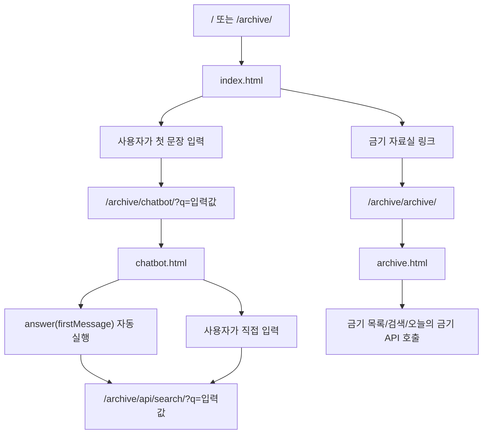
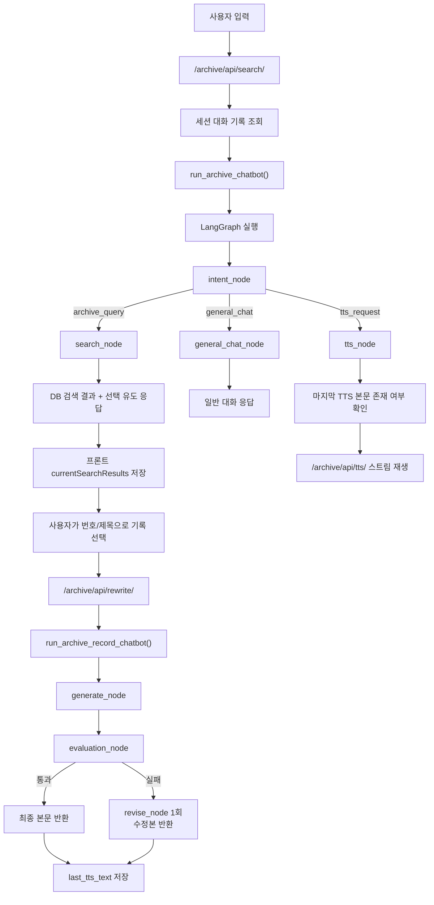
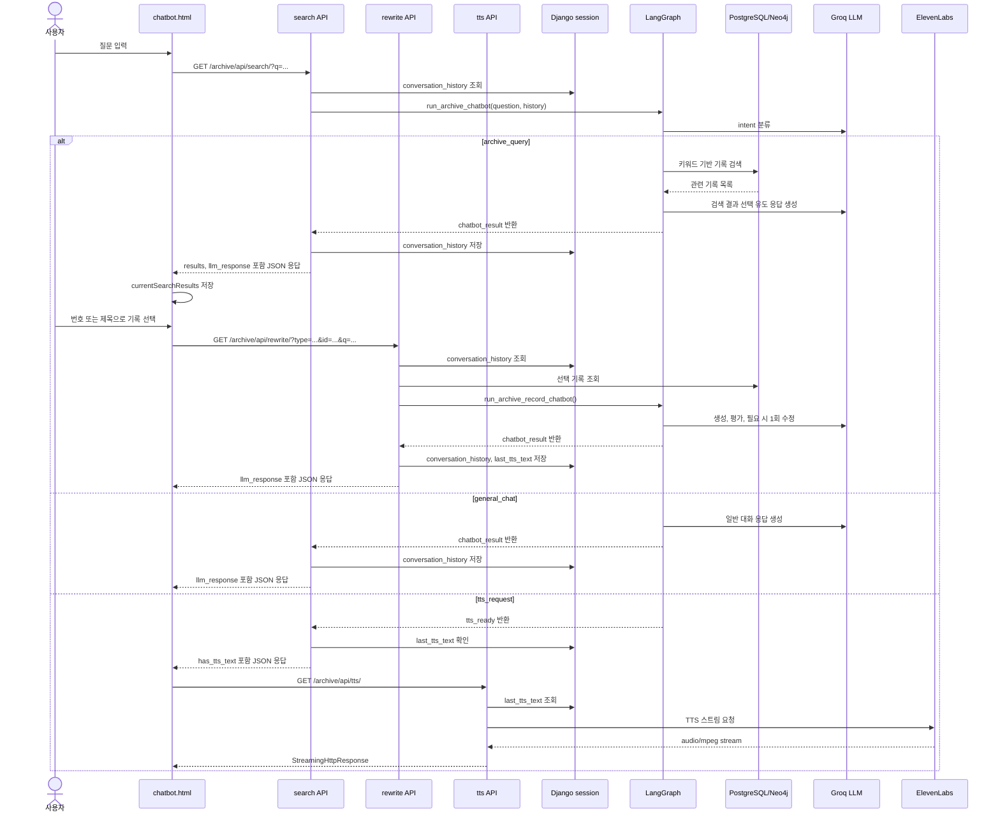

# Archive 앱 구현 흐름 정리

이 문서는 현재 코드에 반영된 `archive` 앱의 화면, API, LangGraph, 검색, 금기 자료실, TTS 흐름을 정리한다.

## 1. 적용 범위

- 진입 화면:
  - `templates/archive/index.html`
  - `templates/archive/chatbot.html`
  - `templates/archive/archive.html`
- URL 설정:
  - `config/urls.py`
  - `archive/urls.py`
- 주요 API:
  - `/archive/api/search/`
  - `/archive/api/rewrite/`
  - `/archive/api/tts/`
  - `/archive/api/taboos/`
  - `/archive/api/taboos/search/`
  - `/archive/api/taboos/today/`
  - `/archive/api/taboos/<id>/`
- 주요 서비스:
  - `archive/services/graph.py`
  - `archive/services/graph_nodes.py`
  - `archive/services/archive_search.py`
  - `archive/services/keyword_extractor.py`
  - `archive/services/search_relevance.py`
  - `archive/services/search_policy.py`
  - `archive/services/prompt.py`
  - `archive/services/formatter.py`
  - `archive/services/session_state.py`
  - `archive/services/taboo.py`
  - `archive/services/tts.py`
- LLM 팩토리:
  - `common/llm_factory.py`

## 2. URL 진입 흐름

`config/urls.py`에서 루트 `/`는 `archive.views.index`로 연결되고, `/archive/` 아래 경로는 `archive.urls`가 담당한다.

| URL | View | 역할 |
|---|---|---|
| `/` | `archive.views.index` | 프로젝트 첫 화면 |
| `/archive/` | `archive.views.index` | archive 첫 화면 |
| `/archive/chatbot/` | `archive.views.chatbot` | 기록 열람실 챗봇 화면 |
| `/archive/archive/` | `archive.views.archive` | 금기 자료실 화면 |
| `/archive/list/` | `archive.views.chatbot` | 챗봇 화면 별칭 |
| `/archive/search/` | `archive.views.chatbot` | 챗봇 화면 별칭 |
| `/archive/taboos/` | `archive.views.archive` | 금기 자료실 화면 별칭 |
| `/archive/taboos/today/` | `archive.views.archive` | 금기 자료실 화면 별칭 |
| `/archive/taboos/<id>/` | `archive.views.archive` | 금기 자료실 화면 별칭 |

## 3. 화면 흐름



첫 화면의 입력은 직접 API를 호출하지 않고 `/archive/chatbot/?q=...`로 이동한다. 챗봇 화면은 쿼리스트링의 `q` 값을 읽어 첫 메시지처럼 처리한다.

## 4. 챗봇 API 흐름



`/archive/api/search/`는 처음부터 괴담 본문을 생성하지 않는다. 검색 의도라면 관련 원본 기록 목록과 선택을 유도하는 응답을 반환하고, 사용자가 특정 기록을 고른 뒤 `/archive/api/rewrite/`에서 괴담 재구성 단계로 들어간다.

### 챗봇 시퀀스 다이어그램



## 5. LangGraph 활용 흐름

archive 앱은 LangGraph를 사용해 챗봇 처리 단계를 노드 단위로 나누고, 입력 의도에 따라 다음 흐름을 분기한다.

| 노드 | 함수 | 역할 |
|---|---|---|
| `intent` | `intent_node` | 사용자 입력 의도와 키워드 분류 |
| `general_chat` | `general_chat_node` | 검색이 아닌 일반 대화 응답 |
| `tts` | `tts_node` | 낭독 요청 상태 반환 |
| `search` | `search_node` | DB 검색 및 선택 유도 응답 |
| `generate` | `generate_node` | 선택 기록 기반 괴담 본문 생성 |
| `evaluate` | `evaluation_node` | 생성 결과 평가 |
| `revise` | `revise_node` | 평가 실패 시 1회 수정 |

의도별 분기 기준은 다음과 같다.

| intent | 조건 | 다음 흐름 |
|---|---|---|
| `archive_query` | 괴담, 조회, 검색, 금기, 기록, 본문 등 검색 의도 | `search` |
| `general_chat` | 인사, 감사, 잡담, 검색 대상이 불분명한 문장 | `general_chat` |
| `tts_request` | 읽어줘, 낭독, 들려줘, 재생, tts 등 | `tts` |

특정 기록이 이미 `source_story`로 들어온 경우에는 `intent` 분류를 건너뛰고 `generate` 흐름으로 진행한다. 이 경로는 `/archive/api/rewrite/`에서 사용된다.

## 6. 검색 흐름

`archive/services/archive_search.py`의 `search_archive_records_for_question()`이 검색을 담당한다.

1. `keyword_extractor.extract_keywords()`로 사용자 질문에서 검색 키워드를 만든다.
2. Neo4j 연결이 가능하면 `get_neo4j_related_keywords()`로 관련 키워드를 확장한다.
3. `search_archive_records_by_keywords()`가 PostgreSQL 모델을 검색한다.
4. 결과가 없으면 `extract_fallback_keywords()`로 원문 토큰 기반 보조 키워드를 만들어 한 번 더 검색한다.
5. 검색 결과는 관련도 점수 기준으로 정렬되고 기본 최대 5개까지 반환된다.

검색 대상 모델은 다음과 같다.

| 모델 | DB 테이블 | 검색 필드 |
|---|---|---|
| `HorrorStory` | `horror_stories` | `title`, `content`, `preview`, `region`, `category` |
| `MythEntity` | `myth_entities` | `name`, `origin`, `description`, `behavior`, `weakness`, `history`, `signs`, `survival_rules` |
| `Superstition` | `superstitions` | `content`, `category`, `region` |

`search_relevance.py`는 너무 일반적인 검색어와 약한 매칭 결과를 걸러내고, `score_record_text()`로 결과 정렬 점수를 계산한다.

## 7. 목록 선택 방식

챗봇 프론트는 검색 결과를 브라우저 상태에 저장한다.

| 프론트 상태 | 역할 |
|---|---|
| `currentSearchResults` | 마지막 검색 결과 목록 |
| `lastArchiveQuery` | 마지막 검색 질문 |
| `window.lastViewedRecord` | 마지막으로 열람한 기록 |

사용자가 번호를 입력하면 `currentSearchResults[index]`를 선택한다. 제목이나 제목 일부를 포함한 문장을 입력하면 `findSelectedRecord()`가 정확 매칭 또는 토큰 매칭으로 선택 기록을 찾는다.

선택이 확정되면 `rewriteSelectedRecord()`가 `/archive/api/rewrite/?type=...&id=...&q=...`를 호출한다.

## 8. 선택 기록 기반 생성 흐름

`/archive/api/rewrite/`는 `type`과 `id`로 원본 기록을 하나 조회한 뒤 `run_archive_record_chatbot()`을 실행한다.

1. `get_archive_record()`가 `horror_story`, `myth_entity`, `superstition` 중 하나를 조회한다.
2. 조회 결과를 `source_story` 형태로 변환한다.
3. `generate_node`가 원본 기록, 키워드, 대화 기록을 기반으로 괴담 본문을 생성한다.
4. `evaluation_node`가 생성 결과를 JSON 기준으로 평가한다.
5. 실패하면 `revise_node`가 한 번만 수정한다.
6. 최종 `llm_response`를 JSON으로 반환한다.
7. View는 최종 본문을 `last_tts_text`에 저장한다.

평가 기준은 다음 네 항목이다.

| 평가 키 | 의미 |
|---|---|
| `keyword_passed` | 키워드가 자연스럽게 반영됐는지 |
| `consistency_passed` | 원본 기록의 핵심 내용과 충돌하지 않는지 |
| `style_passed` | 문체가 일관되는지 |
| `atmosphere_passed` | 공포 분위기와 감각적 긴장이 충분한지 |

평가 응답을 JSON으로 파싱하지 못하면 불합격 평가로 처리한다.

## 9. 프롬프트 구성

프롬프트는 `archive/services/prompt.py`에 모여 있다.

| 함수 | 역할 |
|---|---|
| `build_intent_classification_prompt` | 입력 의도와 검색 키워드 분류 |
| `build_general_chat_prompt` | archive 챗봇 말투의 일반 대화 |
| `build_search_choice_prompt` | 검색 결과 목록 기반 선택 유도 응답 |
| `build_generation_prompt` | 선택 원본 기록 기반 괴담 생성 |
| `build_evaluation_prompt` | 생성 결과 평가 |
| `build_revision_prompt` | 실패한 초안 수정 |

대화 기록은 `format_conversation_history()`가 프롬프트용 텍스트로 바꾸고, 원본 기록은 `format_source_story()`가 제목, 유형, 지역, 본문 형태로 정리한다.

## 10. 세션 상태

`archive/services/session_state.py`는 Django 세션에 archive 챗봇 상태를 저장한다.

| 값 | 용도 |
|---|---|
| `conversation_history` | 최근 대화 기록 저장 |
| `last_tts_text` | 마지막으로 생성된 낭독 대상 본문 저장 |
| `last_tts_error` | 마지막 TTS 오류 메시지 저장 |

세션 키는 로그인 사용자와 익명 사용자를 분리한다.

- 로그인 사용자: `archive_*_user_{user.id}`
- 익명 사용자: `archive_*_anonymous`

현재 검색 결과 목록은 서버 세션이 아니라 `chatbot.html`의 `sessionStorage`와 `currentSearchResults`에 저장된다. 로그아웃 링크를 누르면 프론트의 채팅 상태를 지우고, Django 로그아웃 시그널은 `clear_user_archive_session()`으로 archive 관련 서버 세션 기록을 제거한다.

## 11. TTS 흐름

TTS는 `archive/services/tts.py`에서 ElevenLabs 스트리밍 API를 사용한다.

필요한 환경 변수는 다음과 같다.

```env
ELEVENLABS_API_KEY=
ELEVENLABS_VOICE_ID=
ELEVENLABS_MODEL_ID=
```

동작 순서는 다음과 같다.

1. `/archive/api/rewrite/`가 생성된 괴담 본문을 `last_tts_text`에 저장한다.
2. 사용자가 읽어줘, 낭독, tts, 재생 같은 문장을 입력한다.
3. `/archive/api/search/`가 `tts_request`로 분기한다.
4. 저장된 본문이 있으면 프론트가 `/archive/api/tts/`를 오디오 소스로 연다.
5. 서버가 `open_story_audio_stream()`으로 ElevenLabs 스트림을 열고 `StreamingHttpResponse`로 `audio/mpeg`를 반환한다.

`POST /archive/api/tts/`는 직접 전달받은 텍스트를 저장할 수도 있다. `prepare_only`가 참이면 스트리밍하지 않고 `last_tts_text`만 준비한다.

TTS 오류 확인용 보조 요청도 있다.

| 요청 | 역할 |
|---|---|
| `/archive/api/tts/?error=1` | 마지막 TTS 오류 메시지 조회 |
| `/archive/api/tts/?diagnose=1` | 현재 저장된 TTS 본문으로 스트림 준비 가능 여부 점검 |

`ELEVENLABS_MODEL_ID` 기본값은 `eleven_multilingual_v2`다. `eleven_v3`가 아닌 모델에는 `optimize_streaming_latency=1` 쿼리를 붙인다.

## 12. 오디오 볼륨과 배경음

챗봇 화면은 `get_chatbot_audio_volume_settings()` 값을 JSON으로 받아 사용한다.

| 값 | 기본값 | 역할 |
|---|---:|---|
| `bgm` | `27` | YouTube 배경음 볼륨 |
| `tts` | `90` | TTS 오디오 볼륨 |
| `max` | `100` | 볼륨 비율 계산 기준 |

낭독 시작 시 `chatbot.html`은 YouTube iframe을 생성해 배경음을 재생하고, TTS 오디오는 `/archive/api/tts/`를 `Audio` 객체로 열어 재생한다. TTS가 종료되거나 사용자가 중지 명령을 입력하면 현재 오디오와 YouTube iframe을 정리한다.

## 13. 금기 자료실 흐름

`templates/archive/archive.html`은 금기 자료실 화면이다. 화면 진입 후 `loadTaboos()`가 전체 목록 API를 호출한다.

| 기능 | 프론트 함수 | API | 서비스 |
|---|---|---|---|
| 전체 목록 | `loadTaboos()` | `/archive/api/taboos/` | `list_taboos()` |
| 검색 | `loadTaboos(keyword)` | `/archive/api/taboos/search/?q=...` | `search_taboos()` |
| 상세 선택 | `openTabooDetail()` | `/archive/api/taboos/<id>/` | `get_taboo()` |
| 오늘의 금기 | `openDailyTaboo()` | `/archive/api/taboos/today/` | `get_today_taboo()` |

`get_today_taboo()`는 현재 날짜 문자열의 문자 코드 합을 전체 금기 개수로 나눈 나머지를 사용해 하루 동안 고정되는 항목을 고른다.

금기 API 응답은 `serialize_taboo()`가 다음 형태로 정리한다.

| 필드 | 의미 |
|---|---|
| `id` | DB ID |
| `index` | 원본 인덱스 또는 ID |
| `content` | 금기 문장 |
| `category` | 분류 |
| `region` | 지역 |
| `source` | 출처 |
| `source_ref_id` | 출처 기준 ID |

## 14. 북마크 연동

챗봇에서 특정 기록을 열람한 뒤 사용자가 `저장` 또는 `save`를 입력하면 `chatbot.html`이 `/accounts/api/bookmark/add/`를 호출한다.

전송 값은 다음과 같다.

| 값 | 출처 |
|---|---|
| `horror_id` | `window.lastViewedRecord.id` |
| `horror_title` | `window.lastViewedRecord.name` |
| `horror_type` | `window.lastViewedRecord.type` |

로그인하지 않은 사용자는 accounts API에서 401 응답을 받는다.

## 15. 오류 처리

| 상황 | 처리 |
|---|---|
| 빈 검색어 | `status: empty` JSON 응답 |
| DB 오류 | 503 JSON 응답 |
| Groq rate limit | 429 JSON 응답 |
| LLM 생성 오류 | 503 JSON 응답 |
| 선택 기록 없음 | 404 JSON 응답 |
| 잘못된 rewrite 파라미터 | 400 JSON 응답 |
| TTS 본문 없음 | 400 JSON 응답 |
| ElevenLabs 설정 없음 | 400 JSON 응답 |
| ElevenLabs 생성 실패 | 503 JSON 응답 및 오류 메시지 저장 |
| 금기 데이터 없음 | `status: empty` JSON 응답 |

## 16. LLM 설정

`common/llm_factory.py`의 현재 설정은 다음과 같다.

| 함수 | 모델 | 용도 |
|---|---|---|
| `get_llm()` | Groq `openai/gpt-oss-120b` | archive intent, 일반 대화, 검색 선택 응답, 생성, 평가, 수정 |
| `get_post_generation_llm()` | Ollama `gemma3:4b` | post 생성 계열 |
| `generator_llm()` | Ollama `gemma4:e4b` | generator 계열 |

archive 앱의 LangGraph 노드는 공통적으로 `get_llm()`을 통해 LLM을 호출한다.
