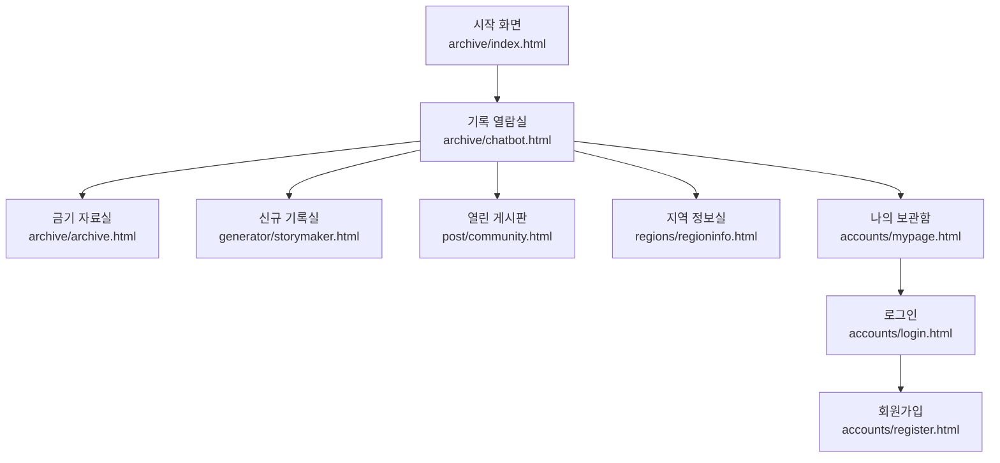

# 화면 설계서

## 1. 문서 개요

본 문서는 괴담 아카이브 서비스의 Web UI 화면 구조를 정의합니다.

- 프로젝트명: 괴이 실록
- 작성 기준: `setup_guide.md`, `docs/service-planning.md`, `docs/requirements-definition.csv`, 실제 template/static 파일
- 화면 콘셉트: 오래된 괴담 기록소, 터미널형 BBS, 검정/붉은색 중심 공포 UI
- 공통 정적 파일: `static/css/styles.css`, `static/js/flicker.js`

## 2. 화면 목록

| No | 화면명 | App | Template | 대표 URL | URL name |
|---:|---|---|---|---|---|
| 1 | 시작 화면 | archive | `archive/index.html` | `/` | `home` |
| 2 | 기록 열람실 | archive | `archive/chatbot.html` | `/archive/chatbot/` | `archive:chatbot` |
| 3 | 금기 자료실 | archive | `archive/archive.html` | `/archive/archive/` | `archive:archive` |
| 4 | 신규 기록실 | generator | `generator/storymaker.html` | `/generator/storymaker/` | `generator:storymaker` |
| 5 | 열린 게시판 | post | `post/community.html` | `/post/community/` | `post:community` |
| 6 | 지역 정보실 | regions | `regions/regioninfo.html` | `/regions/regioninfo/` | `regions:regioninfo` |
| 7 | 로그인 | accounts | `accounts/login.html` | `/accounts/login/` | `accounts:login` |
| 8 | 회원가입 | accounts | `accounts/register.html` | `/accounts/register/` | `accounts:register` |
| 9 | 나의 보관함 | accounts | `accounts/mypage.html` | `/accounts/mypage/` | `accounts:mypage` |

## 3. 공통 레이아웃

### 3.1 공통 스타일

- 전체 화면은 검정 배경과 붉은 강조색을 사용합니다.
- `DungGeunMo.ttf` 픽셀 폰트를 사용해 오래된 기록 장치 느낌을 제공합니다.
- 주요 페이지는 BBS/터미널 스타일의 상단바, 메뉴, 로그형 콘텐츠 영역으로 구성합니다.
- `flicker.js`를 통해 화면 깜빡임 효과를 공통 적용합니다.

### 3.2 공통 메뉴

아래 메뉴는 주요 BBS형 화면에서 공통으로 사용합니다.

| 메뉴 | 이동 대상 | URL name |
|---|---|---|
| 기록 열람실 | 괴담 검색/챗봇 화면 | `archive:sillokgwan` |
| 금기 자료실 | 금기 목록/오늘의 금기 화면 | `archive:geumgirok` |
| 신규 기록실 | 괴담 생성 화면 | `generator:goeijejoso` |
| 열린 게시판 | 목격담/창작담 게시판 | `post:mokgyeokgirok` |
| 지역 정보실 | 지도 화면 | `regions:jidogam` |
| 나의 보관함 | 사용자 기록 화면 | `accounts:mypage` |

## 4. 화면별 설계

### 4.1 시작 화면

- Template: `templates/archive/index.html`
- URL: `/`
- 주요 목적: 서비스 진입, 공포 분위기 연출, 첫 검색어 입력

| 구역 | 구성 요소 | 설명 |
|---|---|---|
| 배경 이미지 | `dark-room.png`, `red-room.png` | 어두운 방과 붉은 방 이미지를 전환 연출에 사용 |
| 오디오 | `switch-sound.m4a`, `horror-loop.wav`, `opendoor.mp3` | 시작, 공포 루프, 문 열림 효과음 |
| 시작 버튼 | 기록 열기 | 클릭 시 화면 깜빡임 후 입력창 활성화 |
| 입력 폼 | 첫 문장 입력창, 전송 버튼 | 입력값을 기록 열람실 검색 쿼리로 전달 |

동작 흐름:

1. 사용자가 `기록 열기`를 클릭합니다.
2. 화면 깜빡임과 사운드가 재생됩니다.
3. 입력창이 활성화됩니다.
4. 검색어 입력 후 전송하면 `/archive/sillokgwan/?q=검색어`로 이동합니다.

### 4.2 기록 열람실

- Template: `templates/archive/chatbot.html`
- URL: `/archive/chatbot/`
- 주요 목적: 괴담/지역/목격담 키워드 검색 경험 제공

| 구역 | 구성 요소 | 설명 |
|---|---|---|
| 상단바 | 접속 경로, 화면명, 로그인 링크 | 기록소 접속 UI 표현 |
| 메뉴 | 6개 주요 화면 링크 | 서비스 주요 화면 이동 |
| 주의문 | NOTICE 01~03 | 화면 분위기와 사용 규칙 표현 |
| 로그 영역 | 시스템 메시지, 사용자 입력, 응답 | 터미널형 대화 표시 |
| 입력 라인 | 검색어 입력, 전송 버튼 | 키워드/지역명/목격담 입력 |

추후 연결 기능:

- `archive.services.search_stories(keyword)`
- 괴담/금기 제목 및 내용 기반 검색
- LLM 요약 또는 추천은 MVP 이후 확장

### 4.3 금기 자료실

- Template: `templates/archive/archive.html`
- URL: `/archive/archive/`
- 주요 목적: 금기 목록, 금기 분류 검색, 오늘의 금기 조회

| 구역 | 구성 요소 | 설명 |
|---|---|---|
| 상단바 | 접속 경로, 화면명, 로그인 링크 | 금기 자료실 위치 표시 |
| 메뉴 | 6개 주요 화면 링크 | 공통 화면 이동 |
| 주의문 | NOTICE 01~03 | 금기 열람 경고문 |
| 오늘의 금기 버튼 | 오늘의 금기 | 모달을 열어 랜덤 금기 표시 |
| 금기 모달 | 제목, 본문, 안내문, 닫기 버튼 | 오늘의 금기 표시 영역 |
| 로그 영역 | 금기 분류 목록 | 번호 기반 금기 분류 안내 |
| 입력 라인 | 분류 번호/검색어 입력 | 금기 분류 또는 검색어 처리 |

추후 연결 기능:

- `archive.services.list_taboos()`
- `archive.services.get_today_taboo()`
- `archive.services.get_taboo(taboo_id)`

### 4.4 신규 기록실

- Template: `templates/generator/storymaker.html`
- URL: `/generator/storymaker/`
- 주요 목적: 사용자 입력 기반 AI 괴담 생성

| 입력 항목 | name/id | 설명 |
|---|---|---|
| 지역 | `region` | 괴담의 배경 지역 |
| 장소 | `place` | 괴담 발생 장소 |
| 괴이 유형 | `entityType` | 귀신, 요괴, 저주, 실종 등 |
| 금기 | `taboo` | 지키면 안 되는 규칙 또는 금기 |
| 시간 | `time` | 사건 발생 시간 |
| 발생 조건 | `condition` | 괴이가 발생하는 조건 |
| 결말 | `ending` | 이야기의 마무리 방향 |

| 출력 구역 | 설명 |
|---|---|
| 생성된 괴담 | 입력 조건을 기반으로 생성 결과 표시 |
| 저장/재생성 영역 | 추후 생성 결과 저장 또는 재생성 기능 연결 |

추후 연결 기능:

- `generator.services.generate_story(input_data, user=None)`
- `generator.services.save_generated_story(user, data)`

### 4.5 열린 게시판

- Template: `templates/post/community.html`
- URL: `/post/community/`
- 주요 목적: 목격담/창작담 목록 조회와 글쓰기 UI 제공

| 구역 | 구성 요소 | 설명 |
|---|---|---|
| 상단바 | 접속 경로, 화면명, 로그인 링크 | 게시판 위치 표시 |
| 메뉴 | 6개 주요 화면 링크 | 공통 화면 이동 |
| 헤더 | 제목, 설명, 글쓰기 버튼 | 열린 게시판 진입부 |
| 탭 | 목격담, 창작담 | 게시글 종류 전환 |
| 글쓰기 패널 | 제목, 지역, 내용, 등록/취소 | 게시글 작성 입력 UI |
| 게시글 목록 | 카드형 버튼 목록 | 선택 시 상세 내용 펼침 |

추후 연결 기능:

- `post.services.list_posts()`
- `post.services.create_post(user, data)`
- `post.services.get_post(post_id)`
- `post.services.update_post(post, data)`
- `post.services.delete_post(post)`

### 4.6 지역 정보실

- Template: `templates/regions/regioninfo.html`
- URL: `/regions/regioninfo/`
- 주요 목적: 지도 기반 괴담 분포 탐색

| 구역 | 구성 요소 | 설명 |
|---|---|---|
| 상단바 | 접속 경로, 화면명, 로그인 링크 | 지역 정보실 위치 표시 |
| 메뉴 | 6개 주요 화면 링크 | 공통 화면 이동 |
| 지도 툴바 | 축소, 확대, RESET, 현재 배율 | 지도 확대/축소 조작 |
| 지도 이미지 | `goei_map_thin_red.png` | 괴이 분포 지도 |

추후 연결 기능:

- `regions.services.get_region_list()`
- `regions.services.get_region_detail(region_name)`
- `regions.services.get_region_places(region_name)`

### 4.7 로그인

- Template: `templates/accounts/login.html`
- URL: `/accounts/login/`
- 주요 목적: 사용자 로그인 진입

| 구역 | 구성 요소 | 설명 |
|---|---|---|
| 안내 문구 | 타이핑 효과 문장 | 로그인 확인 분위기 연출 |
| 로그인 폼 | ID, PW | 사용자 인증 입력 |
| 버튼 | 로그인, 취소 | 로그인 요청 또는 이전 화면 이동 |
| 회원가입 링크 | 아직 기록자가 아니십니까? | 회원가입 화면 이동 |

추후 연결 기능:

- `accounts.services.login_user(request, user_id, password)`
- Django auth 기반 인증
- 로그인 성공 시 이전 화면 또는 메인 화면 이동

### 4.8 회원가입

- Template: `templates/accounts/register.html`
- URL: `/accounts/register/`
- 주요 목적: 신규 사용자 등록

| 입력 항목 | name | 설명 |
|---|---|---|
| ID | `userId` | 로그인 아이디 |
| PW | `password` | 비밀번호 |
| EMAIL | `email` | 이메일 |

| 버튼/링크 | 설명 |
|---|---|
| CREATE | 회원가입 요청 |
| BACK | 로그인 화면 이동 |

추후 연결 기능:

- `accounts.services.signup_user(data)`
- Django User 또는 확장 모델 저장

### 4.9 나의 보관함

- Template: `templates/accounts/mypage.html`
- URL: `/accounts/mypage/`
- 주요 목적: 사용자가 생성하거나 작성한 기록 조회

| 구역 | 구성 요소 | 설명 |
|---|---|---|
| 상단바 | 접속 경로, 화면명, 로그인 링크 | 나의 보관함 위치 표시 |
| 메뉴 | 6개 주요 화면 링크 | 공통 화면 이동 |
| 헤더 | 제목, 설명 | 사용자 기록 관리 안내 |
| 탭 | 창작담 기록, 목격담 기록 | 기록 종류 전환 |
| 기록 카드 | 상태, 제목, 지역, 날짜 | 사용자의 저장/작성 기록 표시 |
| 상세 펼침 | 메타 정보, 본문 | 카드 클릭 시 상세 내용 표시 |

추후 연결 기능:

- `accounts.services.get_user_profile(user)`
- `generator.services.list_user_generated_stories(user)`
- `post.services.list_user_posts(user)`

## 5. 화면 이동 흐름

## 6. 담당 범위 기준

| 담당 영역 | 작업 범위 |
|---|---|
| Web UI / template / static | HTML, CSS, JS, 이미지, 오디오, 폰트 연결 |
| accounts app | 회원가입, 로그인, 로그아웃, 사용자 인증, 마이페이지 기본 정보 |
| archive app | 괴담/금기 화면 연결 및 데이터 조회 로직은 담당자 구현 |
| generator app | AI 괴담 생성 로직은 담당자 구현 |
| post app | 게시판 CRUD 로직은 담당자 구현 |
| regions app | Neo4j 지역 조회 로직은 담당자 구현 |

## 7. 정적 파일 목록

| 구분 | 파일 |
|---|---|
| CSS | `static/css/styles.css` |
| JS | `static/js/flicker.js` |
| Font | `static/fonts/DungGeunMo.ttf` |
| Image | `static/images/dark-room.png` |
| Image | `static/images/red-room.png` |
| Image | `static/images/goei_map_thin_red.png` |
| Image | `static/images/jumpscare.avif` |
| Image | `static/images/jumpscare.jpeg` |
| Audio | `static/audio/switch-sound.m4a` |
| Audio | `static/audio/horror-loop.wav` |
| Audio | `static/audio/opendoor.mp3` |
| Audio | `static/audio/closedoor.mp3` |
| Audio | `static/audio/jumpscare-sting.wav` |

## 8. 비고

- 현재 화면은 정적 UI와 클라이언트 사이드 인터랙션 중심으로 구성되어 있습니다.
- DB, LLM, Neo4j 연동은 각 앱 담당자가 `services.py` 기준으로 구현합니다.
- 화면 파일명은 현재 프로젝트에 실제 존재하는 파일명을 기준으로 작성했습니다.
