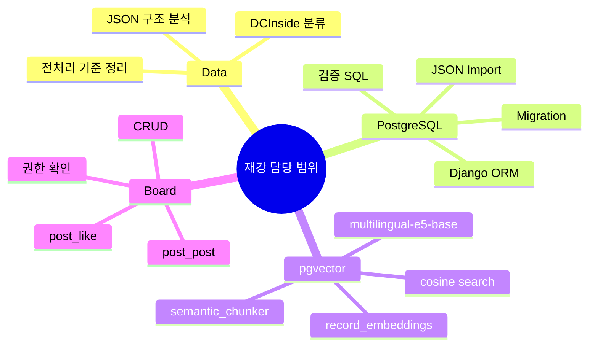
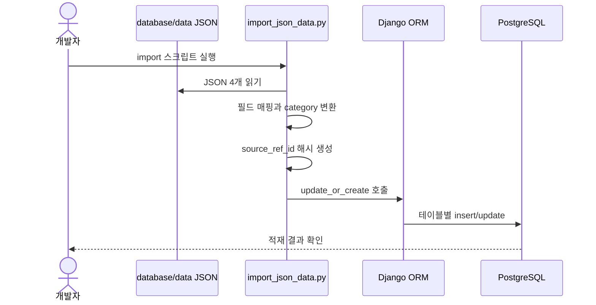
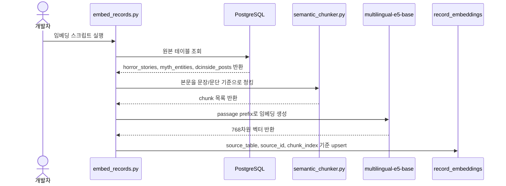
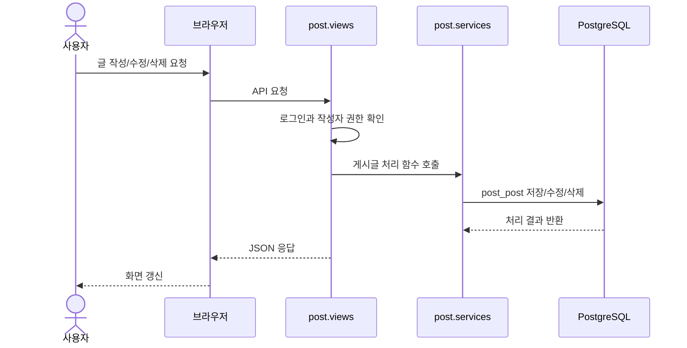

# 재강 — 데이터 · PostgreSQL · pgvector · 열린 게시판

> **괴이실록 4차 프로젝트** · 담당 범위 정리 · 데이터 전처리 / 관계형 DB / 벡터 검색 / 열린 게시판 연결

원본 괴담·괴이·미신·DCInside 데이터를 PostgreSQL에 적재하고, pgvector 기반 의미 검색이 가능하도록 임베딩 파이프라인을 구성했다.  
또한 열린 게시판의 목격담/창작담 작성, 목록, 상세, 수정, 삭제, 추천 흐름이 DB와 연결되도록 구조를 정리했다.

---

## 작업 목차

| 문서/영역 | 핵심 내용 |
|---|---|
| 데이터 전처리 | JSON 4개 구조 확인, 필드 매핑, DCInside 분류 기준 정리 |
| PostgreSQL | `horror_stories`, `myth_entities`, `superstitions`, `dcinside_posts` 적재 |
| pgvector | `record_embeddings` 테이블, 청킹, 임베딩 저장, 검색 스크립트 |
| 열린 게시판 | `post_post`, `post_like` 기반 게시판 CRUD와 추천 처리 |
| 실행/검증 | Docker, migration, import, count check, vector search 순서 정리 |

---

## 기술 스택 한눈에 보기



---

## 1. 담당 작업 요약

| 구분 | 진행한 일 | 주요 결과 |
|---|---|---|
| 데이터 전처리 | 원본 JSON 구조 분석, 적재 기준 정리, DCInside 분류 기준 설계 | PostgreSQL에 넣을 수 있는 데이터 기준 마련 |
| PostgreSQL | ERD 설계, Django 모델/마이그레이션 기반 테이블 생성, JSON 데이터 적재 | `horror_stories`, `myth_entities`, `superstitions`, `dcinside_posts` 등 구성 |
| pgvector | pgvector 확장, 임베딩 저장 테이블 생성, 청크 분리, 임베딩/검색 스크립트 작성 | `record_embeddings` 기반 의미 검색 가능 |
| 열린 게시판 | 목격담/창작담 작성, 목록, 상세, 수정, 삭제, 추천 흐름 점검 및 연결 | 사용자 게시글을 PostgreSQL에 저장하고 화면에서 관리 가능 |

---

## 2. 데이터 적재 대상

현재 `database/data` 기준 JSON 파일 4개를 PostgreSQL에 적재한다.

| JSON 파일 | 대상 테이블 | 역할 |
|---|---|---|
| `verified_korean_horror_master.json` | `horror_stories` | 검증 괴담/도시전설 |
| `ultimate_global_mythology_1000.json` | `myth_entities` | 세계 괴이/신화 존재 |
| `misin.json` | `superstitions` | 미신/금기 문장 |
| `dcinside_horror_filtered.json` | `dcinside_posts` | DCInside 수집 게시글 |

DCInside 데이터는 사용자 작성 게시글인 `post_post`와 섞지 않고 `dcinside_posts`로 분리했다.  
이렇게 하면 `post_post`는 실제 서비스 사용자가 작성한 열린 게시판 글만 담당하고, `dcinside_posts`는 외부 수집 데이터와 임베딩 검색용 데이터로 관리할 수 있다.

---

## 3. PostgreSQL 테이블 역할

| 테이블 | 역할 |
|---|---|
| `horror_stories` | 한국어 괴담 원본 데이터 |
| `myth_entities` | 괴이/신화 존재 데이터 |
| `superstitions` | 미신 문장 데이터 |
| `dcinside_posts` | DCInside 수집 게시글 |
| `post_post` | 사용자가 직접 작성한 열린 게시판 글 |
| `post_like` | 사용자가 게시글에 누른 추천 기록 |
| `record_embeddings` | pgvector 임베딩 청크 저장 |

`dcinside_posts` 권장 컬럼은 다음과 같다.

| 컬럼 | 설명 |
|---|---|
| `source` | 원본 출처 |
| `source_ref_id` | 중복 적재 방지용 해시 ID |
| `category` | `WITNESS` 또는 `CREATION` |
| `title` | 화면 표시용 제목 |
| `region` | 지역 문자열 |
| `content` | 원문 본문 |
| `metadata` | 원본 title 태그 등 보조 정보 |
| `is_active` | 화면/검색 노출 여부 |
| `created_at` | 적재 시각 |

---

## 4. DCInside 처리 기준

DCInside 원본의 `title`은 실제 제목이 아니라 태그인 경우가 많다.

| 원본 title | 저장 category | title 처리 |
|---|---|---|
| `[창작]` | `CREATION` | 본문 앞부분으로 제목 생성 |
| `[경험]` | `WITNESS` | 본문 앞부분으로 제목 생성 |
| `[괴담]` | `WITNESS` | 본문 앞부분으로 제목 생성 |
| `[사건/사고]` | `WITNESS` | 본문 앞부분으로 제목 생성 |
| 기타 | 제외 또는 추후 검토 | 품질 확인 후 결정 |

DCInside 본문 미리보기는 별도 `preview` 컬럼으로 저장하지 않는다.  
목록 화면에서는 `content`를 필요한 길이만큼 잘라서 사용한다.

---

## 5. pgvector 임베딩 구조

임베딩은 원본 테이블에 직접 저장하지 않고 별도 테이블인 `record_embeddings`에 저장한다.

| 항목 | 값 |
|---|---|
| 임베딩 모델 | `intfloat/multilingual-e5-base` |
| 벡터 차원 | 768 |
| 저장 테이블 | `record_embeddings` |
| 거리 기준 | cosine distance |
| 문서 prefix | `passage:` |
| 검색어 prefix | `query:` |

현재 임베딩 대상은 다음 3개이다.

```text
horror_stories
myth_entities
dcinside_posts
```

현재 임베딩 제외 대상은 다음과 같다.

```text
superstitions
post_post
```

`superstitions`는 단순 문장 데이터로 PostgreSQL에만 저장한다.  
`post_post`는 사용자가 계속 작성/수정/삭제하는 데이터라, 현재 단계에서는 임베딩 대상에서 제외했다.

---

## 6. 주요 파일

| 파일 | 역할 |
|---|---|
| `archive/models.py` | `HorrorStory`, `MythEntity`, `Superstition`, `DcinsidePost` 모델 |
| `archive/migrations/0002_dcinsidepost.py` | `dcinside_posts` 테이블 생성 migration |
| `database/PostgreSQL/import_json_data.py` | JSON 4개를 PostgreSQL에 적재 |
| `database/PostgreSQL/schema.sql` | ERD/SQL 기준 스키마 |
| `database/PostgreSQL/queries/count_check.sql` | 테이블별 적재 개수 확인 |
| `database/PostgreSQL/queries/sample_select.sql` | 화면 기준 샘플 조회 |
| `database/PostgreSQL/pgvector/schema_pgvector.sql` | pgvector 확장과 `record_embeddings` 테이블 |
| `database/PostgreSQL/pgvector/semantic_chunker.py` | 문장/문단 기반 청킹 |
| `database/PostgreSQL/pgvector/embed_records.py` | 원본 테이블 임베딩 저장 |
| `database/PostgreSQL/pgvector/search_vectors.py` | 유사도 검색 테스트 |

---

## 7. 실행 순서

PostgreSQL 초기화 후 데이터 적재:

```powershell
docker compose up -d postgres
python manage.py migrate
python database\PostgreSQL\import_json_data.py
```

pgvector 스키마 생성과 임베딩:

```powershell
Get-Content database\PostgreSQL\pgvector\schema_pgvector.sql | docker compose exec -T postgres psql -U postgres -d goei_sillok
python database\PostgreSQL\pgvector\embed_records.py --reset
```

DCInside만 임베딩 테스트:

```powershell
python database\PostgreSQL\pgvector\embed_records.py --source dcinside_posts --reset
```

검색 테스트:

```powershell
python database\PostgreSQL\pgvector\search_vectors.py "폐교 음악실 귀신"
```

---

## 8. 데이터 적재 시퀀스



---

## 9. pgvector 임베딩 시퀀스



---

## 10. 열린 게시판 시퀀스



---

## 11. 검증 포인트

| 검증 항목 | 확인 방법 |
|---|---|
| 테이블 생성 | `python manage.py migrate` 후 DBeaver 또는 `\dt` 확인 |
| JSON 적재 | `count_check.sql` 실행 |
| DCInside 분류 | `dcinside_posts`의 `category`별 개수 확인 |
| 임베딩 저장 | `record_embeddings`에서 `source_table`별 개수 확인 |
| 검색 동작 | `search_vectors.py`로 질의 테스트 |
| 게시판 CRUD | 열린 게시판에서 작성, 상세, 수정, 삭제 확인 |

---

## 12. 최종 정리

이번 작업의 핵심은 원본 JSON 데이터를 서비스용 관계형 데이터와 검색용 벡터 데이터로 나눈 것이다.

PostgreSQL에는 괴담, 괴이, 미신, DCInside 수집글, 사용자 게시글을 역할별 테이블로 분리했다.  
pgvector에는 `horror_stories`, `myth_entities`, `dcinside_posts`를 청크 단위로 임베딩해 의미 기반 검색이 가능하도록 구성했다.  
열린 게시판은 `post_post`와 `post_like`를 중심으로 사용자 작성글과 추천 기록을 PostgreSQL에 저장하도록 연결했다.
