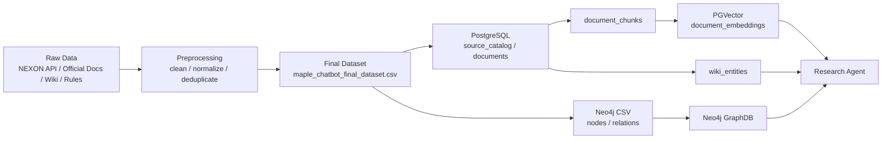
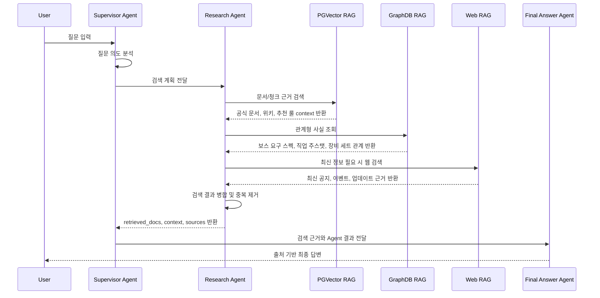
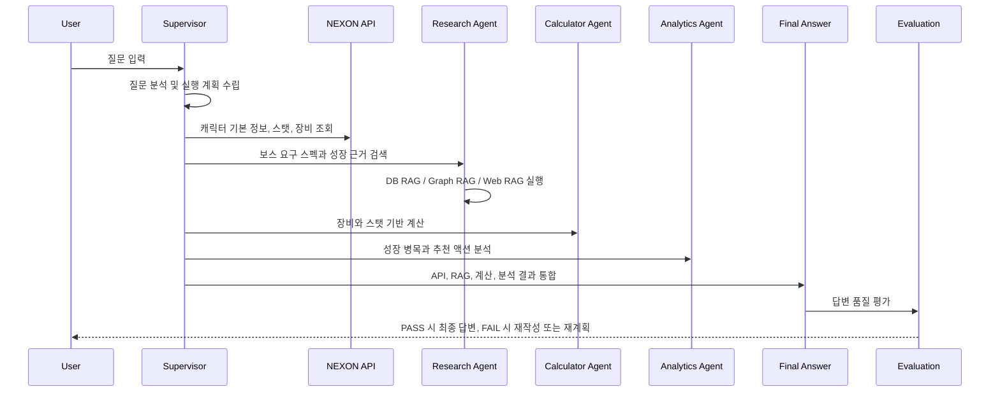

# SKN27-3rd-1TEAM

> SK Networks Family AI Camp 27기 3차 프로젝트  
> 개발 기간: 2026년 5월 1일 ~ 2026년 5월 15일

## Contents

1. [프로젝트 소개](#1-프로젝트-소개)
2. [팀 소개](#2-팀-소개)
3. [기술 스택](#3-기술-스택)
4. [시스템 아키텍처](#4-시스템-아키텍처)
5. [주요 기능](#5-주요-기능)
6. [데이터 파이프라인](#6-데이터-파이프라인)
7. [VectorDB 적재](#7-vectordb-적재)
8. [GraphDB 설계](#8-graphdb-설계)
9. [RAG 설계 및 시퀀스 다이어그램](#9-rag-설계)
10. [Agent 처리 시나리오](#10-agent-처리-시나리오)
11. [테스트 및 평가](#12-테스트-및-평가)
12. [시연 화면](#13-시연-화면)
13. [기대 효과 및 결론](#14-기대-효과-및-결론)
14. [팀원 회고](#15-팀원-회고)

---

## 1. 프로젝트 소개

### 프로젝트명

**메이플스토리 데이터 기반 RAG 멀티 에이전트 챗봇**

### 한 줄 소개

메이플스토리 공식 API, 공식 문서, 위키형 보조 문서, 추천 룰, GraphDB 관계 데이터를 통합하여 캐릭터 분석과 근거 기반 답변을 제공하는 RAG Multi-Agent 챗봇이다.

### 개발 배경

메이플스토리는 장기간 서비스되면서 직업, 장비, 보스, 이벤트, 패치 정보가 방대하게 누적되었다. 사용자는 공식 홈페이지, 위키, 커뮤니티, 정보 사이트를 오가며 최신성과 신뢰도를 직접 판단해야 한다.

본 프로젝트는 다음 문제를 해결하기 위해 설계했다.

| 문제 | 해결 방향 |
|---|---|
| 최신 공지, 이벤트, 업데이트 확인이 번거로움 | Web RAG로 공식 웹 문서와 최신 정보를 보강 |
| 보스 도전 가능 여부 판단이 어려움 | GraphDB와 캐릭터 API 기반 요구 스펙 비교 |
| 장비 성장 우선순위 판단이 어려움 | 추천 룰, Calculator Agent, Analytics Agent로 분석 |
| 공식 정보와 커뮤니티 정보의 신뢰도 구분이 어려움 | 출처, 신뢰도, 최신성 메타데이터 유지 |
| 단일 검색으로 복합 질문을 처리하기 어려움 | Supervisor 기반 Multi-Agent 라우팅 |

### 프로젝트 목표

- NEXON Open API 기반 캐릭터, 장비, 스탯 조회
- PostgreSQL/PGVector 기반 문서형 근거 검색
- Neo4j GraphDB 기반 보스, 직업, 장비, 보상 관계 탐색
- Tavily 기반 Web Search RAG로 최신 공식 문서 보강
- LangGraph 기반 Supervisor 및 역할별 Agent 구성
- Final Answer Agent를 통한 출처 기반 최종 답변 생성
- Evaluation/RAGAS 기반 검색 품질과 답변 품질 검증
- Streamlit 기반 챗봇 및 미니게임 UI 제공

---

## 2. 팀 소개

### 팀명

**자리요!**

<table align="center" width="100%">
  <tr>
    <td align="center"></td>
    <td align="center"></td>
    <td align="center"></td>
    <td align="center"></td>
    <td align="center"></td>
  </tr>
  <tr>
    <td align="center"><b>김민경</b></td>
    <td align="center"><b>권환성</b></td>
    <td align="center"><b>김주영</b></td>
    <td align="center"><b>신동혁</b></td>
    <td align="center"><b>한재웅</b></td>
  </tr>
  <tr>
    <td align="center">팀장</td>
    <td align="center">팀원</td>
    <td align="center">팀원</td>
    <td align="center">팀원</td>
    <td align="center">팀원</td>
  </tr>
  <tr>
    <td align="center"><a href="https://github.com/m2k-dcyh13">m2k-dcyh13</a></td>
    <td align="center"><a href="https://github.com/nanseong">nanseong</a></td>
    <td align="center"><a href="https://github.com/enooola0204-spec">enooola0204-spec</a></td>
    <td align="center"><a href="https://github.com/techshin31">techshin31</a></td>
    <td align="center"><a href="https://github.com/hjoo10200">hjoo10200</a></td>
  </tr>
</table>

| 팀원 | 담당 |
|---|---|
| 김민경 | 프로젝트 구조, 요구사항 정의, Supervisor Agent, Streamlit Chatbot, 코드 통합, WBS |
| 권환성 | GraphDB 스키마, Neo4j, Web Search RAG, Final Answer Agent, Design |
| 김주영 | ERD, PostgreSQL/PGVector, DB Search RAG, RAGAS, README, PPT |
| 신동혁 | 기획서, 화면설계서, 데이터셋 확보/전처리, Research Agent, Evaluation, API 연동 |
| 한재웅 | Analytics Agent, Calculator Agent, 미니게임 설계 |

---

## 3. 기술 스택

| 분류 | 기술 |
|---|---|
| Language | Python 3.12 |
| Frontend | Streamlit |
| Agent Framework | LangChain, LangGraph |
| LLM | Groq `openai/gpt-oss-120b` |
| Embedding | `google/embeddinggemma-300m`, OpenAI `text-embedding-3-small` |
| RDB / VectorDB | PostgreSQL, PGVector |
| GraphDB | Neo4j |
| Web Search | Tavily, DuckDuckGo fallback |
| Infra | Docker, Docker Compose |
| Evaluation | RAGAS, custom answer evaluation |

---

## 4. 시스템 아키텍처

### 전체 구조

<div align="center">
  
</div>

### Agent 역할

| Agent | 역할 | 주요 출력 |
|---|---|---|
| Supervisor Agent | 질문 의도 분석, 실행 계획 수립, Agent 라우팅 | plan, route, next_agent |
| Research Agent | DB RAG, Graph RAG, Web RAG 검색 | retrieved_docs, context, sources |
| Analytics Agent | 캐릭터 상태 분석, 성장 병목 진단 | growth_report, recommended_actions |
| Calculator Agent | 장비와 스탯 기반 계산 | stat_summary, equipment_summary, bottleneck_analysis |
| Final Answer Agent | Agent 결과 종합 및 최종 답변 생성 | draft_answer, final_answer, confidence_score |
| Evaluation | 답변 품질 평가 및 재작성/재계획 판단 | PASS, REWRITE, REPLAN |

### 프로젝트 구조

```text
SKN27-3rd-1TEAM/
├─ app/
│  ├─ maple_chat.py
│  ├─ pages/
│  └─ common/
├─ common/
│  ├─ domain.py
│  ├─ state.py
│  ├─ validator.py
│  ├─ prompt.py
│  └─ get_model.py
├─ database/
│  ├─ docker-compose.yml
│  ├─ postgres/
│  │  ├─ schema.sql
│  │  ├─ load_mapleqa_dataset.py
│  │  ├─ embed_document_chunks.py
│  │  └─ load_wiki_entities.sql
│  ├─ neo4j/
│  │  ├─ prepare_neo4j_csv.py
│  │  └─ graph_loader.py
│  └─ data/
├─ docs/
│  ├─ db_search_rag_design.md
│  ├─ graph_schema.md
│  ├─ web_rag_design.md
│  ├─ ragas_report.md
│  ├─ erd.md
│  └─ test_scenario.csv
├─ src/
│  ├─ agents/
│  ├─ collectors/
│  ├─ rag/
│  └─ evaluation/
├─ requirements.txt
├─ setup-guide.md
└─ README.md
```

### ERD

<div align="center">
  
</div>

### ERD 데이터 영역

| 영역 | 설명 |
|---|---|
| 캐릭터 분석 데이터 영역 | 캐릭터 기본 정보를 중심으로 스탯, 장비, 세트 효과 데이터를 연결한다. 이를 통해 캐릭터의 현재 상태를 조회하고, 보스 도전 가능성이나 장비 개선 방향을 분석한다. |
| RAG 문서 검색 데이터 영역 | 공식 문서, 위키, 추천 룰 데이터를 문서 단위로 저장하고, 이를 `documents -> document_chunks -> document_embeddings` 구조로 분리한다. 원문 관리, 검색 단위 관리, 임베딩 관리를 분리해 재적재와 재임베딩을 독립적으로 처리한다. |

---

## 5. 주요 기능

| 기능 | 설명 |
|---|---|
| 캐릭터 정보 조회 | NEXON Open API로 캐릭터 기본 정보, 장비, 스탯, 유니온 조회 |
| Web Search RAG | Tavily 기반 공식 공지, 이벤트, 업데이트 검색 |
| PGVector RAG | PostgreSQL/PGVector 기반 공식 문서, 위키, 추천 룰 검색 |
| GraphDB RAG | Neo4j 기반 보스, 직업, 장비, 이벤트 관계 탐색 |
| 캐릭터 분석 | 보스 도전 가능성, 성장 병목, 우선순위 진단 |
| 장비 계산 | 장비와 스탯 기반 전투력 관련 보조 계산 |
| 최종 답변 생성 | 여러 Agent 결과를 종합한 사용자 친화적 답변 생성 |
| 답변 평가 | PASS/REWRITE/REPLAN 기반 품질 제어 |
| 미니게임 | Streamlit 기반 부가 사용자 경험 제공 |

---

## 6. 데이터 파이프라인

### 전체 흐름



### 최종 데이터셋

| 항목 | 값 |
|---|---:|
| 전체 문서 행 | 3,567 |
| 컬럼 수 | 25 |
| RAG 사용 가능 여부 | 모든 행 `rag_ready=True` |
| 주요 필드 | `doc_id`, `title`, `category`, `collection_scope`, `source_url`, `trust_level`, `rag_text` |

### 데이터 구성

| 구성 범위 | 수량 | 활용 |
|---|---:|---|
| 추가 수집 wiki 문서 | 1,328 | 보스, 장비, 스킬, 맵, 퀘스트 등 게임 지식 |
| 공식 문서 | 67 | 공지, 이벤트, 업데이트, 테스트월드 정보 |
| 보스/장비 추천 룰 | 197 | 보스 추천 및 장비 성장 판단 |
| 추천 검수/가드레일 | 27 | 안전한 추천 답변 생성 기준 |
| 한국어 스토리 요약 seed | 12 | 지역/스토리 기반 Q&A 보강 |
| 직업별 5차 코어 우선순위 | 47 | 직업별 코어 강화 조언 |
| 직업별 6차 HEXA 우선순위 | 47 | HEXA 성장 우선순위 조언 |
| 시세/이벤트 강화 타이밍 | 8 | 스타포스/큐브 이벤트 판단 보조 |

### 공식 문서 전처리

공식 문서와 웹 문서는 답변 근거로 직접 사용되므로 본문 외 노이즈를 제거한 뒤 `rag_text`로 통일했다.

| 처리 대상 | 처리 방식 | 이유 |
|---|---|---|
| 헤더, 푸터, 내비게이션 | 본문에서 제외 | 반복 UI 문구 제거 |
| 스크립트, 스타일, 폼 | 본문에서 제외 | HTML/UI 코드 혼입 방지 |
| 댓글 영역 | `.reply_wrap`, `.bottom_txar_wrap` 등 제외 | 사용자 댓글이 공식 근거처럼 검색되는 문제 방지 |
| 이벤트 배너, 사이드바 | 본문과 분리 | 추천 이벤트/배너 문구 혼입 방지 |
| 공백, 줄바꿈 | `clean_text()` 기준 정규화 | 임베딩 및 키워드 검색 안정성 확보 |

---

## 7. VectorDB 적재

### 저장 구조

별도 VectorDB 제품을 사용하지 않고 PostgreSQL의 PGVector 확장으로 문서, 청크, 임베딩을 한 저장소에서 관리했다.


```text
documents
  -> document_chunks
  -> document_embeddings
```

| 테이블 | 역할 |
|---|---|
| `documents` | 원본 문서, 출처, 카테고리, 신뢰도, 본문 |
| `document_chunks` | 검색 단위 청크, 문서 내 위치 정보 |
| `document_embeddings` | 청크별 768차원 임베딩 벡터 |
| `wiki_entities` | 위키 문서의 보스, 아이템, 스킬, 퀘스트, 맵 엔티티 색인 |

### 적재 방식

| 구분 | 내용 |
|---|---|
 |
| 무엇을 | 공식 문서, 위키형 보조 문서, 추천 룰, 5차/6차 강화 우선순위, 검수 가드레일 |
| 어떻게 | `rag_text`를 1,800자 단위로 자르고 200자 overlap을 둔 뒤 768차원 임베딩 생성 |
| 왜 | 긴 문서 전체가 아니라 질문과 가까운 근거 문단을 안정적으로 검색하기 위해 |

### 청킹 기준

```text
chunk_size = 1800
overlap = 200
```

예시:

```text
chunk 0: 0 ~ 1800
chunk 1: 1600 ~ 3400
chunk 2: 3200 ~ ...
```

각 청크에는 `chunk_id`, `chunk_index`, `token_count`, `char_start`, `char_end`를 저장한다. 청크 내용이 바뀌면 기존 임베딩을 삭제하고 다시 생성해 문서와 벡터의 불일치를 방지한다.

### 임베딩 적재

| 항목 | 내용 |
|---|---|
| 기본 모델 | `google/embeddinggemma-300m` |
| 벡터 차원 | 768 |
| 배치 크기 | 기본 64 |
| 재실행 방식 | 이미 같은 모델로 임베딩된 청크는 건너뛰고 남은 청크만 처리 |
| 저장 방식 | `ON CONFLICT (chunk_id) DO UPDATE` 기반 upsert |
| 검색 인덱스 | HNSW + `vector_cosine_ops` |


### DB 적재 현황

| 항목 | 값 |
|---|---:|
| documents | 3,567 |
| document_chunks | 11,599 |
| document_embeddings | 11,599 |
| wiki_entities | 1,328 |
| 미임베딩 chunk | 0 |
| embedding model | `google/embeddinggemma-300m` |
| vector dimension | 768 |

### 제외 기준

| 제외/분리 대상 | 처리 방식 | 이유 |
|---|---|---|
| `api_static_sample` | PGVector 청크/임베딩 대상에서 제외 | 캐릭터 raw API 샘플이 공식 답변 근거로 검색되는 문제 방지 |
| 댓글/커뮤니티 반응 | 공식 문서 본문과 분리 | 공식 정보와 사용자 의견 혼동 방지 |
| 이미지 중심 이벤트 정보 | Web RAG 또는 OCR 확장 대상으로 분리 | 텍스트 본문만으로는 조건/보상 누락 가능 |
| 관계형 사실 | Neo4j GraphDB로 별도 적재 | 보스 요구 스펙, 장비 세트처럼 관계 질의가 더 정확함 |


---

## 8. GraphDB 설계

GraphDB는 실시간 캐릭터 상태 저장소가 아니라, 메이플스토리 게임 지식의 관계를 저장하는 DB다. 실시간 캐릭터 정보는 NEXON API로 조회하고, GraphDB는 분석에 필요한 기준 지식을 제공한다.

### 노드

| 노드 | 설명 | 주요 속성 |
|---|---|---|
| `Job` | 직업 | `job_id`, `name`, `job_group`, `main_stat` |
| `Boss` | 보스 | `boss_id`, `name`, `difficulty`, `required_level` |
| `BossAlias` | 보스 별칭 | `alias_id`, `name`, `normalized_name`, `locale` |
| `EquipmentCatalog` | 장비 카탈로그 | `equipment_id`, `name`, `part`, `slot`, `set_name` |
| `EquipmentRule` | 장비 성장/강화 규칙 | `rule_id`, `stage`, `recommended_tier`, `priority` |
| `SetEffect` | 장비 세트 효과 | `set_effect_id`, `name`, `description` |
| `StatRequirement` | 보스/콘텐츠 요구 스펙 | `level`, `main_stat`, `boss_damage`, `ignore_def`, `arcane_force` |
| `Event` | 이벤트 | `event_id`, `name`, `start_date`, `end_date` |
| `Reward` | 보상 | `reward_id`, `name`, `reward_type` |
| `Content` | 콘텐츠 | `content_id`, `name`, `reset_cycle` |
| `Source` | 문서 출처 | `source_id`, `title`, `url`, `trust_level`, `reliability` |
| `StatType` | 스탯 종류 | `code`, `domain_field` |


### 관계

| 관계 | 의미 |
|---|---|
| `(Job)-[:USES_MAIN_STAT]->(StatType)` | 직업의 주스탯 연결 |
| `(BossAlias)-[:ALIAS_OF]->(Boss)` | 보스 한글명, 영문명, 축약어 연결 |
| `(Boss)-[:HAS_REQUIREMENT]->(StatRequirement)` | 보스 요구 스펙 연결 |
| `(Boss)-[:DROPS_REWARD]->(Reward)` | 보스 보상 연결 |
| `(EquipmentCatalog)-[:PART_OF_SET]->(SetEffect)` | 장비와 세트 효과 연결 |
| `(Event)-[:PROVIDES_REWARD]->(Reward)` | 이벤트 보상 연결 |
| `(Event)-[:RELATED_CONTENT]->(Content)` | 이벤트와 콘텐츠 연결 |

<div align="center">
  
</div>
<div align="center">
  
</div>

### GraphDB를 분리한 이유

PGVector는 긴 문서에서 의미적으로 가까운 문단을 찾는 데 강하다. 반면 보스가 어떤 요구 스펙을 갖는지, 어떤 보상을 드롭하는지, 장비가 어떤 세트 효과에 포함되는지는 관계 조회가 더 정확하다. 그래서 문서형 근거는 PGVector, 관계형 사실은 Neo4j가 담당하도록 분리했다.

---

## 9. RAG 설계

### RAG 역할 분리

| RAG | 핵심 역할 | 강점 |
|---|---|---|
| PGVector RAG | 공식 문서, 위키, 추천 룰 문서 검색 | 의미 기반 문서 근거 검색 |
| GraphDB RAG | 보스, 직업, 장비, 보상 관계 조회 | 구조화된 관계 검색 |
| Web RAG | 최신 공식 공지, 이벤트, 업데이트 검색 | 최신성 보강 |

### RAG 검색 시퀀스



<div align="center">
  
</div>

### Hybrid 검색

PGVector RAG는 고유명사 검색과 의미 검색을 함께 처리하기 위해 keyword 검색과 vector 검색을 결합한다.

```text
normalized vector score * 0.65
+ normalized text score * 0.35
```

| 검색 방식 | 장점 | 보완점 |
|---|---|---|
| Keyword/Text Search | 이벤트명, 보스명, 스킬명처럼 정확한 용어 검색에 강함 | 표현이 달라지면 누락 가능 |
| Vector Search | 의미가 유사한 문서 검색에 강함 | 고유명사, 짧은 키워드에는 약할 수 있음 |
| Hybrid Search | 정확 검색과 의미 검색을 함께 반영 | 점수 정규화와 중복 제거 필요 |

### Web RAG 신뢰도 기준

| 기준 | 내용 |
|---|---|
| 공식 도메인 | `maplestory.nexon.com`, `openapi.nexon.com`, `notice.nexon.com` |
| 공식 출처 | `reliability=HIGH` |
| 커뮤니티 출처 | `reliability=MEDIUM` |
| 최신성 HIGH | 발행일 기준 90일 이내 또는 진행 예정/진행 중 문서 |
| 최신성 MEDIUM | 발행일 기준 1년 이내 |
| 최신성 LOW | 발행일 기준 1년 초과 |

---

## 10. Agent 처리 시나리오

대표 질문:

```text
이 캐릭터가 노멀 스우를 잡으려면 어떤 장비를 먼저 강화해야 해?
```

### 처리 흐름



### State 누적

| 단계 | State에 누적되는 값 |
|---|---|
| Research | `retrieved_docs`, `context`, `sources` |
| API 조회 | `character_info`, `stat_summary`, `equipment_summary` |
| Calculator | `calculation_result`, `bottleneck_analysis` |
| Analytics | `growth_report`, `recommended_actions` |
| Final Answer | `draft_answer`, `final_answer`, `confidence_score` |
| Evaluation | `evaluation_result`, `rewrite_reason`, `replan_reason` |

---

## 11. 테스트 및 평가

평가는 단일 정답 생성 여부만 보지 않고 Agent 라우팅, RAG 검색, State 전달, 최종 답변, 재시도 흐름을 분리해 확인했다.

### 평가 기준

| 구분 | 평가 항목 | 통과 기준 |
|---|---|---|
| Agent 라우팅 | 질문 유형별 담당 Agent 선택 | 보스/장비/이벤트/계산 질문에 맞는 Agent 호출 |
| PGVector RAG | 문서 청크 검색 | 질문과 관련된 `document_chunks` 검색 |
| GraphDB RAG | 관계 조회 | `Boss -> HAS_REQUIREMENT -> StatRequirement` 등 관계 조회 |
| Web RAG | 최신 정보 보강 | Tavily 실패 시 DuckDuckGo fallback 가능 |
| State/Validator | Agent 간 state 계약 | `retrieved_docs`, `context`, `analysis_result` 등 필수 값 검증 |
| NEXON API | 정상/예외 처리 | 없는 캐릭터, API key 누락, rate limit graceful fail |
| Calculator | 장비/스탯 계산 | 누락 데이터가 있어도 오류 없이 처리 |
| Final Answer | 최종 답변 생성 | 검색 근거와 API/계산 결과 종합, 출처 유지 |
| Evaluation | 답변 검증 | PASS, REWRITE, REPLAN 흐름 동작 |
| RAGAS | 검색 품질 평가 | faithfulness, answer relevancy, context precision 등 비교 |

### 대표 테스트 시나리오

| ID | 시나리오 | 검증 포인트 |
|---|---|---|
| AG-01 | 자쿰 필요 스펙 알려줘 | Supervisor가 Research Agent로 라우팅 |
| AG-02 | 내 캐릭터 뭐부터 올려야 해? | NEXON API 조회 후 Analytics Agent 실행 |
| AG-03 | 이 장비 끼면 전투력 얼마나 올라? | Calculator Agent 실행 |
| AG-04 | 지금 진행 중인 이벤트 뭐 있어? | Web Search RAG 실행 |
| RAG-01 | PGVector 문서 검색 | 관련 `document_chunks` 검색 |
| RAG-02 | Neo4j 보스 관계 조회 | 보스 요구 스펙 관계 조회 |
| RAG-05 | Web RAG fallback | Tavily 실패 시 DuckDuckGo fallback |
| FA-05 | hallucination 방지 | state에 없는 내용 생성 금지 |
| EV-02 | 근거 부족 REWRITE | 답변은 있으나 근거 부족 시 재작성 |
| EV-03 | 질문 불일치 REPLAN | 엉뚱한 흐름이면 재계획 |

### E2E 테스트

| ID | 목적 | 흐름 |
|---|---|---|
| E2E-01 | 보스 요구 스펙 질문 | UI -> Supervisor -> Research -> GraphDB -> Final Answer -> Evaluation |
| E2E-02 | 캐릭터 추천 | UI -> NEXON API -> Analytics -> DB RAG -> Final Answer |
| E2E-03 | 이벤트 보상 안내 | UI -> Web RAG -> DB RAG 보완 -> Final Answer |
| E2E-04 | 카루타 가능 여부 | UI -> API -> Analytics -> GraphDB -> Calculator -> Final Answer |
| E2E-05 | 장비 세트 효과 | UI -> GraphDB RAG -> Final Answer |

---

## 12. 화면

### 화면설계서 초안

<div align="center">
  
</div>
<div align="center">
  
</div>
<div align="center">
  
</div>

### 실제 화면

<div align="center">
  
</div>
<div align="center">
  
</div>
<div align="center">
  
</div>

---

## 13. 기대 효과 및 결론

### 기대 효과

- 신규/복귀 유저가 성장 루트, 장비 선택, 보스 도전 기준을 빠르게 파악할 수 있다.
- 공식 문서, 위키, 추천 룰, GraphDB 관계를 함께 사용해 단순 검색보다 근거가 분명한 답변을 제공할 수 있다.
- NEXON Open API 기반 캐릭터 상태와 RAG 검색 결과를 결합해 개인화 추천으로 확장할 수 있다.
- Web RAG를 통해 고정 DB의 한계를 보완하고 최신 이벤트/공지 정보를 반영할 수 있다.
- Evaluation과 RAGAS를 통해 답변 품질과 검색 품질을 분리해서 개선할 수 있다.

### 결론

본 프로젝트는 메이플스토리의 복잡한 정보 탐색 문제를 Multi-Agent와 RAG 구조로 해결하고자 했다. PostgreSQL/PGVector는 문서형 근거 검색을, Neo4j는 관계형 사실 조회를, Web RAG는 최신 정보 보강을 담당한다. Supervisor Agent는 질문 유형에 따라 각 도구와 Agent를 조합하고, Final Answer Agent는 state에 누적된 근거만 사용해 최종 답변을 생성한다.

향후에는 보스 요구 스펙과 장비 성장 수치의 팀 검수, 이벤트 이미지 OCR, 서버별 시세 데이터, 직업별 강화 우선순위 세분화를 통해 추천 정확도와 서비스성을 높일 수 있다.

---

## 14. 팀원 회고

### 김민경
- 개발 과정에서 Streamlit 페이지 임포트 오류, 에이전트 간 무한 루프  등 다양한 기술적 예외 상황을 마주하고 이를 해결했습니다. 이번 경험을 바탕으로, 차기 프로젝트에서는 기능 구현에 앞서 데이터 흐름(Data Flow)과 에이전트별 역할 및 책임을 더욱 명확히 정의하여 개발 효율성을 극대화하고자 합니다.
- 
### 권환성
- 프로젝트를 진행하며 GraphDB, Web RAG, Final Answer Agent가 각각 어떤 역할을 하고 어떻게 연결되는지 이해하는 데 가장 많은 시간을 썼다.
처음에는 검색 결과와 최종 답변이 다르게 나오는 문제로 어려움을 겪었지만, 상태 흐름과 근거 선택 과정을 하나씩 추적하며 멀티 에이전트 구조를 더 명확히 이해할 수 있었다.
또한 각각 팀원들 마다 에이전트를 구현하다보니 팀장님이 규칙으로 만들어준 setup_guide와 common 폴더 내부의 파일들이 얼마나 중요한 역할인지 알게 되었다.

### 김주영
- 재미있는 게임 소재로 챗봇을 만드는 결과를 보니 처음으로 코딩을 하며 신기하고 재미있다 라는 감정을 느꼈습니다. DB 설계를 맡아 수집된 데이터별로 적절한 청크로 분리해서 나눠 적재해야 한다는 점을 절실히 알았습니다. 더하여 깃허브와 조금씩 친해졌습니다.  기초적인 업무일수있겠지만, 스스로 포기하지않고 최선을 다했던 열흘이었습니다. 멋진 리더와 팀원들을 만나 setup guide를 따르고, 각자 어떻게 일처리를 하는지 옆에서 보고 배웠습니다.

### 신동혁
- 이번 프로젝트에서는 멀티에이전트 리서치, 데이터셋 전처리, final answer 생성 부분을 담당했습니다. 데이터를 정제하고 구조화하는 과정을 통해 모델이 좋은 답변을 생성하기 위해서는 데이터 품질이 매우 중요하다는 것을 느꼈습니다. 또한 여러 에이전트가 역할을 나누어 정보를 수집하고 분석한 뒤 최종 답변으로 연결되는 흐름을 구현하면서, AI 시스템은 단순히 답변을 생성하는 것이 아니라 검색, 분석, 정리 과정이 유기적으로 연결되어야 한다는 점을 배웠습니다.

### 한재웅
- 우선 흥미로운 주제로 LLM 기술의 활용을 해볼수있었던 점이 좋았습니다. 팀원들간의 원활한 소통덕에 좋은 퀄리티의 결과물을 낼수있었던 것 같습니다. 다만 머신러닝에 대해서는 자신있게 시도했으나 양질의 데이터의 수집의 어려움과 데이터의 편향성때문에 끝까지 하지못했던 점을 아쉬었습니다. 이런 경험을 살려서 다음의 프로젝트때는 적절하게 활용할수있었으면 좋겠습니다.
